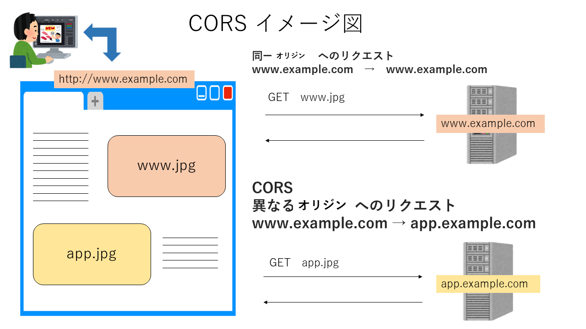
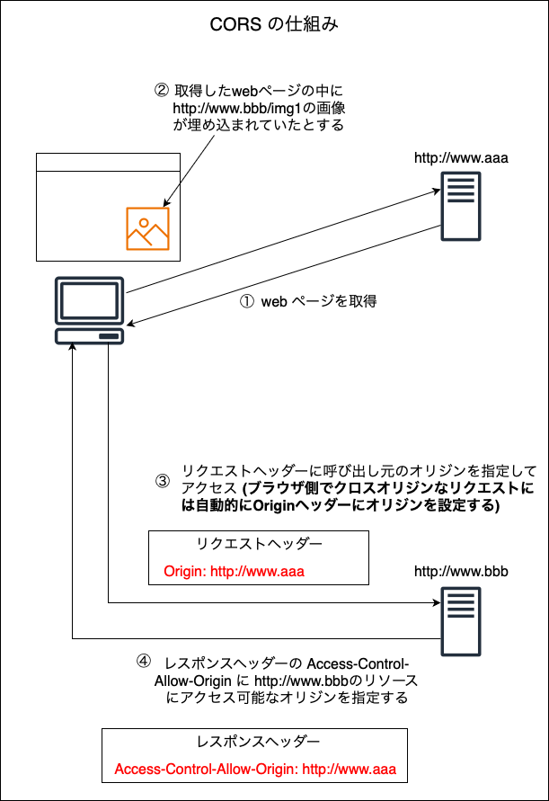
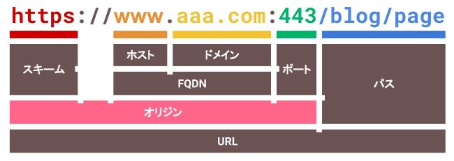
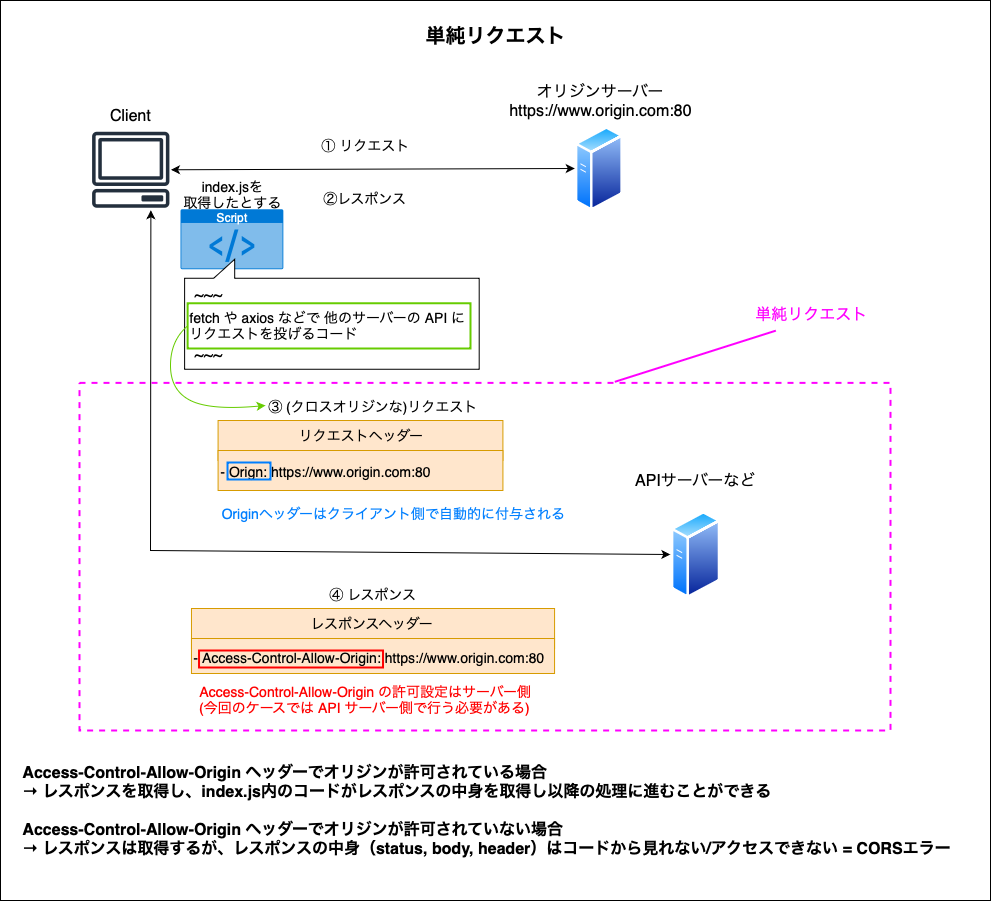
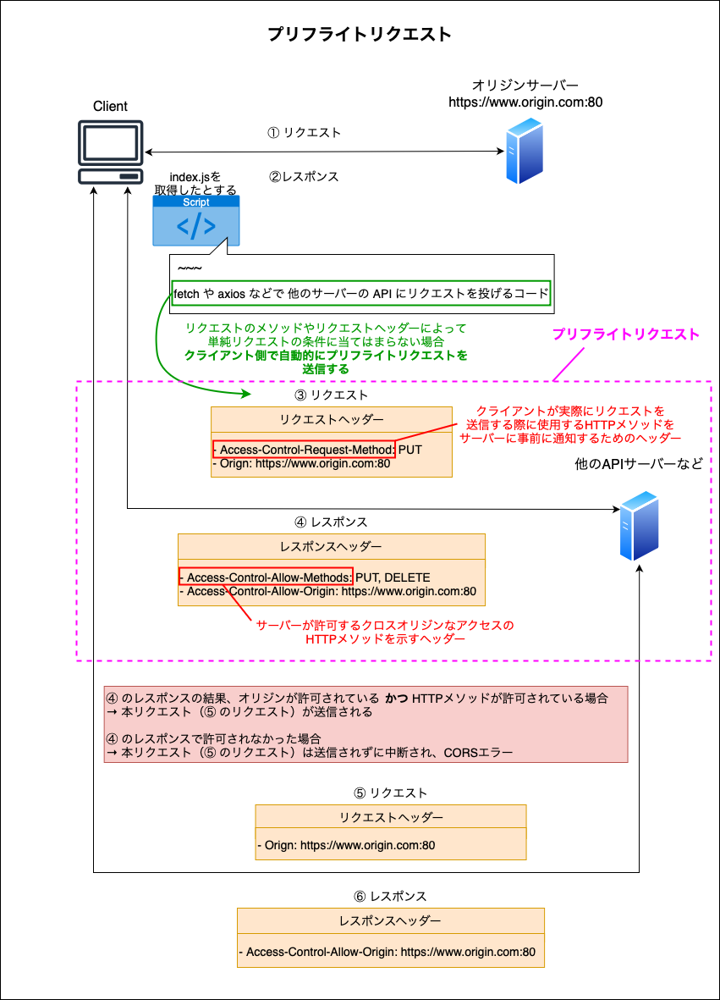
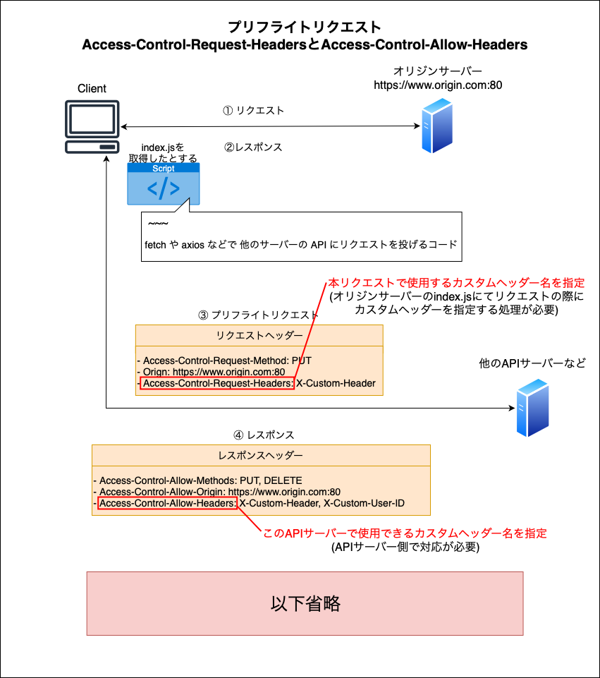
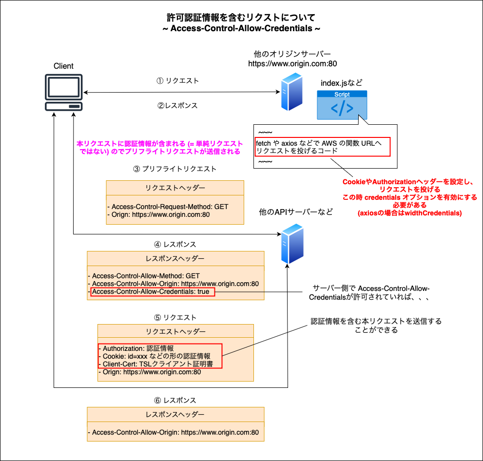
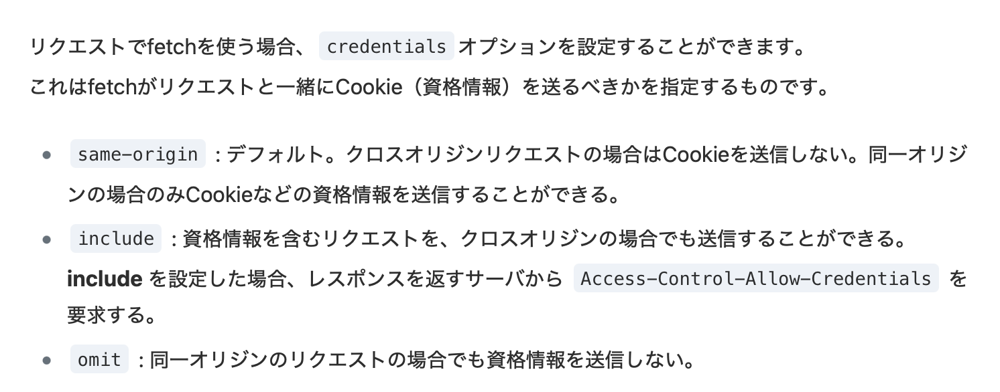

### CORS とは

- Cross-Origin Resource Sharing  (オリジン間リソース共有) の略

- ある[オリジン](#オリジンとは)で動いている Web アプリケーションに対して、異なるオリジンとのデータ交換を可能にするセキュリティ上の仕組み

    - 通常、異なるオリジンからのリソースを読み込もうとした場合、ブラウザはそのリソースの読み込みを禁止する

<br>



引用: [DENET技術ブログ 初心者向け】プロキシ と CORS についてまとめてみました。（図解）](https://blog.denet.co.jp/proxy-reverseproxy-cors/)

---

#### CORS の仕組み ~ クロスオリジンなアクセスを許可するために ~



<br>

- ざっくりというと呼び出し先のクロスオリジンなサーバー側で CORS に対応する必要がある

- 呼び出し先のクロスオリジンなサーバーサイド

    - そのサーバーのリソースにアクセス可能なオリジンを決め、レスポンスヘッダーの Access-Control-Allow-Origin にそのアクセス可能なオリジンを指定する

<br>

- CORS には[単純リクエスト](#単純リクエスト)と[プリフライトリクエスト](#単純ではないリクエスト)という2種のクロスオリジンなリクエストの種類がある (上記画像は単純リクエストの説明)

<br>
<br>

参考サイト

[ITまとめノート 同一オリジンポリシー / CORS](https://shukapin.com/infographicIT/origin-policy)

[CORSの仕組みをGIFアニメで分かりやすく解説](https://coliss.com/articles/build-websites/operation/work/cs-visualized-cors.html)

---

### オリジンとは



引用: [ITまとめノート 同一オリジンポリシー / CORS](https://shukapin.com/infographicIT/origin-policy)

<br>

- プロトコル、ホスト(マシン)、ドメイン、ポート番号 の組み合わせ

    ```
    例1: 以下は同じオリジンではない
    - http://example.com/app1
    - https://example.com/app2

    理由: プロトコルが異なっているため

    
    例2: 以下は全て同じオリジン

    - http://example.com/app1
    - http://example.com/app1/user/page.html
    - http://example.com/app2

    理由: プロトコル ~ ポート番号までが同じため
    ```

<br>
<br>

参考サイト

[ITまとめノート 同一オリジンポリシー / CORS](https://shukapin.com/infographicIT/origin-policy)

[Origin (オリジン)](https://developer.mozilla.org/ja/docs/Glossary/Origin)

---

### 単純リクエスト

- 以下の条件を**全て満たす**クロスオリジンな HTTP リクエストは単純リクエストと呼ばれるリクエストに分類される

    - **メソッド**が `GET`、`HEAT`、`POST` のいずれかであること

    - 手動で設定されている**リクエストヘッダー**が `Accept`、`Accept-Langage`、`Content-Langage`、`Content-Type` のいずれかであること

    - `Content-Type` ヘッダーが付与されている場合、設定値が `application/x-www-form-urlencoded`、`multipart/form-data`、`text/plain` のいずれかであること

        
    
<br>

- クライアントからのクロスオリジンな単純リクエストのプロセスは以下の通り

    

<br>
<br>

参考サイト

[CORSを絶対に理解する](https://zenn.dev/syo_yamamoto/articles/445ce152f05b02)

[CORSにおける単純クリエイトとプリフライトリクエストの違いを調べた](https://qiita.com/curlneko/items/975442495ba13f5d7470#プリフライトリクエストpreflight-request)

---
 
### プリフライトリクエスト

- [単純リクエスト](#単純リクエスト)の条件を満たさないリクエストの場合、**リクエストを送る前にブラウザ側で自動的に**プリフライトリクエストというリクエストがクロスオリジンなサーバーに送信される

<br>

#### プリフライトリクエストのプロセス



- プリフライトリクエストの `Access-Control-Request-Method` ヘッダーにて、本リクエストで使用したい HTTP メソッドを指定する (クライアント側で自動で指定される)

- プリフライトリクエストに対するレスポンスの `Access-Control-Allow-Methods` にて、許可しているクロスオリジンリクエストの HTTP メソッドを返却する

- プリフライトリクエストの結果、許可されれば本リクエストを送信し、許可されなければ CORS エラーで本リクエストは送信されない

<br>

#### プリフライトリクエスト/レスポンスで使用できる他のヘッダー

##### リクエストヘッダー

- `Access-Control-Request-Headers`

    - 実際に送信されるリクエストで使用される HTTP ヘッダーの種類を事前にサーバーに知らせるために使用される

##### レスポンスヘッダー

- `Access-Control-Allow-Headers`

    - サーバー側がどのリクエスト HTTP ヘッダーを許可しているかを通知するために使用される



<br>
<br>

参考サイト

[CORSを絶対に理解する](https://zenn.dev/syo_yamamoto/articles/445ce152f05b02)

[【CORS】なぜ、Preflight Request が発生するときとしないときがあるのか](https://zenn.dev/tm35/articles/ad05d8605588bd)

---

### 認証情報を含むリクエスト

- 認証情報とは以下の情報のこと (以下のヘッダーが1つでも設定されたリクエストのことを「認証情報を含むリクエスト」と呼ぶ)

    - `Cookie` ヘッダー

    - `Authorization` ヘッダー

    - `Client-Cer` ヘッダー

<br>

#### 認証情報を含むリクエスト (クロスオリジン) のプロセス



<br>

- オリジンサーバー側で、クロスオリジンなリクエストを投げる際に credentials オプションを設定する必要がある

    

    引用: [CORSを絶対に理解する](https://zenn.dev/syo_yamamoto/articles/445ce152f05b02#資格情報を含むリクエストについて)

- クロスオリジンなサーバー側でレスポンスの `Access-Control-Allow-Credentials` ヘッダーを true として返すよう設定する必要がある

<br>
<br>

参考サイト

[CORSを絶対に理解する](https://zenn.dev/syo_yamamoto/articles/445ce152f05b02)