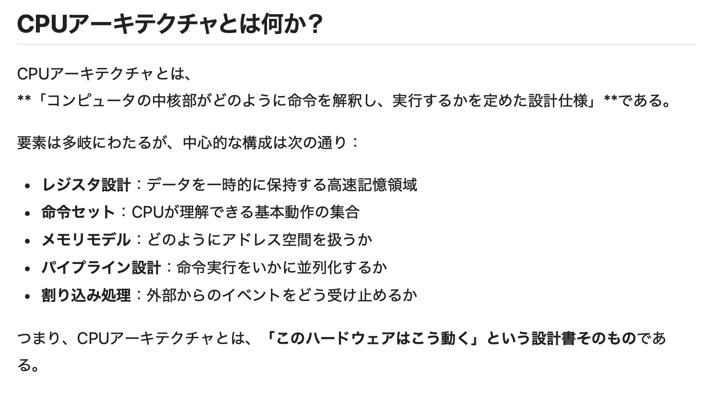

### CPU アーキテクチャーとは

- CPU の設計、構造のこと

- 具体的には以下の要素を含む

    

    引用: [CPUアーキテクチャと命令セットの基礎](https://qiita.com/CRUD5th/items/36fb22c205f7b7ceae62)

     

    - 命令セットとは CPU に対する命令の集合

        - ざっくりとしたイメージとして、 CPU が1つの言語を理解できる人とすると、命令セットはその言語にあたる

            - ↑は異なる CPU アーキテクチャー向けアプリが動かない理由の説明によく使われるメタファー

 
 

参考サイト

[なんちゃってプログラマーの日記](https://nakaterux.hatenablog.com/entry/2024/12/29/162112)

[DockerとCPUアーキテクチャ　#454](https://note.com/ym202110/n/n22aeba379c8d)

---

### 代表的な CPU アーキテクチャー

#### x86 (x64)

- インテルが開発したアーキテクチャー

    - ★インテルのセカンドソースメーカー (あるメーカーが開発した製品と同じ仕様の製品を、正規の許諾契約を結んで製造販売するメーカーのこと) の1つであった AMD 社が設計、製造する CPU も x86 アーキテクチャーを採用している (Ryzen が有名)

    - x86 (x64) のライセンスを所有しているのは Intel、AMD、兆芯(ザオシン)の3社

 

- ARMと比べて、複雑な命令セットを持ち、複雑な処理を少ない命令で実行するのが特徴

 

- 一方で、ARM に比べて消費電力は大きい

 

- 多くの Windows マシンが Intel か Ryzen を搭載している

 

- ##### x86 と x64 (x86-64)

    - x86 は 32ビット CPU 用のアーキテクチャー

        - なぜ x32 じゃないのか? → intelが開発した最初の32ビット CPU 向け CPU アーキテクチャーが 80386 (i386) という名前であったため、その下2桁から x86 となった

     

    - x64 (x86-64 とも表記される) は 64ビット CPU 用のアーキテクチャー

        - ★★amd64 も x86-64 を意味する

 
 

#### ARM

- イギリスの ARM 社がライセンスを持つアーキテクチャー

    - 開発したのはイギリスの Acorn Computers 社

 

- x86 (x64) に比べて、シンプルな命令セットを持つのが特徴

 

- x86 (x64) よりも消費電力が小さいため、多くの小型デバイスに採用されている

 

- Apple シリコンは ARM アーキテクチャーを採用している

 

- ##### AArch32 と AArch64

    - AArch32 は 32 ビット CPU 向け ARM アーキテクチャー

     

    - AArch64 は 64 ビット CPU 向け ARM アーキテクチャー

 
 

#### RISC-V

- カリフォルニア大学バークレー校が開発した**オープンソース**の CPU アーキテクチャー

    - ライセンスフリーで利用、カスタマイズが可能

 

- ★ARM と同様に RISC というタイプの命令セットを採用しているので、 x86 と比べ消費電力が少ない

 

- IoT デバイスに採用されることがある

 
 

参考サイト

[【半導体】intelがAMDに負けた理由とは？](https://souken.shikigaku.jp/19469/#:~:text=セカンドソースメーカーとは,するメーカーのことです%E3%80%82)

[なぜ32bitはx32じゃなくx86なの？](https://legal.blogat.jp/legal_blog/2019/09/32bitx32x86-8886.html)

[命令セットとアーキテクチャの関係とは？](https://note.com/semicontimes/n/n9570085c5986)

[ARM? RISC-V? x86? 用語がごっちゃになっている人のためのCPUアーキテクチャの全体図](https://qiita.com/rihib/items/6b70361b48c3840d09b0)

[CPUアーキテクチャの種類(x86, x64, arm)](https://www.wakuwakubank.com/posts/809-it-cpu-x86-x64-arm/)

[Armがなぜいま重要なのか？エンジニアへの影響は？今後どうなる？](https://peislab.com/programming/introduction/arm-nvidia/)

[CPUのアーキテクチャの違いまとめ（x86/x64/x86_64/AMD64/i386/i686とはなんなのか？）](https://blog.framinal.life/entry/2020/04/22/041548)

[「x86-64」「x64」「AMD64」これらは何が違うのか？](https://onoredekaiketsu.com/x86-64-x64-amd64-what-is-the-difference-between-these/)