### DNS (Domain Name System) とは

- ドメイン名とそのドメイン名に対応する IP アドレスを管理する仕組み

- ブラウザで URL を入力して Web ページにアクセスする裏側では、入力された URL から対応する IP アドレスを求める。このことを「名前解決」と呼ばれる

---

### Domain Tree

- ドメイン名の管理の仕組みのこと

- ドメイン名の管理はツリー構造から成っている

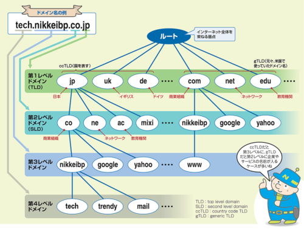

引用: [世界最大のツリー構造、ネットを網羅する「ドメイン名空間」を図解](https://xtech.nikkei.com/atcl/nxt/column/18/00780/062000011/?P=2)

 
 

具体的な仕組み

- ツリーの頂点にルート(".")と呼ばれる DNS サーバーがあり、Top Level Domain (jp, uk, com, net など) を管理するサーバーの IP アドレスを知っている

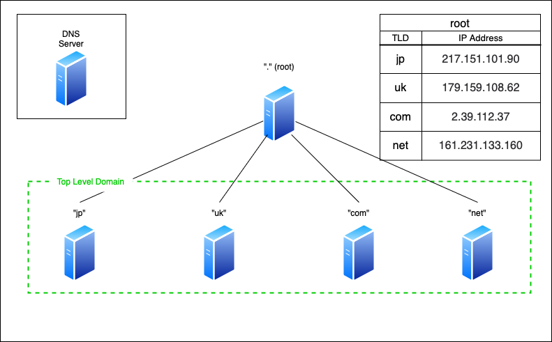

 

- 各 Top Level Domain を管理する DNS サーバーは、そのドメインに紐づく Second Level Domain を管理する DNS サーバーの IP アドレスを知っている

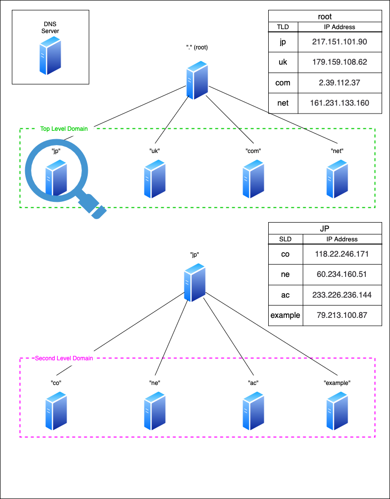

 

- 各 Second Level Domain を管理する DNS サーバーは、そのドメインに紐づく Third Level Domain を管理する DNS サーバーの IP アドレスを知っている

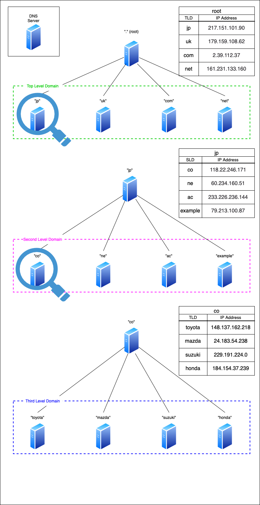

 

- 各 Thrid Level Domain を管理する DNS サーバーは、そのドメインに紐づくホスト名を管理する DNS サーバーの IP アドレスを知っていてる

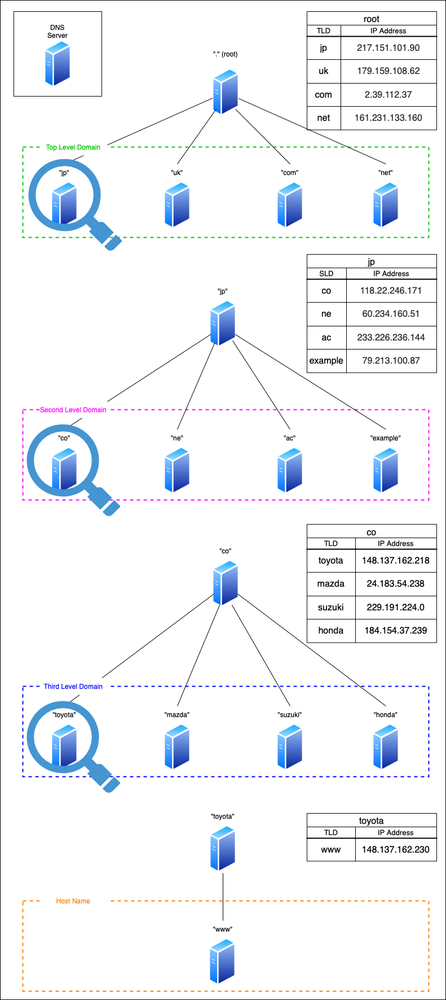

 

参考サイト

DNSツリーについてわかりやすかったサイト1 -> [世界最大のツリー構造、ネットを網羅する「ドメイン名空間」を図解](https://xtech.nikkei.com/atcl/nxt/column/18/00780/062000011/)

DNSツリーについてわかりやすかったサイト2 -> [DNSの仕組みの基本を理解しよう](http://labo.s164.xrea.com/dns/dns.html)

---

### ルートサーバー

ルートサーバーが止まってしまうと URL でサイトにアクセスできなくなってしまうため、1台に問題が発生しても問題ないように冗長化されており、世界に13台配置されている

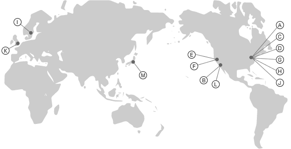

引用: [ドメイン名のしくみ](https://www.nic.ad.jp/ja/dom/system.html)

---

### 名前解決の仕組み

- ブラウザで URL を入力し、アクセスする前に DNSキャッシュサーバーに URL中のドメイン名 に対応する IP アドレスを知らないか問い合わせる

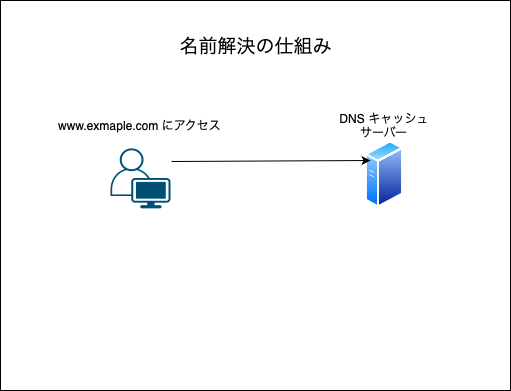

 

- DNS キャッシュサーバーが知らなければ、 DNS キャッシュサーバーがルートサーバーに問い合わせる

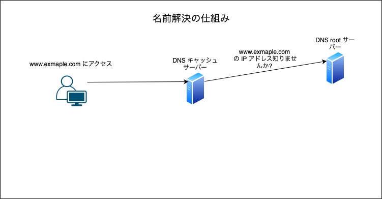

 

- ルートサーバーは問い合わせのあったドメイン名のトップレベルドメインを管理する DNS サーバーの IP アドレスを回答する

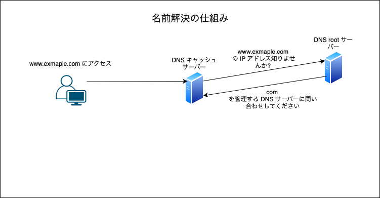

 

- DNS キャッシュサーバーは、回答された DNS にサーバーにドメイン名に対応する IP アドレスを知らないか問い合わせる

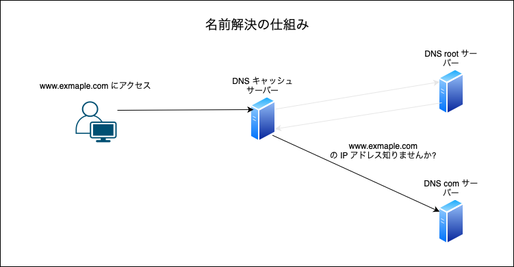

 

- DNS サーバーは知っていればそのIPアドレスを回答し、知らなければサブドメインの管理をしている DNS サーバーの IP アドレスを回答する

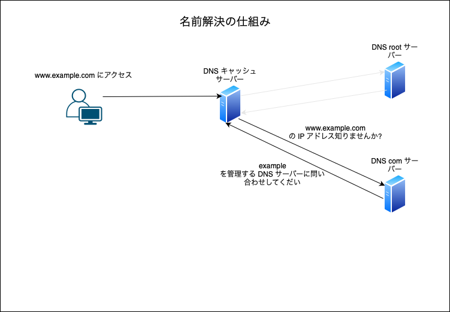

 

- (サブドメインを管理する IP アドレスが回答された場合) 回答された DNS サーバーにドメイン名に対応する IP アドレスを知らないか問い合わせる

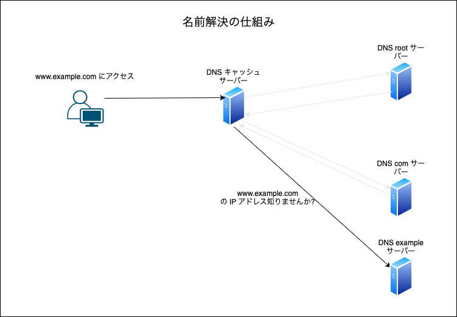

 

- (問い合わせのあったドメイン名を管理していた場合) DNS サーバーは問い合わせのあったドメイン名に対応する IP アドレスを回する

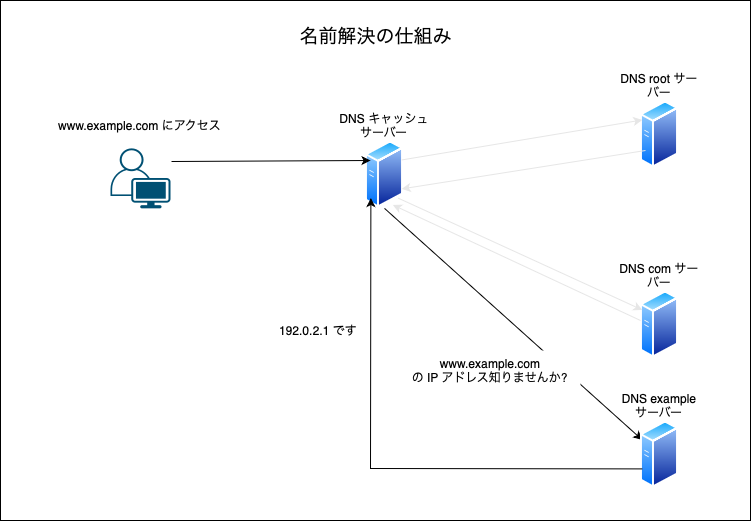

 

- DNS キャッシュサーバーは取得した IP アドレスをクライアントに回答する

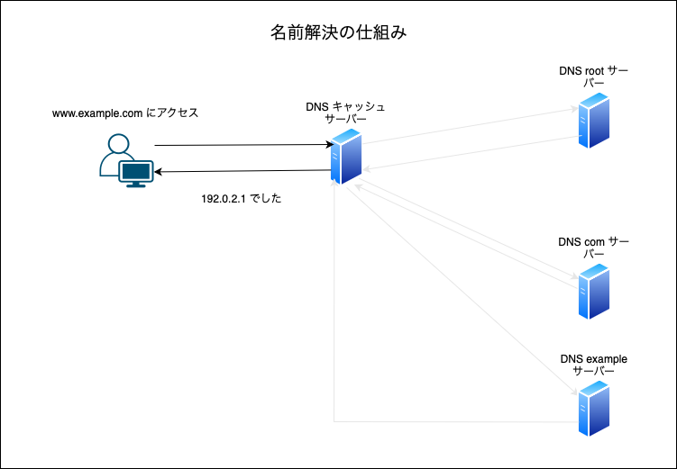

 

- クライアントは回答された IP アドレスで Web サーバーにアクセスする

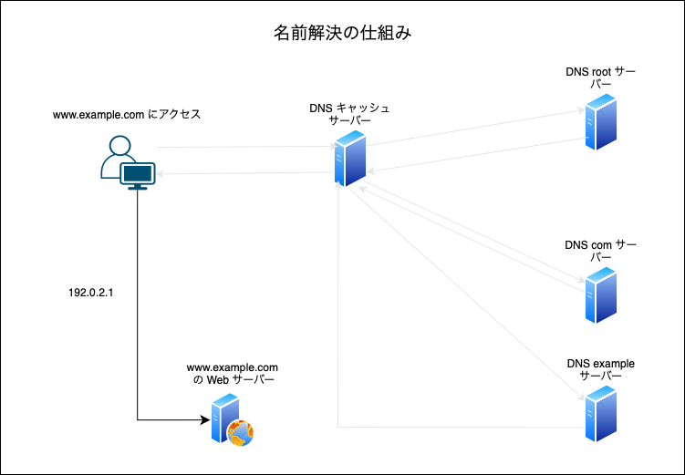

 
 

- なお DNS キャッシュサーバーは、問い合わせのあったドメイン名と対応する IP アドレスを一定期間保存し、同じドメイン名の問い合わせが来た時、再びルートサーバーに問い合わせなくても済むようにする
    
    - ルートサーバーの負担軽減になる
    - DNS 問い合わせの処理時間短縮にもなる

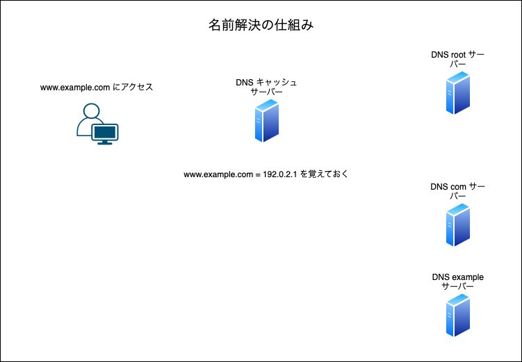
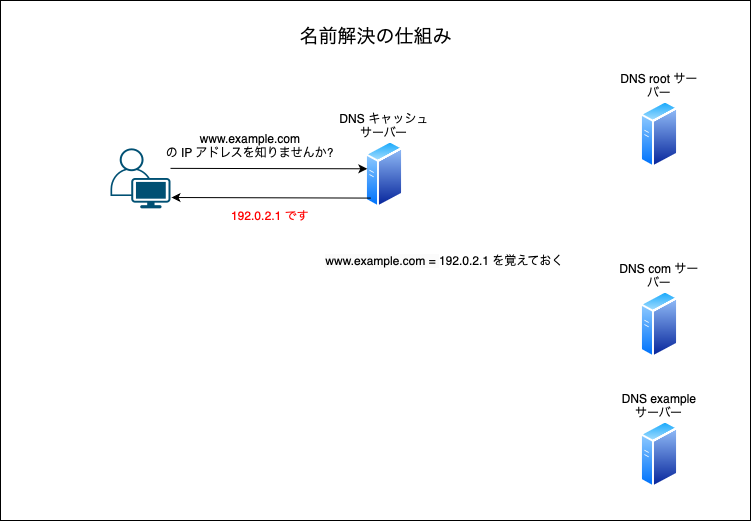

 
 

参考サイト

名前解決の仕組みについてわかりやすかったサイト1 -> [【勉強メモ】DNSの仕組み](https://qiita.com/43z335/items/6c7d132c0eceba9d16a2)

名前解決の仕組みについてわかりやすかったサイト2 -> [DNSとは？インターネットを支える仕組み – ルートサーバーとキャッシュサーバーについても解説](https://www.rworks.jp/system/system-column/sys-entry/16303/)

名前解決の仕組みについてわかりやすかったサイト3 -> [DNSキャッシュの役割とは？仕組みとキャッシュクリアの方法を徹底解説！](https://www.onamae.com/column/domain/35)

DNS キャッシュサーバーについてわかりやすかったサイト -> [ドメイン名とドメインネームシステム（DNS）](https://www.idcf.jp/rentalserver/user-support/knowledge/domain/dns.html)