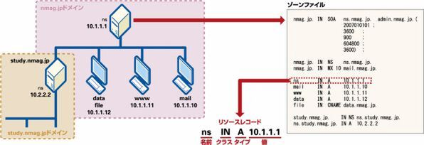
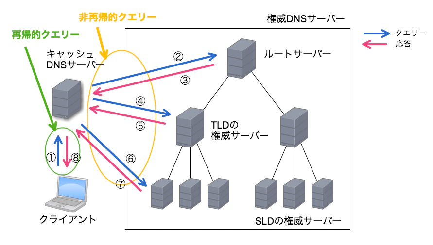
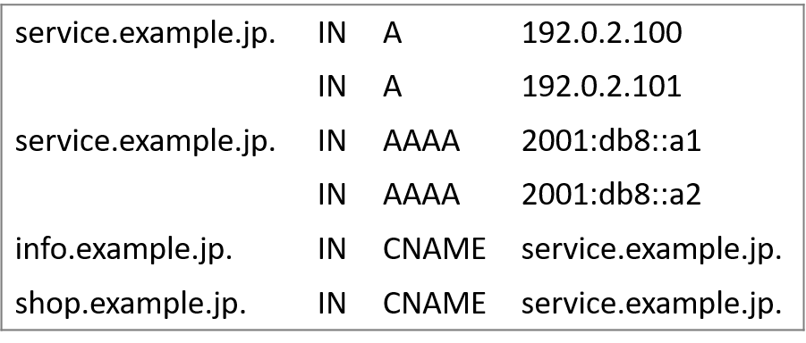
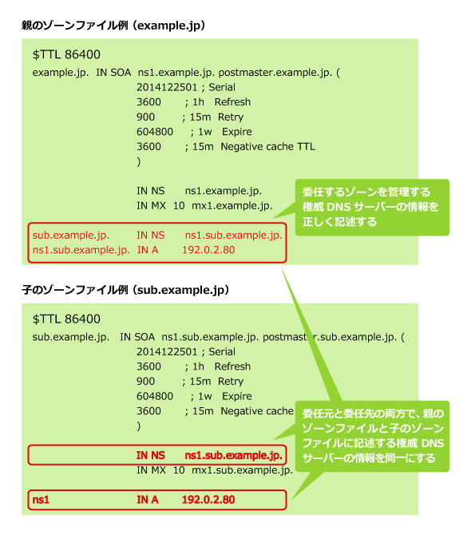
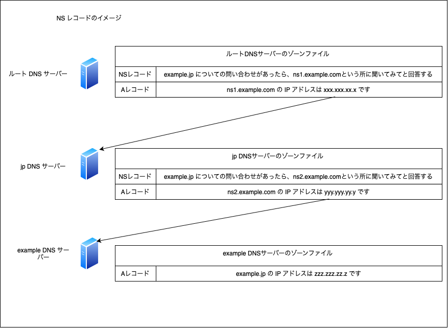

### DNS　レコードとは

DNS サーバーはドメイン名とそれに対応するIPアドレスなどの情報を保持している。それらを DNS レコード (リソースレコード) と呼ぶ

リソースレコードの集合体をゾーンファイルと呼ぶ (DB のイメージ)

引用: [リソースレコードの種類と役割とは](https://ascii.jp/elem/000/000/458/458858/)

 

ゾーンファイルは権威 DNS サーバーに配置される

引用: [奥が深いDNSサーバーとdigコマンド](https://qiita.com/hypermkt/items/610b5042d290348a9dfa)

---

### DNS レコードの種類

DNS レコードはそのレコードのタイプによって保持する情報が異なる

- A レコード (Address)
    - ドメイン名とそのドメイン名に対応する IPv4 の IP アドレスを保持するレコード

- AAAA レコード
    - ドメイン名とそのドメイン名に対応する IPv6 の IP アドレスを保持するレコード

- CNAME レコード (Canonical Name)
    - 特定のドメイン名を他の対象のドメイン名に関連づけるレコード

    - 対象のドメイン名にエイリアスをつけるために使用される

    - 下の画像では、`info.example.jp` の IP アドレスの問い合わせが来たら、 `service.example.jp` の IP アドレスが回答される = `service.example.js` のエイリアスとして `info.example.jp` を設定したとも言える

    

    引用: [CNAMEリソースレコード（シーネームリソースレコード）](https://jprs.jp/glossary/index.php?ID=0212)

- MX レコード (Mail Exchange)
    - 特定のドメイン宛ての電子メールをどのメールサーバーに転送すればいいかを指定するレコード

- NS レコード (Name Server)
    - その権威 DNS サーバーの一つしたの階層の(サブドメインを管理する) 権威 DNS サーバーのホスト名を指定するレコード
    - 1つ下の権威 DNS サーバーはその一つ上の階層の権威 DNS　サーバーのホスト名の NS レコードを持つ必要がある

    

    引用: [NSリソースレコードについて教えてください](https://atmarkit.itmedia.co.jp/ait/articles/1503/20/news010.html)

     

    
    

- TTL レコード (Time To Live)
    - DNSキャッシュサーバがキャッシュする情報の有効期限

 
 

参考サイト

A, TTL, CNAME レコードについてわかりやすかったサイト: [【勉強メモ】DNSの仕組み](https://qiita.com/43z335/items/6c7d132c0eceba9d16a2)

NS レコードについてわかりやすかったサイト: [NSリソースレコードについて教えてください](https://atmarkit.itmedia.co.jp/ait/articles/1503/20/news010.html)

CNAME レコードについてわかりやすかったサイト: [CNAMEレコードについて少し解説してみた](https://qiita.com/Ogin0pan/items/199986966e541d9e9ba4)