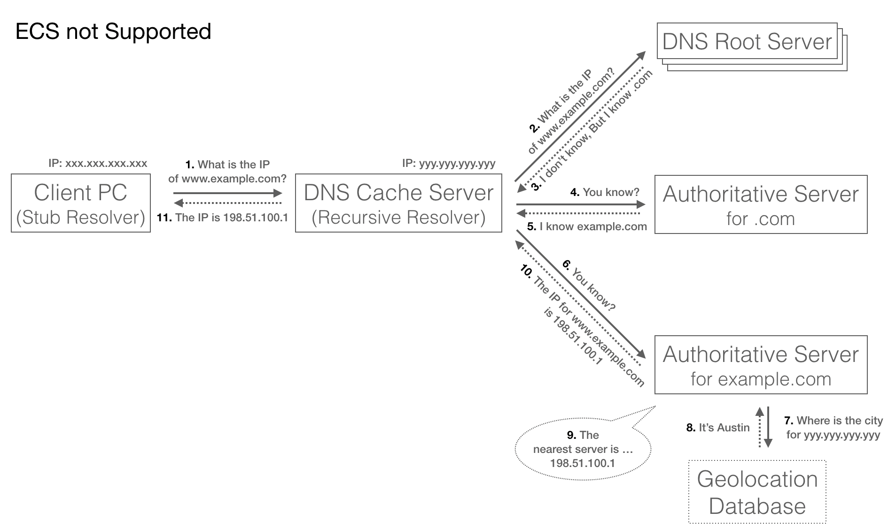
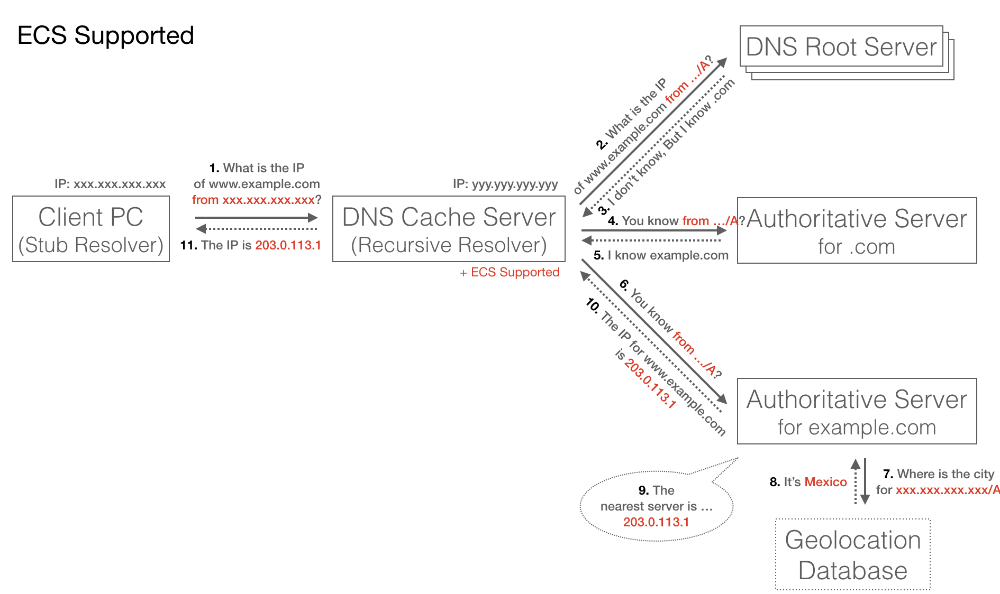
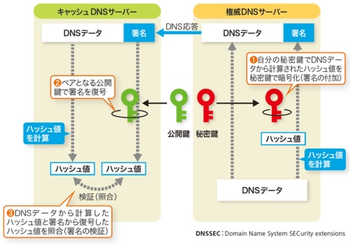
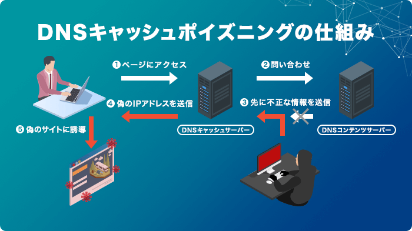
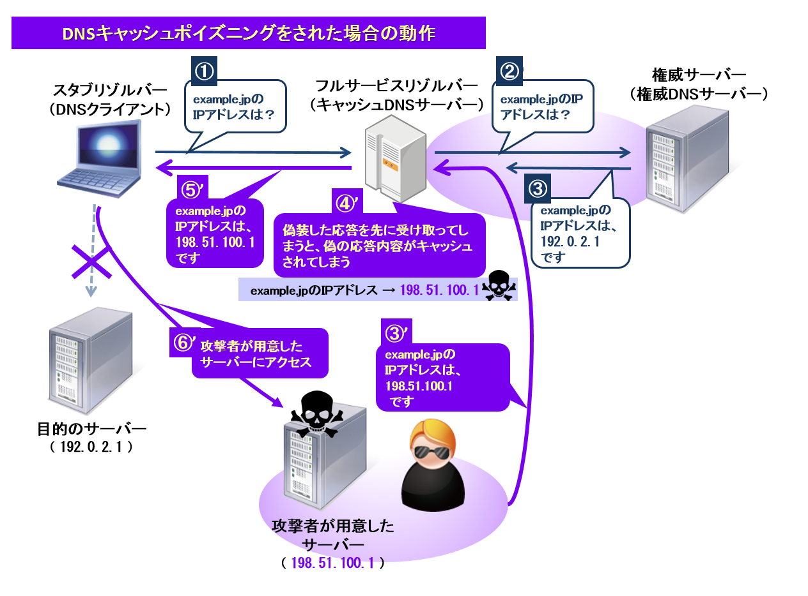

### EDNS とは

- DNS の機能を拡張する技術のこと

    - DNS で送受信されるメッセージ形式の規格の一つという説明も見受けられた

 

- Extension mechanisms for DNS の略

 

- 512 バイトを超える大きなメッセージを UDP で扱えるようにすることができる技術

    - 従来の DNS では扱うことのできる DNS 問い合わせのデータサイズは 512 バイトであった

    - DNS では主な通信プロトコルとして UDP が採用されている

 
 

参考サイト

[EDNS とは何ですか? また、DNS をどのように改善してより高速で安全にしますか?]()

[Umbrella: DNS Flag Day の影響について](https://community.cisco.com/t5/tkb-セキュリティ-ドキュメント/umbrella-dns-flag-day-の影響について/ta-p/3792668)

---

### EDNS0 とは

- EDNSのバージョン番号 (0) を示したもの

- 多くの文脈で EDNS ≒ ENDS0 で語られている

---

### ECS (EDNS-Client-Subnet) とは

- EDNS (EDNS0) によって実現される機能の1つ

 

- ECS がサポートされていない従来の DNS の問い合わせは以下の画像の通り、キャッシュ DNS サーバーの IP アドレスで権威 DNS サーバーにドメイン名の問い合わせを行っていた

    

    引用: [EDNS Client Subnet (ECS) とは](https://qiita.com/ugwis/items/11fdc32f823c0052f496#ecs-edns-client-subnet-を試す)

     

    - 従って、回答される IP アドレスはキャッシュ DNS サーバーに近いものが回答されていた

 
 

- ECS をサポートするキャッシュ DNS サーバーは以下の画像の通り、キャッシュ DNS サーバーは権威 DNS サーバーへの問い合わせの際にクライアントの IP アドレスも送信する

    

    引用: [EDNS Client Subnet (ECS) とは](https://qiita.com/ugwis/items/11fdc32f823c0052f496#ecs-edns-client-subnet-を試す)
    
     

    - 従って、回答される IP アドレスはクライアントから近いものが回答される

 

- キャッシュ DNS サーバーが ENDS & ECS をサポートしていなければ従来通りの DNS 問い合わせが行われる

 
 

参考サイト

[EDNS Client Subnet (ECS) とは](https://qiita.com/ugwis/items/11fdc32f823c0052f496#ecs-edns-client-subnet-を試す)

[EDNS Client Subnetとは](https://www.nic.ad.jp/ja/basics/terms/edns-client-subnet.html)

[Amazon Route 53もEDNS-Client-Subnetをサポートしているようだ](https://dev.classmethod.jp/articles/route-53-edns/)

---

### DNSSEC (DNS Security Extensions) とは

- EDNS (EDNS0) によって実現される機能の1つ

 

- ドメイン名の問い合わせの応答を受け取ったサーバーが、その情報が本当に正しいものかを検証する機能

    - 具体的には、権威 DNS サーバーからの応答データに署名を含める

    - 応答を受け取ったキャッシュ DNS サーバーは公開鍵でその応答の正当性を検証する

    

    引用: [DNSトラブルを防ぐポイント、防御策を追加するより大事な習慣とは](https://xtech.nikkei.com/atcl/nxt/column/18/01419/091000004/?P=2)

 

- [キャッシュポイズニング](#キャッシュポイズニングとは)に対する防御手段

 

- DNSSED を利用したい場合、キャッシュ DNS サーバーは EDNS をサポートしている必要がある

 

- キャッシュ DNS サーバーおよび、権威 DNS サーバー共に、DNSSEC に対応している必要がある

 
 

参考サイト

[DNSSECの役割と動作の概要](https://atmarkit.itmedia.co.jp/ait/articles/1104/13/news120.html)

[DNSSECのしくみ](https://www.itbook.info/network/dns5.html)

[DNSSECの基礎を理解して、実際のレコードを確認してみた](https://techblog.asia-quest.jp/202312/understanding-the-basics-of-dnssec-and-checking-actual-records)

[DNSSECの概要](https://www.nic.ad.jp/ja/materials/iw/2015/proceedings/t5/t5-harada.pdf)

[【図解】初心者にも分かりそうなDNSSECの仕組みと機能,シーケンス～キャッシュポイズニングと対策,普及/対応状況,KSKとZSKを分ける意義～](https://milestone-of-se.nesuke.com/l7protocol/dns/dnssec-summary/)

[権威DNS DNSSEC対応](https://www.nic.ad.jp/ja/materials/iw/2012/proceedings/t9/t9-Yamaguchi.pdf)

---

### キャッシュポイズニングとは

引用: [DNSキャッシュポイズニングとは？攻撃の仕組みと効果的な対策を5分解説](https://office110.jp/security/knowledge/cyber-attack/dns-cache-poisoning)

 

引用: [DNSキャッシュポイズニング](https://jprs.jp/glossary/index.php?ID=0171)

 

- 権威 DNS サーバーからキャッシュ DNS サーバーへの応答を改ざんし、悪意のあるサイトなどにユーザーを誘導させる攻撃手法

- 悪意のあるサイトの IP アドレスがキャッシュ DNS サーバーに残るのでキャッシュポイズニング

 
 

参考サイト

[DNSキャッシュポイズニングとは？攻撃の仕組みと効果的な対策を5分解説](https://office110.jp/security/knowledge/cyber-attack/dns-cache-poisoning)

[DNSキャッシュポイズニング](https://jprs.jp/glossary/index.php?ID=0171)