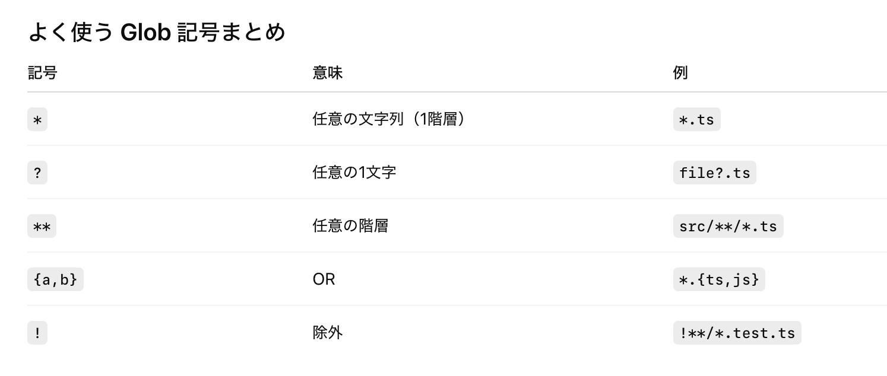
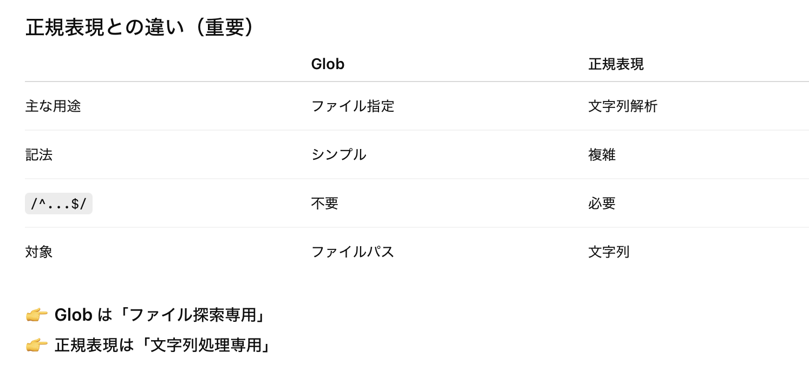

### グロブとは (Glob Pattern)

- ファイルやフォルダを指定する際に使われるパターン

<br>

#### グロブで使える記号



<br>

- tsconfig.json の include フィールドなどでグラブパターンを使うこともできる

    ```json
    {
        "include": ["src/**/*.{ts, tsc}"]
    }
    ```

    <br>

    

<br>
<br>

参考サイト

[グロブパターンの理解](https://code2prompt.dev/ja/docs/explanations/glob_patterns/)

[glob（グロブ）](https://atmarkit.itmedia.co.jp/ait/articles/1708/29/news025.html)

[Glob と正規表現の違い](https://zenn.dev/yukionodera/articles/difference-between-glob-regexp)

---

### グロブと正規表現の違い

