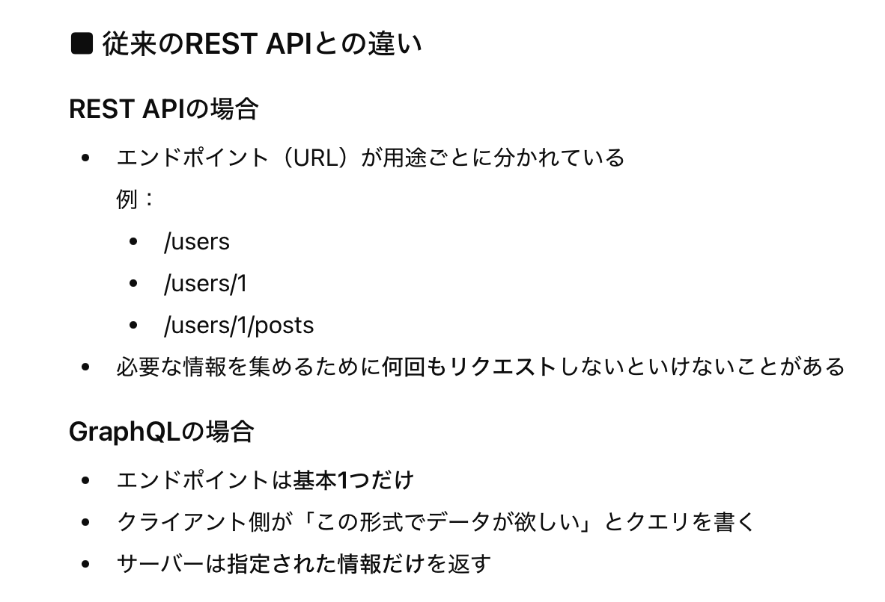
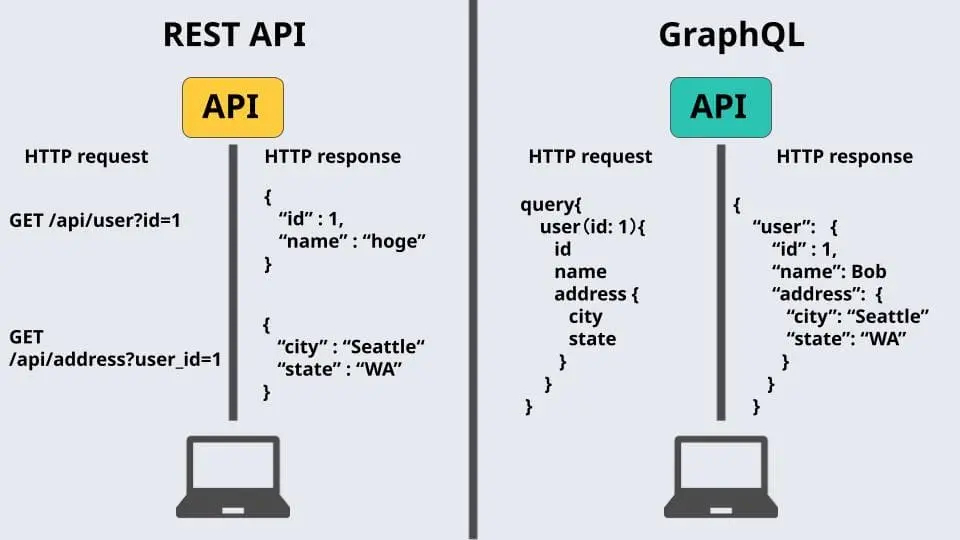
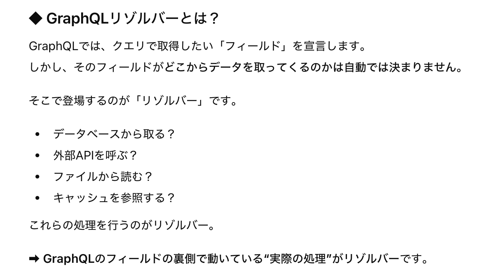
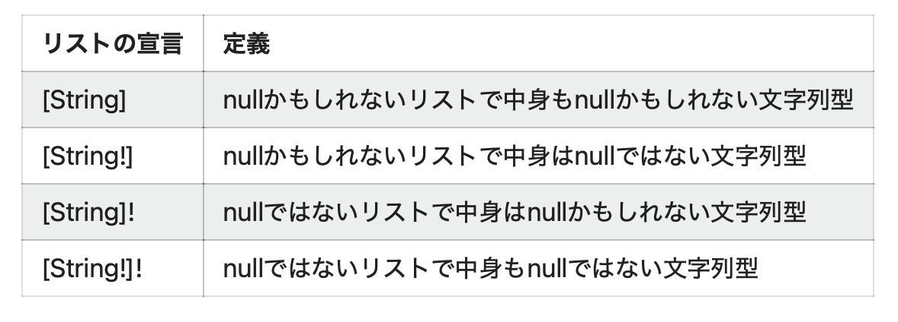
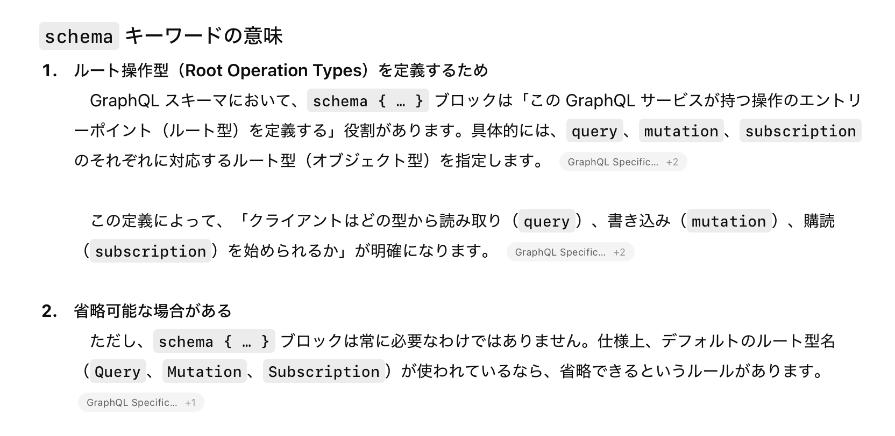

### GraphQL とは

- Facebook が開発した API のクエリ言語であり、API の仕組みでもある

- 通信プロトコルは HTTP/HTTPS に限らない

<br>

#### REST API との違い


引用: [AppSyncを理解するために、GraphQLについてまとめてみた](https://benjamin.co.jp/blog/technologies/graphql_for_appsync/#graphql)

<br>



<br>

- ##### REST API

    - 取得できるデータは操作対象のリソース&メソッドによって決まる

<br>

- ##### GraphQL

    - エンドポイント (URL) は基本的に1つ

    - (HTTP/HTTPS の場合) 利用するメソッドは基本的に POST 

        - クエリをリクエストボディに含めるから

        - GET メソッドを使って、クエリをリクエストパラメータに含めてもいいけど、そこまでする意味はない

<br>

#### GraphQL のメリット/デメリット

- メリット
    - クエリに必要なデータのみを指定することで、過不足なくデータを取得可能
        
        

        引用: [エンジニア初学者におすすめ GraphQLの基礎と簡単なクエリ例](https://envader.plus/article/419)

        <br>

        - 一方、REST API の場合はデータの過不足が発生することがある

            

<br>

- デメリット

    - REST API と比べると学習コストが高い

    <br>

    - クエリ内容によっては、サーバー側の負荷が大きくなる

    <br>

    - キャッシュ管理が難しい

        - エンドポイントが1つで、リクエストごとにクエリが異なることがほとんどなので、[キャッシュキー](#キャッシュキー)が決めれない

    <br>

    - エラー処理が複雑

        - GraphQL では、レスポンスの HTTP ステータスコードは基本に 200 (バックエンド側の処理の成功/失敗に関わらず)

        - エラー情報はレスポンスの errors フィールド に格納される
<br>
<br>

参考サイト

[【今話題！】GraphQLとは？RESTとの違いやできること、仕組みを詳しく解説！](https://jitera.com/ja/insights/39795)

[GraphQLとRESTの比較](https://hasura.io/learn/ja/graphql/intro-graphql/graphql-vs-rest/)

[GraphQLのエラーハンドリングが分かりづらすぎるので整理する](https://zenn.dev/minamiso/articles/994e56830e42e1)

---

### GraphQL で大事な概念、用語

- **[スキーマ](#スキーマ)**

<br>

#### クエリ

- 文脈によって複数の意味を持つ

    1. データを読み取るためのリクエストとしてのクエリ (クライアントが送る実行操作としてのクエリ)
    
        - GraphQL のクエリとは**完全に読み取り専用で副作用 (データ変更) を起こさない**読み取り操作

        - REST API でいう GET
    
    <br>

    2. スキーマに定義する*読み取り用のエンドポイントの集合*としての[クエリ](#クエリ型-query) (GraphQL サーバーで定義するクエリ)

<br>

#### ミューテーション

- 文脈によって複数の意味を持つ

    1. データを作成、更新、削除するためのリクエストとしてのミューテーション (クライアントが送る実行操作としてのミューテーション)

        - REST API でいう POST, PUT, DELETE
    
    <br>

    2. スキーマに定義する*データ操作 (作成、更新、削除) 用のエンドポイントの集合*としての[ミューテーション](#ミューテーション型-mutation) (GraphQL サーバーで定義するミューテーション)

<br>

#### サブスクリプション

- 文脈によって複数の意味を持つ

    1. GraphQL サーバーがクライアントにリアルタイムでデータをプッシュする仕組み

        

        <br>

        - ★最初にクライアント側から WebSocket を開き、対象のサブスクリプションをリクストして登録する必要がある

        - ★サブスクリプションの持続的な接続は、通常 [WebSocket](./WebSocket.md) を使用して確立される

        - Query / Mutation は都度リクエスト → Response だが、Subscription は 常時接続＋サーバーからのプッシュ

    <br>

    2. スキーマに定義する*プッシュ通知操作用のエンドポイントの集合*としての[サブスクリプション](#サブスクリプション型-subscription) (GraphQL サーバーで定義するサブスクリプション)

<br>

#### リゾルバー

- 多くの場面では、「スキーマで定義したクエリ、ミューテーション、サブスクリプションの実装」を意味する

    

    

    <br>

    - しかし、この考え方だと [Resolver Chain](./GraphQL/GraphQL_Resolver.md#イメージで理解する-resolver-chain) が理解しにくかったので、次の定義をしっかり理解したほうがいい

<br>

- ★正しくは「スキーマで定義した“フィールド”に対応する値を返すための関数」

    

    - 詳しくは[こちら](./GraphQL_Resolver.md)を参照

<br>
<br>

参考サイト

[エンジニア初学者におすすめ GraphQLの基礎と簡単なクエリ例](https://envader.plus/article/419)

[GraphQL入門：基本概念とクエリの書き方を一通り体験しよう](https://zenn.dev/dotdtech_blog/articles/994a7e82f98fb8#リゾルバ定義)

[ApolloでgraphQLのsubscriptionを実装したはなし](https://zenn.dev/meii/articles/a3710fc09104b6)

[GraphQLのリゾルバ（Resolver）とは](https://qiita.com/NagaokaKenichi/items/86272f2f654070b06488)

---

### スキーマ


<br>

- API 全体の型定義の設計図

    - GraphQL API が提供するデータや操作の構造をまとめたもの

<br>

- スキーマで定義できるデータ型は以下の通り

    - #### スカラー型 (Scalar)

        

        <br>

        - ★主にオブジェクトのフィールドの型として利用される

        <br>

        - 単独では定義できないし、する必要がない

            ```graphql
            type User { #User型オブジェクト
                user_id: ID! #スカラー型(ID) のuser_idフィールド
                name: String! #スカラー型(String) のnameフィールド
                age: Int #スカラー型(Int) のuser_idフィールド
            }

            #↓みたいな単独でのスカラー型の定義はできない
            UserName: String 
            ```

        <br>
        
        - 提供されているスカラー型は以下の通り

            - `String`: 文字列

            - `Int`: 整数

            - `Float`: 浮動小数点

            - `Boolean`: 論理

            - `ID`: unique identifier

                - ★★オブジェクトを一意に識別する文字列 → GraphQL 側では文字列として識別される

                - ★★GraphQL 自体は ID が本当に一意かどうかを保証しない

    <br>

    - #### オブジェクト型 (Object)

        

        <br>

        - 1つ以上のフィールドを持つデータ構造を定義する型

            - ★フィールドには他のオブジェクト型を含むこともできる

        <br>

        - `type` キーワードで宣言する

        <br>

        - ★クエリの返り値になる

    <br>

    - #### 列挙型 （Enum）

        

        <br>

        - Enum は 固定の選択肢を持つ型

            - Enum 型で列挙する値は小文字でも別にいいが、慣例としては全て大文字&単語間のつなぎ文字は`_`

        <br>

        - `enum`キーワードで宣言する

        <br>
    
        - ★Enum 型を受けるクエリに対して列挙されていない値を受け取った場合、 GraphQL サーバー側でバリデーションエラーになる (DB などへデータを取得する前にエラーにする)

    <br>

    - #### インターフェース型 （Interface）

        

        <br>

        - 他のプログラミング言語の interface と同じで、オブジェクトが実装すべきオブジェクトが実装すべきフィールドを定義した型

        <br>

        - ★`interface` キーワードで宣言する

        <br>

        - ★他のオブジェクト型は `implements` キーワードでその interface を実装する

        <br>

        - クエリやミューテーション、サブスクリプションの戻り値のデータ型としても指定できる

            - ★★実際のクエリなどから返ってくるのは実装した具体的な型

            - ★★しかし、戻り値でアクセスできるフィールドは Interface が持つフィールドのみ (Java などをイメージするとわかりやすい)

                

        <br>

        - ★interfaceで Nullable で定義したフィールドは実装オブジェクトで Non-Null に変更することが可能 (**実装タイプのフィールドは Interface のフィールド型の“サブタイプ”であればOK**)

            

            <br>
            
            - ★★同様に interface で定義したフィールドの具体クラスを実装オブジェクト側で定義することも可能

    <br>

    - #### ユニオン型（Union）

        

        <br>

        - 複数の型のうち1つを返す型

            - [TypeScript のユニオン型](https://typescriptbook.jp/reference/values-types-variables/union)と同じ

        <br>

        - ★`union` キーワードで宣言し、`=` で対象の型を指定する

        <br>

        - ★ユニオン型の対象に interface 型を含めることはできない → オブジェクト型のみ

            

    <br>

    - #### 入力型 (Input Object)

        

        <br>

        - クエリやミューテーションに引数として渡す複雑なオブジェクトの型を定義するもの
        
        <br>

        - ★`input` キーワードで宣言する

        <br>

        - ★★Input Object のフィールドに定義できるのは スカラー型、Enum 型、他の Input Object 型

        <br>

        - Input Object は [Query](#クエリ型-query)、[Mutation](#ミューテーション型-mutation)、[Subscription](#サブスクリプション型-subscription) の戻り値の型として指定することはできない

    <br>

    - #### クエリ型 (Query)

        

        <br>

        - GraphQL におけるエンドポイント定義 (**データ取得用**)

            - ここでの「エンドポイント」とは REST API でのエンドポイント (URL) とは異なり、当GraphQL API が提供するデータ取得用操作の入り口のイメージ

                

        <br>

        - `type` キーワードで宣言する

        <br>

        - プログラムで言うメソッドに近い

        <br>
        
        - ★引数なしの操作は定義可能だが、戻り値なしの操作は定義できない

            

        <br>

        - 戻り値の型にはスカラー型、Enum 型、Object 型を指定することができる

        - ★引数の型に Object 型は指定できない (Input Object、スカラー、Enum 型 は OK)

    <br>

    - #### ミューテーション型 (Mutation)

        

        <br>

        - GraphQL におけるエンドポイント定義 (**データ作成、更新、削除用**)

            - [Query](#クエリ型-query) と書き方は一緒

        <br>

        - `type` キーワードで宣言する

        <br>

        - プログラムで言うメソッドに近い

        <br>

        - ★引数なしの操作は定義可能だが、戻り値なしの操作は定義できない

            

        <br>

        - ★引数の型に Object 型は指定できない (Input Object、スカラー、Enum 型 は OK)

    <br>

    - #### サブスクリプション型 (Subscription)

        

        

        <br>

        - GraphQL サーバー側からクライアントへのプッシュ通知操作エンドポイント定義

            - [Query](#クエリ型-query) と書き方は一緒

        <br>

        - `type` キーワードで宣言する

        <br>

        - [Query](#クエリ型-query)、[Mutation](#ミューテーション型-mutation) と同様に引数なしの操作は定義可能だが、戻り値なしの操作は定義できない

            - ★引数の型に Object 型も指定できない

<br>

- スキーマは SDL（Schema Definition Language）という独自の構造（言語）で書かれる

<br>

- ★オブジェクト名やそのフィールド名、クエリ(ミューテーション、サブスクリプション)名などはスペースを含んではいけない

    

<br>

- フィールドのデータ型を `[]` でくくると、そのフィールドは配列であることを表す

- ★フィールドのデータ型の末尾に `!` をつけると、そのフィールドが Non-Null (Null になることがない) を表す

    - リスト (`[]`) と `!` の組み合わせはいくつかあり、それぞれ意味合いが違うので注意

        

        引用: [GraphQLのスキーマと型定義](https://qiita.com/NagaokaKenichi/items/d341dc092012e05d6606#リスト)

<br>
<br>

参考サイト

[GraphQL - Schemas and Types](https://graphql.org/learn/schema/?utm_source=chatgpt.com)

[スキーマ定義から見たgraphql](https://zenn.dev/urotea/books/ece9493100b5be/viewer/53920c#特殊なプリミティブ型id)

[GraphQLスキーマ完全ガイド | 理解して再利用できるスキーマ解説](https://blog.querier.io/posts/detail/4z6k00um7ivp/)

[GraphQLに入門する](https://qiita.com/jintz/items/c9105dca1725224d36a8)

[GraphQLのスキーマと型定義](https://qiita.com/NagaokaKenichi/items/d341dc092012e05d6606#リストのエクスクラメーションマークマーク)

---

### スキーマ定義中の scehma キーワード



<br>


<br>

- ★★★スキーマ中の[ルート操作型（Root Operation Types)](#ルート操作型root-operation-types) を定義できるキーワード

    - 各オペレーションに対して指定したオブジェクト型をそのルート型にマッピングするキーワード

    - [Query](#クエリ型-query)、[Mutation](#ミューテーション型-mutation)、[Subsceiprion](#サブスクリプション型-subscription) も**普通のオブジェクト型**であり、デフォルトで各オペレーションのルート型にマッピングされているから特別な型

        

<br>

- ★`schema` キーワードで宣言する

<br>

#### ルート操作型（Root Operation Types）


<br>

- ルート型とはスキーマ定義するオペレーション([Query](#クエリ型-query), [Mutation](#ミューテーション型-mutation), [Subscription](#サブスクリプション型-subscription))のエントリーポイント (=名前空間) を表現する型

    - デフォルト (=schema キーワードでの定義がない) の場合

        - クエリオペレーションのルート型は Query オブジェクト (実態は[Object](#オブジェクト型-object))

        - ミューテーションオペレーションのルート型は Mutation オブジェクト (実態は[Object](#オブジェクト型-object))

        - サブスクリプションオペレーションのルート型は Subscription オブジェクト (実態は[Object](#オブジェクト型-object))

<br>
<br>

参考サイト

[GraphQL - Root Operation Types](https://spec.graphql.org/draft/#sec-Root-Operation-Types)

[GraphQLのスキーマと型を学び直した - ルート型](https://qiita.com/inetcpl/items/30ad038d20968199ee5e#ルート型)

[GraphQLのスキーマと型定義 - ルート型](https://qiita.com/NagaokaKenichi/items/d341dc092012e05d6606#ルート型)


---

### カスタムスカラー型

- 独自のスカラー型を作ることができる機能

    - ★★カスタムスカラーはあくまでもスカラー型の1種なので、**1つの値しか持てない**

- `scalar` キーワードで宣言する

    - ★スキーマでは自作の型名だけを宣言する

    - 実際にその独自のデータ型の具体定内容はリゾルバーで記述する必要がある

        - クライアントからサーバーへは文字列で送信される

    

<br>
<br>

参考サイト

[GraphQL Scalars便利だなぁ🚀](https://zenn.dev/yun8boo/articles/a8a9088db88d98)

[GraphQL スキーマ仕様: 組み込みのスカラー型とカスタムスカラー型](https://maku.blog/p/tw75a7p/)

---

### クエリの送信


<br>

- GET で送信する場合はクエリパラメータに含める

<br>

- POST で送信する場合は Body の `query` にクエリを `variables` に変数を含めて送信するらしい

    - ★基本的に POST が使用される

<br>

- ★そもそも、ライブラリを使うことで「どのメソッドで送るのか」や「どこにクエリを含めるのか」を意識しなくてもいいようになっている

<br>

### クエリ文


<br>

- クエリ (POST) はリクエストボディ (JSON の場合) に3つの要素を含む

    - #### query

        - クエリ本体となるGraphQLサーバーへの問い合わせ文

            
    
    <br>

    - #### variables

        - [query](#query) に渡すパラメーター

            

    <br>

    - #### operationName

        - クエリにつける名前みたいなもの ([後のセクション](#操作名有りクエリ)でなぜ名前をつけるのかわかる)

            
            
<br>

- ★操作名無しクエリと操作名有りクエリの2つが存在する

    - #### 操作名無しクエリ

        - query のトップレベルに名前がないクエリ= operationName が null

            
    
    <br>

    - #### 操作名有りクエリ

        - query のトップレベルに名前があるクエリ= operationName に対象の操作名を指定する必要がある

            

        <br>

        - ★1つのクエリに複数操作が含まれている場合は operationName で指定した操作が実行される

            

            - 1つのクエリに複数操作が含まれている場合は operationName で実行したい操作を指定しなければならない

            - しかし、1つのクエリに複数の操作を含める必要性は無い (むしろ1クエリには１操作を心がけるべき)

<br>

- query フィールドの値の先頭の `query` キーワードは **「トップレベルのオペレーションが1つだけが存在」し、「operationName を使わない」** の時だけ省略できる (by [公式](https://spec.graphql.org/October2015/?utm_source=chatgpt.com#sec-Language.Query-Document))

    

<br>

#### Mutation リクエスト

- リクエストボディ中の [query](#query) フィールドの値の先頭に `mutation` を付ける必要がある

    

    <br>

    - ★queryフィールドの値の先頭の mutation は省略できない

<br>

- Mutation でも操作名無しクエリと操作名有りクエリの両方で記述できる

    

<br>
<br>

参考サイト

[GraphQLに入門する](https://qiita.com/jintz/items/c9105dca1725224d36a8)

[呼び出し側から見たgraphql](https://zenn.dev/urotea/books/ece9493100b5be/viewer/8a6467)

---

### キャッシュキー

- キャッシュされたデータを取り出すための鍵（ID）のこと

    - サーバー側で「このリクエストに対するレスポンスを保存しておこう」だったり、「前と同じリクエストだから、サーバーに問い合わせずにキャッシュを返そう」というような場合に、「同じリクエストかどうか」を判断する必要がある

        →その判断に使われるのがキャッシュキー

<br>

- REST では、だいたい URL がキャッシュキー

    ```
    1回目のリクエスト: GET /users/1
    2回目のリクエスト: GET /users/1
    
    同じURLなので、2回目のリクエストはサーバーに問い合わせずにキャッシュに保存したデータを返そうとなる
    ```

---

### 開発手法

- #### スキーマファースト

    - [スキーマ](#スキーマ)から開発を始める手法

    - DB における ER の洗い出しのように、データ構造などから先に考える

    - メリット

        - 保守性が高くなる

    - デメリット

        - スキーマとは別に[リゾルバー](#リゾルバー)の実装が必要になり、スキーマと理ゾルバーの両方の管理・メンテナンスが必要になる

<br>

- #### コードファースト

    - リゾルバーなどの実装から始める方法

    - 多くの場合、他のツールを使ってコードからスキーマを自動生成する

    - メリット

        - コードを書いてしまえばスキーマは自動生成するのでコードのメンテナンスさえしとけばいい

    - デメリット

        - 可読性がスキーマよりも悪い

<br>
<br>

参考サイト

[GraphQLをわかりやすく解説：基本概念と具体例](https://www.issoh.co.jp/tech/details/2924/#i-3)

[GraphQL Server実装におけるSchema FirstとCode Firstの比較](https://zenn.dev/chillnn_tech/articles/15462cffcdecd3)