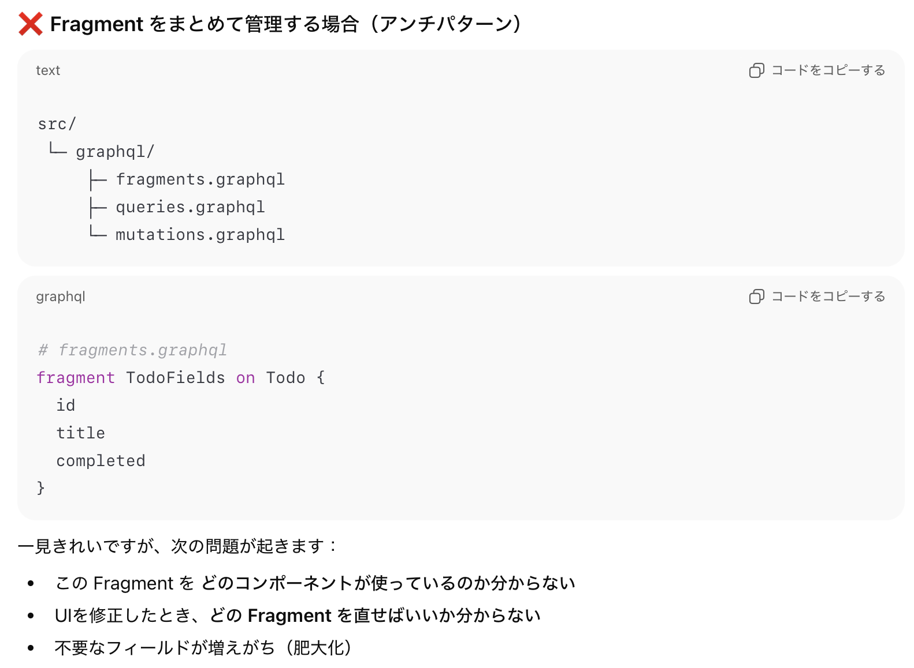

### Fragment とは

- クライアントが送信するクエリ内で再利用できるフィールドの集合を定義することができ機能

    - ★サーバーのスキーマで使い機能ではないことに注意

 

- ざっくりとした使い方は以下の通り

    

 

#### 注意点

- Fragment で定義した場合、クエリ/ミューテーション/サブスクリプションで任意のフィールドを選択することはできない

    

 

- 複数のオブジェクトのフィールドを1つのフラグメントにまとめることはできない

    

 
 

参考サイト

[GraphQLのFragmentについて](https://tech.yukashikado.co.jp/posts/graphql-fragment/)

[【GraphQL】 Fragment Colocation とは](https://qiita.com/terakura-aina/items/9a05f35e9af46a6f09ec)

[GraphQLのFragmentとは？基礎概念、役割、定義方法とメリットを最新の使用例と共に詳しく解説](https://www.issoh.co.jp/tech/details/9660/)

---

### Fragment Colocation とは

- ★Fragment Colocationは **機能ではなく設計手法／考え方（アーキテクチャ・パターン）** を指す

 

- ざっくりいうと **GraphQL Fragment を「どこに」「どう置くか」という設計ルール** のこと

     

    - Fragment Colocation = **UI コンポーネントが必要とするデータは、そのコンポーネントの近くに置く**

     

    
    
     

    

 
 

参考サイト

[【GraphQL】 Fragment Colocation とは](https://qiita.com/terakura-aina/items/9a05f35e9af46a6f09ec)

---

### ApolloClient での Fragment の利用

 

### Fragment を InCacheMemory に保存する方法

 

- ★Fragment をメモリにキャッシュすることで、クエリ文中に fragment 定義をすることなく `...<fragment名>` でフラグメントを利用可能にする

 
 

参考サイト

[Fragments](https://www.apollographql.com/docs/react/data/fragments)