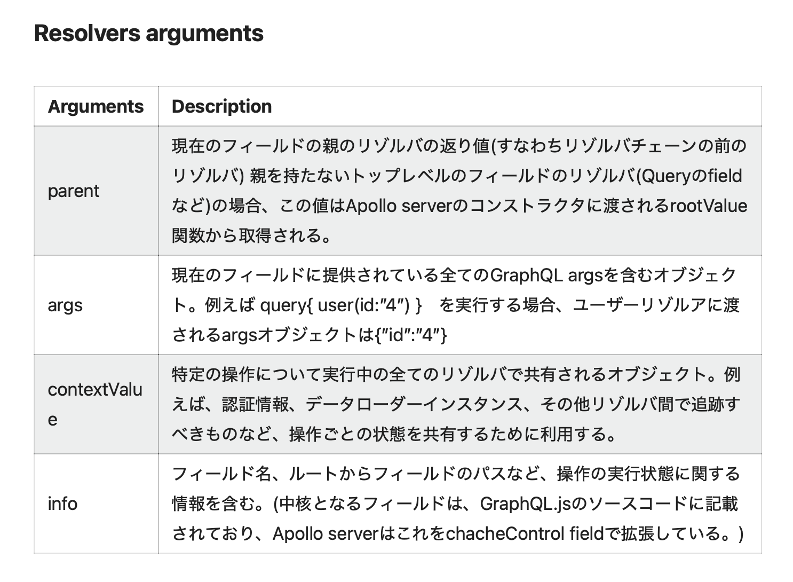
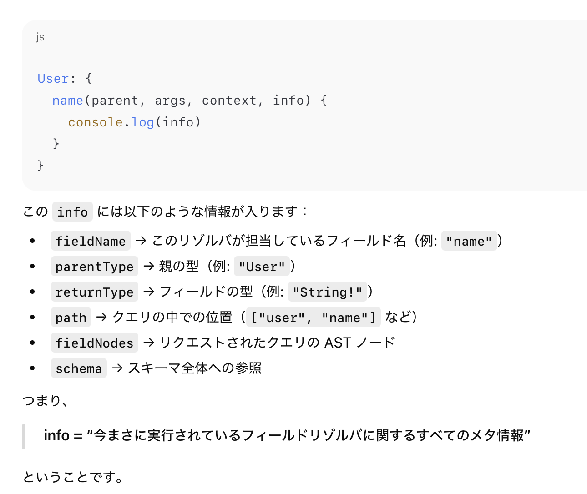

### GraphQL の Resolver

- 「Resolver とは何か」については[こちら](../GraphQL.md#リゾルバー)を参照

---

### Resolver の実装 (Apollo Server)

- Apollo Server については[こちら](./GraphQL_Sample/README.md#apollo-server-とは)を参照

- Resolver の実態はただのオブジェクト

    ```ts
    import { ApolloServer } from "@apollo/server";

    //schema定義
    const typeDefs = `#graphql
        #コメントはハッシュで

        type Book {
           id: ID!
           title: String
           author: String
        }

        type Query {
            #ここにクエリオペレーションの定義
        }
        type Mutation {
            #ここにミューテーションオペレーションの定義
        }
        type Subscription {
            #ここにサブスクリプションオペレーションの定義
        }
    `;

    //★★★resolverの実装★★★
    const resolvers = {
        Query: {
            //ここにschemaで定義したクエリの実装を書く
        },
        Mutation: {
            //ここにschemaで定義したミューテーションの実装を書く
        },
        Subscription: {
            //ここにschemaで定義したサブスクリプションの実装を書く
        }
    };

    //GraphQLサーバーの作成(まだ起動してない)
    const server = new ApolloServer({
        typeDefs, //schemaの登録
        resolvers, //resolverの登録
    });
    ```

    - ★スキーマ定義 (const typeDefs) の先頭行に #graphql をつけると、IDE でハイライトなどの機能が使える

<br>
<br>

参考サイト

[Get Started with Apollo Server](https://www.apollographql.com/docs/apollo-server/getting-started)

---

### Resolver = 「スキーマで定義した“フィールド”に対応する値を返すための関数」 とは


<br>

- 各オブジェクト型のフィールドに対応するリゾルバは**デフォルトリゾルバー**と呼ばれるデフォルトの処理が用意されているが、あえて自前で書くこともできる

    

<br>

#### 実験1

- 以下のように Book のフィールドに対するリゾルバを自前で書いてみた

    ```ts
    // Appolo ServerでGraphQLサーバーを作成
    import { ApolloServer } from "@apollo/server";
    import { startStandaloneServer } from "@apollo/server/standalone";

    //スキーマ定義
    const typeDefs = `#graphql
        type Book{
            id: ID!
            title: String
            author: String
        }

        type Query{
            getBooks: [Books]
        }
    `;

    //データを用意
    const books = [
        { //Book1
            id: "1",
            title: "Kokoro",
            author: "Natsume Sōseki"
        },
        { //Book2
            id: "2",
            title: "Snow Country",
            author: "Yasunari Kawabata"
        },
        { //Book3
            id: "3",
            title: "Anne of Green Gables",
            author: "L.M. Montgomery"
        }
    ];

    //リゾルバの実装
    const resolvers = {
        Query: {
            getBooks: () => {
                return books;
            }
        },
        Book: { //★★★ここ★★★
            title: () => {
                return "Booooook!!";
            },
            author: () => {
                return "It's me!!"
            }
        }
    }

    //GraohQLサーバーの作成
    const server = new ApolloServer({
        typeDefs,
        resolvers,
    });

    //HTTPサーバーの作成&起動
    const { url } = await startStandaloneServer(
        server,
        {
            listen: { port: 4000 },
        }
    );
    ```

<br>

- そして、クエリ (getBook) を実行すると、、、面白い結果が取得できる

    ```graphql
    query GetBooks {
        getBooks {
            title
            author
        }
    }
    ```

    ```json
    //結果: 全てのBookのtitleが"Booooook!!"、authorが"It's me!!"になってる
    {
        "data": {
            "getBooks": [
                {
                    "title": "Booooook!!",
                    "author": "It's me!!"
                },
                {
                    "title": "Booooook!!",
                    "author": "It's me!!"
                },
                {
                    "title": "Booooook!!",
                    "author": "It's me!!"
                }
            ]
        }
    }
    ```

<br>

- 実験結果で、なぜ全ての title が "Booooook!!"、author が "It's me!!" になったのかについては [Resolver Chain](#resolver-chain) が大いに関わっている

    

---

### Resolver Arguments (Apollo Server)

- Apollo Server ではリゾルバ関数は4つの引数を受け取る

    ```ts
    import { ApolloServer } from "@apollo/server";

    //スキーマ定義
    const typeDefs = `
        type Books {
            id: ID!
            title: String
        }

        type Query {
            getBooks: [Book]
        }
    `;

    //リゾルバ実装
    const resolverd = {
        Query: {
            //getBooksフィールドのリゾルバ
            getBooks: (parent, args, context, info) => {
                return [Bookの配列];
            }
        },
        Book: {
            //idフィールドのリゾルバ
            id: (parent, args, context, info) => {
                //省略
            },    
            //titleフィールドのリゾルバ
            titile: (parent, args, context, info) => {
                //省略
            }
        }
    }
    ```

<br>

- リゾルバ関数が受け取ることができる引数は以下の通り

    

    引用: [GraphQLとApollo serverについて](https://qiita.com/Riku_dazo/items/71538cdfaf1cfdd03aa6)

    <br>

- #### 第1引数 `parent`: 親リゾルバの取得結果 (親リゾルバで return した値)

    

<br>

- #### 第2引数 `args`: クライアントからの GraphQL のクエリで渡される引数

    

    <br>

    - ★実は、普通のオブジェクトのフィールドにも引数を定義することができ、リゾルバーの第2引数で受け取ることができる

        

<br>

- #### 第3引数 `context`: リクエスト全体で共有するデータ

    - ★利用する Web サーバー (Express / Fastify / Next.js / Cloudflare Workers / Serverless など) によって context の設定方法が異なるので注意

        - ★★[こちらのページ](https://www.apollographql.com/docs/apollo-server/integrations/integration-index)に GraphQL と統合できる Web サーバーが詳細されているので、利用したいフレームワークのリファレンスページに飛び、context の設定方法を調べる必要がある

    - context のユースケースとしては認証情報、DB クライアント (接続情報)、ログ用オブジェクトなどが挙げられる

    

<br>

- #### 第4引数 `info`: そのリゾルバ自身のメタデータ

    

<br>
<br>

参考サイト

[GraphQLとApollo serverについて](https://qiita.com/Riku_dazo/items/71538cdfaf1cfdd03aa6)

[Resolvers](https://www.apollographql.com/docs/apollo-server/data/resolvers)

---

### Resolver Chain

- クエリ中のフィールドの値が解決されるために実行されるリゾルバ関数の実行の流れ/仕組みのこと

- ★親リゾルバ → 子リゾルバ → さらにその子リゾルバ(孫リゾルバ)... の流れでフィールドの値が解決されていく

<br>

#### イメージで理解する Resolver Chain

1. 以下のコードで GraphQL サーバーを立てるとする

    

<br>

2. 以下のクエリをリクエストしてみると

    ```graphql
    query GetALlLibraries {
        getAllLibraries { #Query.getAllLibrariesリゾルバが解決
            books{ #Library.booksリゾルバが解決
                author { #Book.authorリゾルバが解決
                    name #Author.nameリゾルバが解決
                }
            }
        }
    }
    ```

    

<br>

3. 別のクエリをリクエストしてみると

    ```graphql
    query GetLibraryByBranch {
        getLibraryByBranch { #Query.getLibraryByBranchリゾルバが解決
            books { #Library.booksリゾルバが解決
                title #Book.titelリゾルバが解決
                author { #Book.authorリゾルバが解決
                    name #Author.nameリゾルバが解決
                }
            }
        }
    }
    ```

    

<br>
<br>

参考サイト

[GraphQLとApollo serverについて](https://qiita.com/Riku_dazo/items/71538cdfaf1cfdd03aa6#resolver-chains)

[Resolvers](https://www.apollographql.com/docs/apollo-server/data/resolvers)
