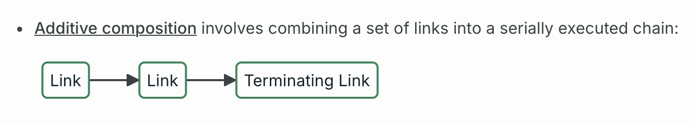
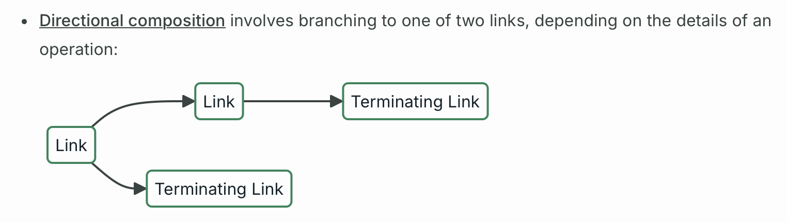

### Apollo Client とは

- GraphQL サーバーに投げるリクエストを簡単にしてくれるライブラリ

<br>

#### 必要なパッケージのインストール

```bash
npm install @apollo/client graphql rxjs
```

- `@apollo/client`

    - Apollo Client 本体

    - 自分のファイル (コンポーネントなど) では、この `@apollo/client` の機能を呼び出す

<br>

- `graphql`

    - コア機能 (@apollo/client が内部で利用している)

<br>

- `rxjs`

    - リアクティブプログラミング用ライブラリ

        - リアクティブプログラミングとは

            

    <br>

    - 主に [Subscription](../../GraphQL.md#サブスクリプション) で使われるっぽい


<br>

#### コードでの利用方法

1. main.tsx で Apollo Client インスタンスの作成

    - ApolloClient インスタンスは [`link`](#apollo-client-における-link) と [`cache`](#apollo-client-における-cache) というプロパティを持ったオブジェクトを引数として渡す必要がある

        - ★Apollo Link v3 までは link の代わりに uri というプロパティも受け取っていたが、v4 からは非推奨になった (by [公式](https://www.apollographql.com/docs/react/v3/api/core/ApolloClient#apolloclientoptions-uri))

        ```ts
        /*
        * main.ts
        **/
        import { StrictMode } from 'react'
        import { createRoot } from 'react-dom/client'
        import './index.css'
        import App from './App.tsx'

        //↓アポロクライアント作成に必要なモジュール
        import { ApolloClient, HttpLink, InMemoryCache, gql } from "@apollo/client";

        //↓アポロクライアントインスタンスの作成
        const client = new ApolloClient({
            link: new HttpLink({
                uri: `https://グラフQLサーバーが動いているドメイン/パス:ポート`
            });,
            cache: new InMemoryCache()
        });

        createRoot(document.getElementById('root')!).render(
            <StrictMode>
                <App />
            </StrictMode>,
        )
        ```

<br>

2. ApolloProvider コンポーネントの作成 & ApoloClient の利用範囲を ApolloProvider コンポーネントで囲む

    - ApolloProvider コンポーネントは client props を持ち、それに ApolloClient インスタンスを指定する

        ```ts
        /*
        * main.ts
        **/
        import { StrictMode } from 'react'
        import { createRoot } from 'react-dom/client'
        import './index.css'
        import App from './App.tsx'
        import { ApolloClient, HttpLink, InMemoryCache, gql } from "@apollo/client";
        //↓ApolloProviderのインポート
        import { ApolloProvider } from "@apollo/client/react";

        const client = new ApolloClient({
            link: new HttpLink({
                uri: `https://グラフQLサーバーが動いているドメイン/パス:ポート`
            });,
            cache: new InMemoryCache()
        });

        createRoot(document.getElementById('root')!).render(
            <StrictMode>
                <ApolloProvider client={clinet}> {/* client props に ApolloClientインスタンスを指定 */}
                    <App />
                </ApolloProvider>
            </StrictMode>
        )
        ```

<br>

3. クエリを実行&結果を表示したいコンポーネントにて ApolloClient を通じてクエリの実行&結果の取得を行う

    - 詳しくは以下を参照

        - [Query を実行](#apollo-client-で-query-実行)

        - [Mutation を実行](#apollo-client-で-mutation-実行)

        <br>

        ```ts
        /* UserList.ts */

        //Queryの実行に必要なモジュールのインポート
        import { gql } from '@apollo/client';
        import { useQuery } from "@apollo/client/react";
        
        const UserList = () => {
            
            const GET_ALL_USER = gql`
                queyr GetAllUser {
                    getAllUser {
                        id,
                        name,
                        age
                    }
                }
            `;

            //ApolloClientが提供するクエリ実行のためのhooksを利用
            const {loading, error, data} = useQuery(GET_ALL_USER);

            //loading中のこのhtml要素
            if (loading) rertun <p>loading...</p>

            //エラーだった時のhtml要素
            if (error) rertun <p>Error: {error.message}</p>

            //データを取得したときのhtml
            return <ul>
                {
                    data.getAllUser?.map((user) => (
                        <li key={user.id}>
                            <p>{user.name}</p>
                            <p>{user.age}</p>
                        </li>
                    ))
                }
            </ul>
        }
        ```

    <br>

    - ちなみに、GetAllUser が呼び出す getAllUser のスキーマ定義は以下の想定

        ```ts
        //server.ts
        const schema = `gql#

            #ユーザーオブジェクト定義
            type User {
                id: ID!
                name: String!
                age: Int
            }

            type Query {
                getAllUser(): [User]
            }
        `;
        ```

<br>
<br>

参考サイト

[Get started with Apollo Client](https://www.apollographql.com/docs/react/get-started)

---

### Apollo Client における Link

- ざっくり理解するとサーバーのミドルウェアのようなもの

    

<br>

- ApolloClient が提供している主な Link は[こちら](./ApolloClient_Link.md)を参照

<br>

- リンクは以下のようにチェーンできる

    - 一連のリンクを直列にチェーンする (Additive Composition)

        

        引用: [Apollo Link overview](https://www.apollographql.com/docs/react/api/link/introduction#the-request-handler)

    <br>

    - Link チェーンを分岐して繋げる (Directional Composition)

        

        引用: [Apollo Link overview](https://www.apollographql.com/docs/react/api/link/introduction#the-request-handler)

<br>

#### Additive Composition

- `ApolloLink.from()` に Link インスタンスの配列を渡すことで Addtivei Composition なチェーンが可能

    ```ts
    import { ApolloClient, ApolloLink, HttpLink, InMemoryCache } from "@apollo/client";
    import { ErrorLink } from "@apollo/client/link/error";

    //requset headers や requset body をカスタマイズするリンク
    const link1 = new ApolloLink((operation, forward) => {
        //処理を記述
        return forward(operation);
    });

    //ネットワークエラーやレスポンスエラーのハンドリングを実装したリンク
    const link2 = new ErrorLink(({ error, operation }) => {
        //処理を記述
    });

    //GraphQLサーバーにHTTPリクエストを送信するターミネイトリンク
    const link3 = new HttpLink({
        uri: "リクエスト先エンドポイント"
    });

    //ApolloClientのlinkプロパティにリンクチェーンを指定する
    const client = new ApolloClient({
        link: ApolloLink.from([ //Link.from() でリンクチェーンを構築
            link1,
            link2,
            link3
        ]),
        cache: new InMemoryCache()
    });
    ```

    

<br>

#### Directional Composition

- `ApolloLink.split()` で分岐条件、チェーン先の Link の登録を行う

    ```ts
    import { ApolloClient, ApolloLink, HttpLink, InMemoryCache } from "@apollo/client";

    //認証チェックを実装したリンク
    const link1 = new ApolloLink((operation, forward) => {
        //処理を記述
        return forward(operation);
    });

    //requset headers や requset body をカスタマイズするリンク
    const link2 = new ApolloLink((operation, forward) => {
        //処理を記述
        return forward(operation);
    });

    //GraphQLサーバーにHTTPリクエストを送信するターミネイトリンク
    const link3 = new HttpLink({
        uri: "リクエスト先エンドポイント"
    });

    //GraphQLサーバーにHTTPリクエストを送信するターミネイトリンク
    const link4 = new HttpLink({
        uri: "リクエスト先エンドポイント"
    });

    /*
    *★★★ここ★★★
    *operationにisAdminがtrueで設定されていればlink2→link3
    *そうでなければlink4に進む
    **/
    const linkChain = link1.split(
        ((operaton) => (operation.getContext().isAdmin)),//分岐条件 (関数)
        ApolloLink.from([link2, link3]),//分岐条件が分岐条件がtrueの場合に続くLink
        link4//分岐条件が分岐条件がfalseの場合に続くLink
    );

    //ApolloClientのlinkプロパティにリンクチェーンを指定する
    const client = new ApolloClient({
        link: linkChain,
        cache: new InMemoryCache()
    });
    ```

    

<br>
<br>

参考サイト

[Apollo Link overview](https://www.apollographql.com/docs/react/api/link/introduction)

---

### Apollo Client における cache

- ApolloClient が提供している Cache クラスは InMemoryCache のみ (2025/12/18時点)

    - ★クライアントのキャッシュに対してクエリを実行し、見つかったらその結果をクライアントに返し、見つからなかったら GraphQL サーバーにクエリをリクエストするイメージ
        
        

<br>
<br>

参考サイト

[Caching in Apollo Client](https://www.apollographql.com/docs/react/caching/overview)

---

### Apollo Client で Query 実行

- `@apollo/client` パッケージに含まれている `react` モジュールにて簡単に Query を実行してくれる `useQuery` というフックが提供されている

    - ★`gql` という関数を使うことでクエリ文字列を DocumentNode にパースしてくれる (useQuery フックは DocumentNode 型の引数を受け取る)

        - クエリの書き方に関しては[こちら](../../GraphQL.md#クエリ文)を参照

    <br>

    - ★userQuery フックは [`useQuery.Result`](https://www.apollographql.com/docs/react/api/react/useQuery#result) 型のオブジェクトを返すので、必要なプロパティを[分割代入](https://developer.mozilla.org/ja/docs/Web/JavaScript/Reference/Operators/Destructuring)で切り出すのが慣例

        ```jsx
        import { gql } from "@apollo/client";
        import { useQuery } from "@apollo/client/react";

        //gql`` で gql を実行するケース (詳しくはタグ関数で検索)
        const GET_ALL_USERS = gql`
            query GetAllUsers {
                getAllUsers {
                    id
                    name
                    age
                }
            }
        `;

        /*
        gql() で gql を実行してもいい
        const GET_ALL_DEPARTMENTS = gql(`
            query GetAllUsers {
                getAllUsers {
                    id
                    name
                    age
                }
            }
        `);
        */

        //getAllUserクエリの結果を分割代入で切り出す
        const { loading: getUserLoading, error: getUserError, data: getUserData } = useQuery(GET_ALL_USERS);

        if (getUserLoading) return <p>loading User Data...</p>;

        if (getUserError) return <p>Error: {getUsrtError.message}</p>

        return <>
            if (getUserData) {
                return 
            }
        </>
        ```

        - ★★コード中の useQuery の結果の分割代入の書き方である `let/const { prop: alias } = obj` は、オブジェクトのプロパティとは異なる名前の変数に分割代入することができる書き方 (詳しくは[こちら](https://developer.mozilla.org/ja/docs/Web/JavaScript/Reference/Operators/Destructuring#新しい変数名への代入)を参照)

<br>

#### 引数を受け取る Query の場合

- `gql` 関数に渡すクエリ文の中で引数を受け取るよう記述する (引数を受け取るクエリ文の書き方については[こちら](../../GraphQL.md#クエリ文))

    ```ts
    import { gql } from "@apollo/client";
    import { useQuery } from "@apollo/client/react";

    //★引数を受け取るようにクエリ文を記述
    const GET_USER = gql`
        query GetUser ($id: ID!) {
            getUser (id: $id){
                id
                name
                age
            }
        }
    `;
    ```

<br>

- ★次に、`useQuery` の第二引数に variables プロパティを持つオブジェクトを渡す

    ```ts
    import { gql } from "@apollo/client";
    import { useQuery } from "@apollo/client/react";

    //引数を受け取るようにクエリ文を記述
    const GET_USER = gql`
        query GetUser ($id: ID!) {
            getUser (id: $id){
                id
                name
                age
            }
        }
    `;

    //★useQueryの第二引数に変数を指定したオブジェクトを渡す
    const {loading, error data} = useQuery(GET_USER, {variables: {id: "1"}});
    ```

<br>

#### TypeScript で実装する場合の注意点

- useQuery で受け取る data は、そのままだと any 型になってしまう

    

<br>

- `@apollo/client` が提供している型情報 (interface) である `TypedDocumentNode` を利用ことで**クエリが受け取る引数のデータ型とクエリの取得結果のデータ型**を定義することができる

    - [codegen と組み合わせる](../codegen.md#クライアント側での利用方法-クエリに用いる型情報ファイルの生成)と簡単に実装できる

<br>
<br>

参考サイト

[Queries](https://www.apollographql.com/docs/react/data/queries)

[構造分解（分割代入）](https://developer.mozilla.org/ja/docs/Web/JavaScript/Reference/Operators/Destructuring#新しい変数名への代入)

---

### Apollo Client で Mutation 実行

- [useQuery](#apollo-client-で-query-実行) と同様に `@apollo/client` パッケージに含まれている `react` モジュールにて簡単に Mutation を実行してくれる `useMutation` というフックが提供されている

    - ★useQuery と違う点として、useMutation の戻り値は配列であり、第1要素に Mutation の実行関数、第2要素に Mutation の実行結果のオブジェクトが格納される

    - ★useQuery と違う点として、useMutation は即座には実行されず、戻り値の第1引数である関数を実行することで Mutation をリクエストする


<br>
<br>

参考サイト

[Mutations in Apollo Client](https://www.apollographql.com/docs/react/data/mutations)
