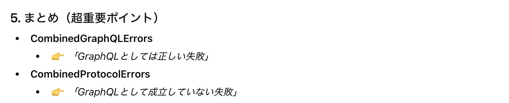

### Apollo Client が提供する代表的な Link 

- #### [ApolloLink](#apollolink-1)

    - ★リクエストデータのカスタマイズなどができる Link クラス

<br>

- #### [ErrorLink](#errorlink-1)

    - GraphQL サーバーからのレスポンスにエラーがあったり、ネットワークエラー発生した場合に**エラーを検知するための Link クラス**

<br>

- #### [RetryLink](#retrylink-1)

    - 一時的な失敗が起きたときに、同じ GraphQL リクエストを自動で再送するための Link クラス

<br>

- ### [HttpLink](#httplink-1)

    - 任意の URI に HTTP/HTTPS リクエストを送信する **terminating link** な Link クラス

---

### ApolloLink

- `@apollo/client` から import する

- ApolloLink はコンストラクター引数にコールバック関数を受け取る

    <br>
    
    - コールバック関数は operation と forward という引数を受け取る

        

        <br>

        

    <br>

    - コールバック関数の中で forward を返さないとエラーが発生するので注意

        - forward は [express のミドルウェアでいう next](https://zenn.dev/ashe/articles/9acf613948475d#ミドルウェアのnext()について) みたいなイメージ

    <br>

    ```tsx
    //main.tsx
     import { ApolloClient, ApolloLink, InMemoeryCache } from "@apollo/client";

    //なんの処理も行わないLink
    const link = new ApolloLink((operation, forward) => {
        return forward(operation);
    });

    //ApolloClientインスタンスの作成
    const client = new ApolloClient({
        link: link,
        cache: new InMemoeryCache()
    })
    ```

<br>
<br>

参考サイト

[ApolloLink](https://www.apollographql.com/docs/react/api/link/apollo-link)

---

### ErrorLink

- ErrorLink は `@apollo/client/link/error` からインポートする

    

<br>

- ErrorLink はコールバック関数をコンストラクタ引数に受け取る

    

<br>

- コールバック関数は `ErrorLink.ErrorHandlerOptions` 型のオブジェクトを引数として受け取る

    

<br>

- ★Error Link はコールバック関数の中で **forward を返さなくてもいい**

    

    <br>

    

<br>

- ★★エラーの検知には `CombinedGraphQLErrors` などの Error クラスを利用する

    

<br>

- ★★★ErrorLink でエラーを検知したとしても、 **Error を thorw しないほうがいいらしい**

    

<br>

#### 各 Error クラスについて

- CombinedGraphQLErrors

    

    

<br>

- CombinedProtocolErros

    

<br>

- LinkError

    

<br>

- LocalStateError

    

<br>

- ServerError

    

<br>

- ServerParseError

    

<br>

- UnconventionalError

    

<br>

#### Error クラスのポイント

- クライアント側のクエリ文に問題があったり、GraphQLサーバーのresolverの実装に問題がある場合は、CombinedGraphQLErrors クラスが ErrorLink の `ErrorLink.ErrorHandlerOptions.error` に入る

    

<br>

- ⇧以外のネットワーク系のエラーなどは CombinedGraphQLErrors **以外**のクラスとしてErrorLink の `ErrorLink.ErrorHandlerOptions.error` に入る

    

<br>
<br>

参考サイト

[ErrorLink](https://www.apollographql.com/docs/react/api/link/apollo-link-error)

[CombinedGraphQLErrors](https://www.apollographql.com/docs/react/api/errors/CombinedGraphQLErrors)

[Handling operation errors](https://www.apollographql.com/docs/react/data/error-handling)

---

### RetryLink

- RetryLink は `@apollo/client/link/retry` からインポートする

    <br>

    ```ts
    import { RetryLink } from "@apollo/client/link/retry";
    ```
<br>

- ★RetryLink はコンストラクター引数に [RetryLink.Options](https://www.apollographql.com/docs/react/api/link/apollo-link-retry#retrylink.options) 型のオブジェクトを受け取る

    

    <br>

    - attemps プロパティは `RetryLink.AttemptsOptions | RetryLink.AttemptsFunction` 型のオブジェクト

        <br>

        - `RetryLink.AttemptsFunction` はリクエスト再送処理を実装できる関数

            

        <br>

        - `RetryLink.AttemptsOptions` はリクエスト再送に関する条件 (プロパティ) を設定できるオブジェクト

            

    <br>

    - delay プロパティは `RetryLink.DelayOptions | RetryLink.DelayFunction` 型のオブジェクト

        <br>

        - `RetryLink.DelayFunction` はリクエスト再送間隔を設定する関数

            

        <br>

        - `RetryLink.DelayOptions` はリクエスト再送間隔を設定するオブジェクト

            

<br>

- ★RetryLink は **ネットワークエラーでのリクエスト失敗時のみ再送信しようとする** が **GraphQL 由来のエラー (レスポンスにerrorsフィールドが設定されている等) では再送信しない**

    

<br>
<br>

参考サイト

[RetryLink](https://www.apollographql.com/docs/react/api/link/apollo-link-retry)

---

### HttpLink

- HttpLink は `@apollo/client` からインポートする

    ```ts
    import { HttpLink } from "@apollo/client";
    ```

<br>

- HttpLink は `HttpLink.Options` 型のコンストラクター引数を受け取る

    

    <br>

    

<br>

- ★HttpLink は Terminating Link なので、[Link チェーン](./ApolloClient.md#apollo-client-における-link) の終端に指定する必要がある

<br>
<br>

参考サイト

[HttpLink](https://www.apollographql.com/docs/react/api/link/apollo-link-http)