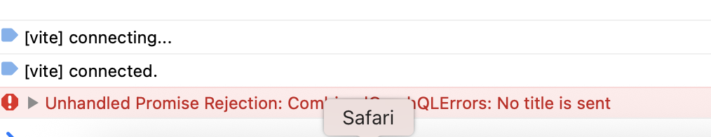

### 事象

- [GragQL + React で Todo 管理アプリを作成](https://qiita.com/Sicut_study/items/13c9f51c1f9683225e2e)していたところ、Todoを作成するクエリ (Mutation) にて、空のデータが飛んできたらサーバー側でエラーを投げるよう実装した

    

 

- ★クライアント側で空のデータを投げたときに、うまくエラーをハンドリングできなかった

    ↓ブラウザのコンソール

    

---

### 原因

- 非同期関数 (async) 内にて、 ミューテーションの実行を await すると error が設定されるよりも前に `Unhandled Promise Rejection` で処理が落ちるから

    

---

### 解決策

- 以下の２つの方法がある

    1. 非同期関数をやめる (お勧めしない)

        

         

        - alert が意図したタイミングとずれて発火する可能性大

            → useMutation の戻り値の第2要素である Result は非同期で反映されるから
        
            

     

    2. `await <ミューテーション実行関数>()` の結果 (エラー) を catch する

        

