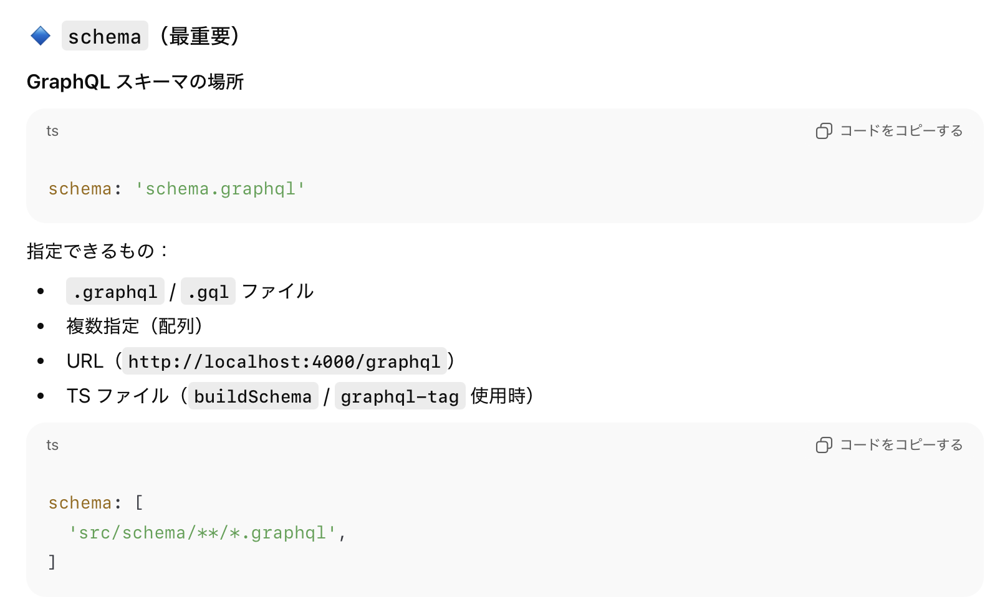
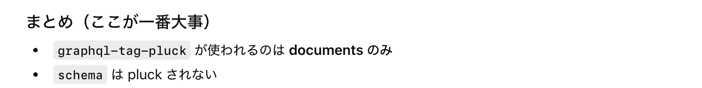

### codegen とは

- GraphQL の[スキーマ](../GraphQL.md#スキーマ) から型定義ファイルを生成してくれるツールのこと

<br>
<br>

参考サイト

[スキーマからコード生成してハッピーになる](https://qiita.com/hitochan777/items/3390ec6a66098bfb552f)

---

### サーバー側での利用方法 (resolver用の型情報ファイルの生成)


<br>

1. 必要なパッケージのインストール

    ```bash
    npm i -D @graphql-codegen/cli @graphql-codegen/typescript-resolvers @graphql-codegen/typescript
    ```

    <br>

    - `@graphql-codegen/cli`

        - codegen 本体

    <br>

    - `@graphql-codegen/typescript`

        - 型定義ファイルを生成するのに必要な codegen のプラグインの1つ

        - ★GraphQL サーバー側のスキーマから型定義ファイルを生成するためのパッケージ
    
    <br>

    - `@graphql-codegen/typescript-resolvers`

        - resolver 実装を型安全にしてくれる型定義ファイルを生成するためのパッケージ

        

<br>

2. codegen 用の設定ファイルを作成する (ts/js)

     - 実態はオブジェクトを export するファイル

    <br>

    - 設定オブジェクトの必須プロパティは以下の2つ (2025/12/19 時点)

        - [schema](#schema)

        - [generates](#generates)

    ```ts
    //codegen.ts
    import { CodegenConfig } from '@graphql-codegen/cli'; //設定オブジェクトの型情報をimport

    const config: CodegenConfig = {
        schema: './schema/**/*.{gql, graphql}',
        generates: {
            './generate/resolvers-types.ts': {
                plugins: [
                    'typescript', 'typescript-resolvers'
                ]
            }
        },
        ignoreNoDocuments: true
    };

    export default config;
    ```

<br>


3. codegen を `npm run ~~` で実行できるように package.json の scripts フィールドに登録

    ```json
    {
        "scripts": {
            "codegen": "graphql-codegen"
        }
    }
    ```

<br>

4. codegen 実行後に型情報ファイルが出力されていることを確認し、resolver を実装しているファイルで生成された型情報ファイルを利用する

    ```ts
    //server.ts

    //生成された型情報ファイルからResolversをimport
    import { Resolvers } from "../generate/resolvers-types"

    //Resolvers型アノテーションでresolverを実装
    const resolvers: Resolvers = {
        Query: {
            //戻り値を誤った型で返している場合 → 型チェックに引っかかる
            getAllTodos: () => {
                return false;
            }
        },
        Mutation: {
            //引数に誤った型を指定している (paramsは本当はstring) → 型チェックに引っかかる
            createTodo: (_: never, param: {id: number}) => {
                //省略
            }
        }
    }
    ```

    <br>

    - ちなみに、codegen で生成した型情報ファイルは Resolvers 以外の型情報 (もっと細かいレベル Query, Mutation の型情報) も含んでいるので、以下のような使い方もできる

        ```ts
        //server.ts

        //生成された型情報ファイルからQuery, Mutationをimport
        import { Query, Mutation } from "../generate/resolvers-types"

        //{クエリプロパティ: Query型, ミューテーションプロパティ: Mutation型}の型アノテーションでresolverを実装
        const resolvers: {Query: Query, Mutation: Mutation} = {
            Query: {
                //戻り値を誤った型で返している場合 → 型チェックに引っかかる
                getAllTodos: () => {
                    return false;
                }
            },
            Mutation: {
                //引数に誤った型を指定している (paramsは本当はstring) → 型チェックに引っかかる
                createTodo: (_: never, param: {id: number}) => {
                    //省略
                }
            }
        }
        ```

    <br>

    - ちなみにスキーマ定義は以下のような感じ

        - todo.gql

            ```gql
            type Todo {
                id: ID!
                title: String
                completed: Boolean
            }
            ```
        
        <br>
        

        - todo.query.gql

            ```gql
            type Query {
               getAllTodos: [Todo!]
            }
            ```
        
        <br>

        - todo.mutation.gql

            ```gql
            type Mutation {
                createTodo(title: String): Todo!
            }
            ```

<br>
<br>

参考サイト

[Guide: GraphQL Yoga / Apollo Server](https://the-guild.dev/graphql/codegen/docs/guides/graphql-server-apollo-yoga)

[Generating Types from a GraphQL Schema](https://www.apollographql.com/docs/apollo-server/workflow/generate-types)

---

### クライアント側での利用方法 (クエリに用いる型情報ファイルの生成)

*本セクションではApolloClientを利用する


<br>

1. 必要なパッケージのインストール

    ```bash
    npm install -D @graphql-codegen/cli @graphql-codegen/typescript @graphql-codegen/typescript-operations
    ```
    
    - `@graphql-codegen/cli`

        - codegen 本体

    <br>

    - `@graphql-codegen/typescript`

        - 型定義ファイルを生成するのに必要な codegen のプラグインの1つ

        - ★GraphQL サーバー側のスキーマから型定義ファイルを生成するためのパッケージ

    <br>

    - `@graphql-codegen/typescript-operations`

        - 型定義ファイルを生成するのに必要な codegen のプラグインの1つ
        
        - ★クライアント側のクエリを投げているファイルなどから型情報ファイルを生成するためのパッケージ
        
<br>

2. codegen 用の設定ファイルを作成する (codegen.ts)

    - 実態はオブジェクトを export するファイル

    - 設定オブジェクトの必須プロパティは以下の2つ (2025/12/19 時点)

        - [schema](#schema)

        - [generates](#generates)

        ```ts
        //codegen.ts
        import { CodegenConfig } from '@graphql-codegen/cli'; //設定オブジェクトの型情報をimport

        const config: CodegenConfig = {
            scheam: './schema/**/*.{gql, graphql}',
            generates: {
                'output.ts': {
                    plugins: [
                        'typescript',
                        'typescript-operations'
                    ]
                }
            }
        }
        export default CodegenConfig
        ```

<br>

3. codegen を `npm run ~~` で実行できるように package.json の scripts フィールドに登録

    ```json
    {
        "scripts": {
            "codegen": "graphql-codegen"
        }
    }
    ```

<br>

4. codegen 実行後に型情報ファイルが出力されていることを確認し、クエリを投げている&取得したデータを使っているファイルで生成された型情報ファイルを利用する

    - ★`@apollo/client` パッケージが提供している TypedDocumentNode と言う型を import と一緒に利用するのを[公式が推奨](https://www.apollographql.com/docs/react/data/typescript#using-operation-types)している

        ```tsx
        //App.tsx
        import './App.css'
        import { gql, type TypedDocumentNode } from '@apollo/client';
        import { useQuery } from "@apollo/client/react";

        //↓生成した型情報ファイル
        import type { GetTodosQuery, GetTodoQueryVariables } from "../dist/query-types";

        //↓★クエリに対してTypedDocumentNode+生成した型情報を型アノテーションで使う
        const QUERY: TypedDocumentNode<GetTodosQuery, GetTodoQueryVariables> = gql`
            query GetTodo ($ID: String!) {
                getTodo (ID: $ID) {
                title
                completed
                }
            }
        `;

        return (
            <>
                {/*型情報を利用しているから、dataオブジェクトにTodoプロパティ (オブジェクト) があることがわかる*/}
                {/*型情報を利用しているから、Todoプロパティ (オブジェクト) は title と completed と言うプロパティを持つのもわかる*/}
                <p>{data?.Todo?.title}</p>
                <p>{data?.Todo?.completed}</p>
            <>
        ):
        ```

<br>

#### ポイント

- クライアント側での codegen が生成するのは、useQuery などで取得したデータや、引数(variables) の型定義ファイル

    

<br>

- 一方で、gql`` に記述されたクエリのチェックには効果は発揮しない

    - ★でも、codegen で型情報を生成する際にクエリに間違いがあれば、エラーが吐かれるので、そこで間違いを検知することはできる

        

<br>
<br>

参考サイト

[GraphQL Codegen](https://www.apollographql.com/docs/react/development-testing/graphql-codegen)

---

### codegen 設定ファイルの主な各項目

- #### schema

    

<br>

- #### documetns

    

    <br>

    - ★サーバー側のスキーマ定義ではなく、クライアント側のQuery / Mutation / Subscription を実行しているファイルを指定する

    

<br>

- #### generates

    - ざっくり言うと codegen で生成するファイルについての設定項目

    

    <br>

    - ##### generates.plugins

        

    <br>

    - ##### generates.preset

        - 複数の [plugins](#generatesplugins) をまとめたテンプレートみたいなイメージ

        

    <br>

    - ##### generates.schema

        

    <br>

    - ##### generates.documents

        
        
    <br>

    - ##### generates.config

        - [generates.schema](#generatesschema) や [generates.documents](#generatesdocuments) と同じように、アウトプット単位の config 設定

    <br>

    - ##### generates.overwrite

        - [generates.schema](#generatesschema) や [generates.documents](#generatesdocuments) と同じように、アウトプット単位の overwrite 設定

<br>

- #### config

    - [generates.plugins](#generatesplugins) に渡す設定項目のためのフィールド

    

    <br>

    - ルートの config は全 generates.plugins に反映される

    - ★Config は全体 (ルート) レベル、アウトプットレベル、プラグインレベル で設定でき、優先順位は **プラグインレベル config > アウトプットレベル config > 全体レベル config**

        

<br>

- #### overwrite

    - 前回の codegen によって生成したファイルを今回の codegen の実行の際に上書くかどうか

    

<br>

- #### require

    - **npm install (-D) 済み**モジュールを codegen 実行前に動かす項目

    

<br>

- #### pluckConfig

    - graphql-tag-pluck 用の設定項目

    

    <br>

    - ★graphql-tag-pluck は [documents](#documetns) で指定したファイルのみに対して機能する
    
        → [schema](#schema) に対しては機能しない = js, ts ファイル中のスキーマから型情報ファイルを生成することはできない

        

    <br>

    - `pluckConfig` は以下の3つのサブフィールドを持つ

        
        
        <br>

        - pluckConfig.modules

            
        
        <br>

        - pluckConfig.gqlMagicComment

            - コードの中で SDL として抜き出す対象としての文字列中のコメント (にある識別子) を指定する

            

        <br>

        - pluckConfig.globalGqlIdentifierName

            - コードの中で SDL として抜き出す対象として認識するための[タグ関数](https://github.com/MasaGt/javascript/blob/18846125ebec7f2fac74b4463de3d3add00caeef/%E3%82%BF%E3%82%B0%E9%96%A2%E6%95%B0.md) を指定する

            

<br>

- #### ignoreNoDocuments

    

<br>
<br>

参考サイト

[codegen.ts file](https://the-guild.dev/graphql/codegen/docs/config-reference/codegen-config)