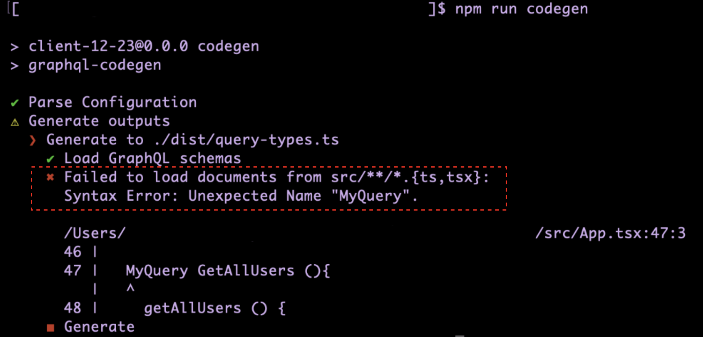

### 事象

- サーバー側のスキーマ定義にて [schema キーワード](../../GraphQL.md#スキーマ定義中の-scehma-キーワード)を使ってクエリのルート型を Query から MyQuery に変更した

    ```graphql
    schema {
        query: MyQuery
    }

    type User {
        id: ID!
        name: String
        age: Int
    }

    type MyQuery {
        getAllUsers(): [User] 
    }
    ```

<br>

- クライアント側でクエリを以下のように書いた

    ```tsx
    //App.tsx
    import { gql } from "@apollo/client"

    const QUERY = gql`
        MyQuery MyOperation {
            getAllUsers {
                id
                name
                age
            }
        }
    `;

    const App = () => {
        return <></>
    }
    ```

    

<br>

- **codegen** でクライアント側で使う型情報ファイルを生成しようとしたところエラーが発生

    
    
---

### 原因

- サーバー側のスキーマ定義で Query/Mutation/Subscription のルート型が変更されていても、**クライアント側で投げるクエリ文には影響しない**

    →クライアントのクエリ文を修正する必要はない

---

### 解決策

- MyQuery ではなく 普通に qurey キーワードを使う

    ```diff
    //App.tsx
    import { gql } from "@apollo/client"

    const QUERY = gql`
    -    MyQuery MyOperation {
    +    query MyOperation {
            getAllUsers {
                id
                name
                age
            }
        }
    `;

    const App = () => {
        return <></>
    }
    ```