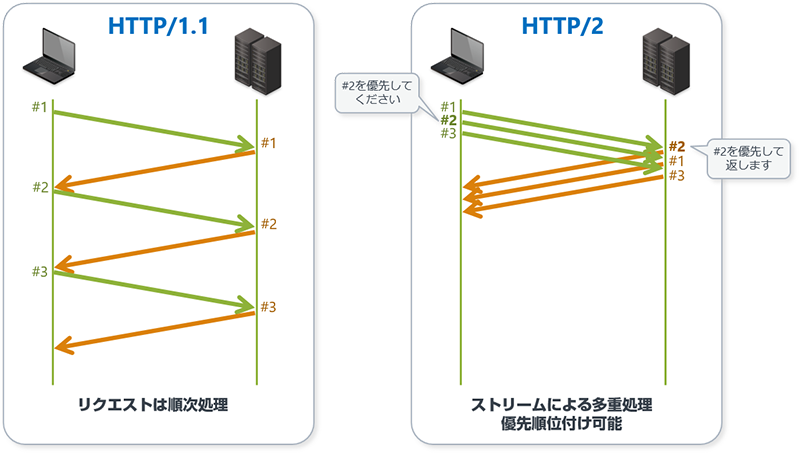

### HTTP/2 とは

Web の通信プロトコルである HTTP の新しいバージョン (v2)

以前のバージョンは HTTP/1.1

---

### 大まかな HTTP/1.1 と HTTP/2 の比較

HTTP/1.1
- １つのリクスト&レスポンスの処理が終わってから、次のクリエスト&レスポンスが開始される

HTTP2
- 複数のリクエスト&レスポンスを並行処理するようになった

 

その他の進化も相まって、 HTTP2 を利用すると Web ページの表示速度の向上が期待できる

 

参考サイト1: [HTTP/2 とは？](https://www.cybertrust.co.jp/blog/ssl/knowledge/http2.html)

参考サイト2: [【図解】HTTP/2って？HTTP/1.1との違いと導入メリット・課題まとめ](https://www.kagoya.jp/howto/it-glossary/security/http-2/)

参考サイト3: [HTTP/2 とは？ HTTP/2 対応のレンタルサーバーでサイトを高速化させよう](https://knowledge.cpi.ad.jp/basic-knowledge/http2-help/)

---

### HTTP/2 を利用するための条件

Web サーバーとブラウザの間の通信を、HTTPS 通信にする必要がある

(Web サイトの全てのページを HTTPS 通信にする必要がある)
