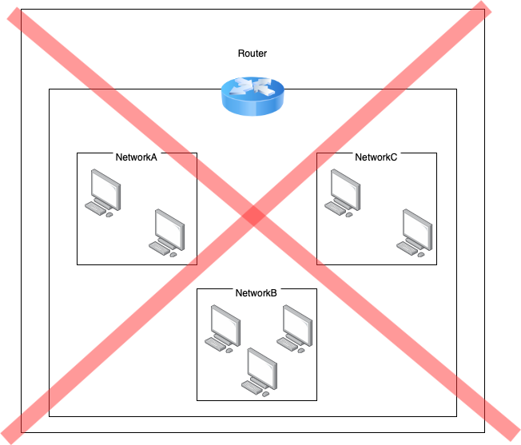
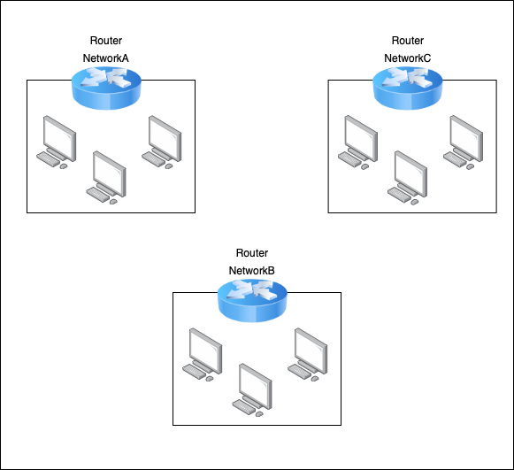
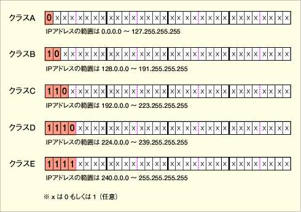
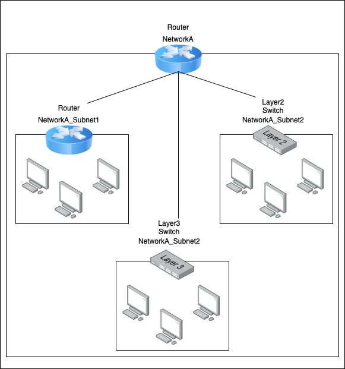

# Index

1. [IP アドレスとは](#ip-adress)
2. [IP v4 と IP v6](#ip-version)
3. [グローバル IP アドレスとプライベート IP アドレス](#global-private)
4. [IP アドレスのネットワーク部とホスト部](#ip-segment)
5. [クラス](#class)
6. [ネットワークアドレスとブロードキャストアドレス](#reserved_ip)
7. [各クラスごとの利用可能なネットワーク数](#network_num)
8. [クラス (アドレスクラス) による弊害](#disad-class)
9. [サブネット化](#subnetting)
10. [CIDR](#cidr)
11. [サブネットマスク](#subnet-musk)

---
<div id="ip-adress"></div>

### IP アドレスとは

IP アドレス: TCP / IP, IP 通信プロトコル[^tcp/ip] を使用するネットワークにて、個別のコンピューターを識別するために割り当てられる番号 (イメージ: 現実世界での住所や郵便番号)

[^tcp/ip]: TCPとIPを組み合わせた通信プロトコル

[TCPについてはこちらを参照](./TCP.md)

---
<div id="ip-version"></div>

### IP v4 と IP v6

IP v4

- 32ビットからなる IP アドレスの形式

- 例： 11000000 10101000 00000001 00000011 これはコンピュータが実際に利用する際の形式。

- 人間が認識できるように上記の IP アドレスを8ビットずつピリオドで区切り、それぞれを10進数で表すと 192.168.1.3 となる

<br>

IP v6

- IP v4 の4倍の 128 ビットからなる IP アドレスの形式

- 例: 0010000 000000001 0000000 011010011 00000000 00000000 00000000 00000000 00000010 10101011 00000000 0010001 11111110 00100101 10001011 01011101 これはコンピューターが実際の利用する際の形式

- 人間が認識できるように上記の IP アドレスを16ビットずつコロンで区切り、それぞれを $\color{red}{16進数}$ で表すと以下の画像のようになる

```
*2進数 -> 16進数の変換は
1. 2進数を4ビットごとに区切り10進数へ変換
2. その後、変換した10進数をさらに16進数へ変換する

例 11111110 00100101 を16進数へ変換する

2進数: 1111 1110 0010 0101
10進数: 15   14    2    5 
16進数: FE25
```

<br>


参照: [IPv6 - addressing](https://www.infraexpert.com/study/ipv6z2.html)

---
<div id="global-private"></div>

### グローバル IP アドレスとプライベート IP アドレス

グローバル IP アドレス

- インターネット上で個々の機器を判別するための IP アドレスのこと

- 世界中で一意でなければならない (自分宛のデータが他の機器に送信されたら大問題)

- グローバル IP アドレスが割り振られるのはルーター

- 2011年で IPv4 のグローバル IP アドレスは枯渇し、　IPv6 の IP アドレスが払い出されている。
    - どうしてもIPv4 の IP アドレスを使いたい場合は、他の企業から買い取るなどしないと無理らしい

<br>

プライベート IP アドレス

- LAN 上で個々の機器を判別するための IP アドレス

- LAN 上で一意

- プライベート IP アドレスが割り振られるのは LAN に接続しているコンピューター機器

<br>


参照: [グローバルIPアドレスとプライベートIPアドレスの違いとは？【初心者向け・図解付】](https://www.gate02.ne.jp/media/it/column_98/#グローバルIPアドレスとプライベートIPアドレスの違いとは)

---
<div id="ip-segment"></div>

### IP アドレスのネットワーク部とホスト部

- グローバル/プライベート IP アドレスには「ネットワーク部」と「ホスト部」がある

- IPアドレスは前半がネットワーク部、後半がホスト部で構成される
    - 前半何ビットがネットワーク部で後半何ビットがホスト部なのかについての決まりはない。そのため、[クラス](#class)による分類や[サブネットマスク](#subnet)などで IP アドレスのネットワーク部とホスト部を体系的に定義するのが一般的

<br>

ネットワーク部

- IPアドレスが属しているネットワークを表す部分

<br>

ホスト部

- そのコンピューター機器を示す部分 (グローバルアドレスの場合ルーターを表す部分)


<br>
<br>

$\color{red}{勘違いしていたこと}$

今まで持っていたイメージ
- 1つのルーターに複数のネットワーク(ローカル)を設定できるイメージでいたがそれは間違い



<br>

実際のイメージ図
- 各コンピューター機器は、それが接続しているルーターのネットワークに所属している



参考: [Q．【ご参考】いまさら聞けないインターネット・ネットワーク概論　4／5](https://qa.elecom.co.jp/faq_detail.html?id=4159&category=152)

---
<div id="class"></div>

### クラス

クラスとはネットワークの規模によって IP アドレスの先頭何ビットをネットワーク部に割り当てるかの規定こと

**ホスト部が全て0かホスト部が全て1のIPアドレスは予約され割り当てることができない ([ネットワークアドレスとブロードキャストアドレス](#reserved_ip)を参照)**

5つのクラスがあるが、一般的には以下の3つが利用される

- クラスA
    - 先頭8ビットをネットワーク部、残りの24ビットをホスト部として割り当てる
    - 先頭1ビットは $\color{red}{0}$ で固定
    - 利用可能なネットワーク数は **2^7 - 2**
    - 各ネットワークにて割り当て可能なホスト(コンピューター機器)数は **2^24 - 2** 台 ([ネットワークアドレスとブロードキャストアドレス](#reserved_ip)を除く)

- クラスB
    - 先頭16ビットをネットワーク部、残りの16ビットをホスト部として割り当てる
    - 先頭2ビットは $\color{red}{10}$ で固定
    - 利用可能なネットワーク数は **2^14** (一説では[2^14 - 2](#network_num))
    - 各ネットワークにて割り当て可能なホスト(コンピューター機器)数は **2^16 - 2** 台 ([ネットワークアドレスとブロードキャストアドレス](#reserved_ip)を除く)

- クラスC
    - 先頭24ビットをネットワーク部、残りの8ビットをホスト部として割り当てる
    - 先頭3ビットは $\color{red}{110}$ で固定
    - 利用可能なネットワーク数は **2^21** (一説では[2^21 - 2](#network_num))
    - 各ネットワークにて割り当て可能なホスト(コンピューター機器)数は **2^8 - 2** 台 ([ネットワークアドレスとブロードキャストアドレス](#reserved_ip)を除く)

<br>



参照: [第8回　アドレス・クラスとさまざまなIPアドレス](https://atmarkit.itmedia.co.jp/ait/articles/0301/17/news003.html)

<br>
<br>

上記から各クラスにて以下のことがわかる

- 利用可能なネットワーク数について

    クラスC > クラスB > クラスA

<br>

- 各ネットワークにおいて利用可能なPC数について

    クラスA > クラスB > クラスC

---
<div id="reserved_ip"></div>

### ネットワークアドレスとブロードキャストアドレス

ネットワークアドレス
- ホスト部が全て0の IP アドレスはネットワークアドレスといい、その**ネットワーク自体を表す IP アドレス**として予約されているため、他のPCに割り当てることはできない

<br>

ブロードキャストアドレス
- ホスト部が全て1の IP はブロードキャストアドレスといい、**そのネットワークに属している全てのホストに送信するための IP アドレス** として予約されているため、他のPCに割り当てることはできない

---
<div id="network_num"></div>

### 各クラスごとの利用可能なネットワーク数

IBMなどの説明によると、クラスAについて２つのネットワークアドレスは予約済みのため、利用可能なネットワーク数は 2^7 - 2 = 126  

しかし、クラスBにおいて利用可能なネットワーク数はクラスAのような予約されているものはなく、 2^14 = 16,384  

また、クラスCにおいても利用可能なネットワーク数は 2^21 = 2,097,152

参考1: [IBM: Class A addresses](https://www.ibm.com/docs/en/aix/7.2?topic=addresses-class)

参考2: [GeeksforGeeks: Introduction of Classful IP Addressing](https://www.geeksforgeeks.org/introduction-of-classful-ip-addressing/)

参考3: [IP address: IPアドレスのクラス](https://www.infraexpert.com/study/ip3.html)

<br>
<br>

一方で、 $\color{red}{各クラスのネットワーク部について、全てが0または全てが1となるネットワーク部は予約済みのためネットワークに割り当てることができない}$ と説明するサイトも存在する

上記の説明によると、クラスAで利用可能なネットワーク数は 2^7 - 2 で IBM のものと変わりない

しかし、クラスBで利用可能なネットワーク数は 2^14 - 2 = 16,382

クラスCで利用可能なネットワーク数は 2^21 - 2 = 2,097,150

とのことである

参考1: [TECH+: 割り当てができない例外アドレス](https://news.mynavi.jp/techplus/article/networksyosinsya-8/)

参考2: [TECH+: クラス分けによるネットワーク割り当ての限界](https://news.mynavi.jp/techplus/article/networksyosinsya-9/)

参考3: [ITの基礎知識｜ITパスポート・基本情報: ネットワーク部とホスト部](https://basics.k-labo.work/2017/11/27/ネットワーク層のプロトコル/)

<br>
<br>

しかし、クラスの概念で重要なものは、各クラスA/B/Cにて**何ビットがネットワーク部として利用され、残り何ビットがホスト部として利用されるか**、また、**各ネットワークにおいて、ネットワークアドレスとブロードキャストアドレスはホストには割り当てれない**ということである。

---
<div id="disad-class"></div>

### クラス (アドレスクラス) による弊害

とある会社にて、クラスA で利用できる以上にネットワークを分けたい、でもクラスBになると一気に利用可能なネットワーク数が増え、"そこまでのネットワーク数もいらない"

または、最大で50人ぐらいの社員数の会社でクラスCでIPアドレスを運用しようにも"254のホスト必要ない"みたいなことが起こる

もっと柔軟にIPアドレスのネットワーク部を決めれるようにするために考案されたのがのが[サブネット(subnetting)](#subnetting)
、その中で現在主流なものが[CIDR](#cidr)

---
<div id="subnetting"></div>

### サブネット

1つのネットワークをさらに小さい複数のネットワークに分割すること



<br>

サブネット化の方法の1つに [CIDR](#cidr) が存在する

---
<div id="cidr"></div>

### CIDR (Classless Inter Domain Routing)

**CIDRという言葉1つでサブネット化の方法の1つであるCIDRとCIDR表記のそれぞれを意味する場合があるので文脈に注意**

参考: [【脱ネットワーク初心者】CIDRとCIDR表記](https://envader.plus/article/52)

---
<div id="subnet-musk"></div>

### サブネットマスク

≒ ネットマスク

IP アドレスのうち、どこまでがネットワーク部でどこがホスト部なのかを判別するための記法

ネットワーク部を1、ホスト部を0


