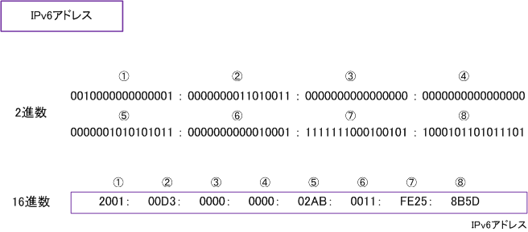
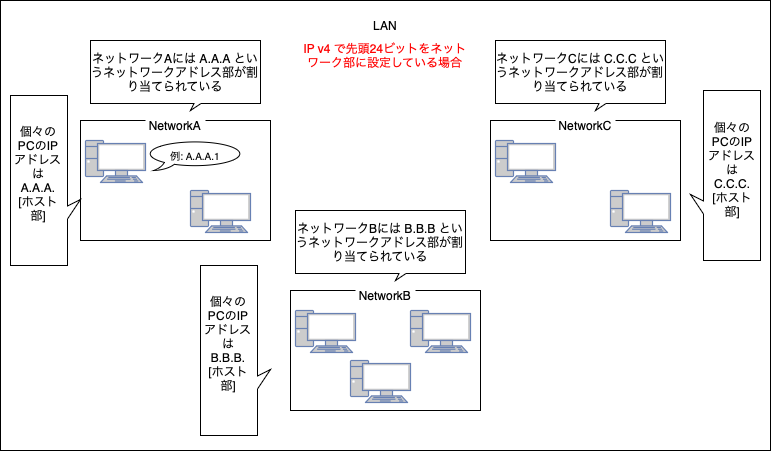

### IP アドレスとは

IP アドレス: TCP / IP, IP 通信プロトコルを使用するネットワークにて、個別のコンピューターを識別するために割り当てられる番号 (イメージ: 現実世界での住所や郵便番号)

[^tcp/ip]: TCPとIPを組み合わせた通信プロトコル

[TCPについてはこちらを参照](./TCP.md)

---

### IP v4 と IP v6

IP v4

- 32ビットからなる IP アドレスの形式

- 例： 11000000 10101000 00000001 00000011 これはコンピュータが実際に利用する際の形式。

- 人間が認識できるように上記の IP アドレスを8ビットずつピリオドで区切り、それぞれを10進数で表すと 192.168.1.3 となる

<br>

IP v6

- IP v4 の4倍の 128 ビットからなる IP アドレスの形式

- 例: 0010000 000000001 0000000 011010011 00000000 00000000 00000000 00000000 00000010 10101011 00000000 0010001 11111110 00100101 10001011 01011101 これはコンピューターが実際の利用する際の形式

- 人間が認識できるように上記の IP アドレスを16ビットずつコロンで区切り、それぞれを<font color="red">16進数</font>で表すと以下の画像のようになる

```
*2進数 -> 16進数の変換は
1. 2進数を4ビットごとに区切り10進数へ変換
2. その後、変換した10進数をさらに16進数へ変換する

例 11111110 00100101 を16進数へ変換する

2進数: 1111 1110 0010 0101
10進数: 15   14    2    5 
16進数: FE25

```

<br>



参照: [IPv6 - addressing](https://www.infraexpert.com/study/ipv6z2.html)

---

### グローバル IP アドレスとプライベート IP アドレス

グローバル IP アドレス

- インターネット上で個々の機器を判別するための IP アドレスのこと

- 世界中で一意でなければならない (自分宛のデータが他の機器に送信されたら大問題)

- グローバル IP アドレスが割り振られるのはルーター

<br>

プライベート IP アドレス

- LAN 上で個々の機器を判別するための IP アドレス

- LAN 上で一意

- プライベート IP アドレスが割り振られるのは LAN に接続しているコンピューター機器

<br>


参照: [グローバルIPアドレスとプライベートIPアドレスの違いとは？【初心者向け・図解付】](https://www.gate02.ne.jp/media/it/column_98/#グローバルIPアドレスとプライベートIPアドレスの違いとは)

---

### IP アドレスのホスト部とネットワーク部

- グローバル/プライベート IP アドレスには「ネットワーク部」と「ホスト部」がある

<br>

ネットワーク部

- IPアドレスが属しているネットワークを表す部分

<br>

ホスト部

- そのコンピューター機器を示す部分 (グローバルアドレスの場合ルーターを表す部分)


