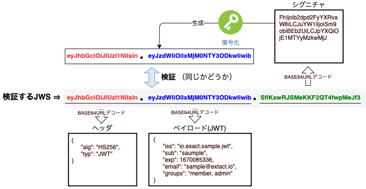

###  JSON Web Token (JWT) とは

#### 概要

- HTTP ヘッダーやクエリパラメータに JSON データを付与するための仕組みのこと

    - POST であれば body に JSON をそのままテキストとして書けば良いが、 GET などではその方法は使えない

        - → 全ての HTTP メソッドで、HTTP ヘッダーやクエリパラメータを利用することで JSON データを送信することを可能にするのが JWT
    
 

#### 疑問

- JSON データをそのまま文字列としてクエリパラメータやリクエスト/レスポンス　ヘッダーに付与しないのか?

    - セキュリティ面で問題あり

    - JSON データをそのまま文字列として付与しようとすると、ヘッダーや URL が長くなりすぎる

        - URLやHTTPヘッダーには文字数制限があるため長いヘッダーや URL ではリクエスト/レスポンスが送れなくなる

    → これらの問題を JWT および JWS で解決する

 
 

参考サイト

[基本から理解するJWTとJWT認証の仕組み](https://developer.mamezou-tech.com/blogs/2022/12/08/jwt-auth/)

---

### JWT の仕組み

- JWT は以下のような文字列

引用: [JWT認証の流れを理解する](https://qiita.com/asagohan2301/items/cef8bcb969fef9064a5c)

 

#### 構成

- JWT は以下の3つから構成される

    1. Header 部 (要素)

        
        
        引用: [ITまとめノート JWT (JSON Web Token)](https://shukapin.com/infographicIT/jwt)

         

        - 署名生成 (Signature部) に使用したアルゴリズムやその他メタ情報が記載される

        - 上記情報が [BASE64URL エンコード](#base64url-エンコードとは)されたものが Header 部

     

    2. Payload 部 (要素)

        

        引用: [ITまとめノート JWT (JSON Web Token)](https://shukapin.com/infographicIT/jwt)

         

        - 主要な情報が記述される

        - Payload 部のデータ項目 (JSONのキーと値のペア) はクレームと呼ばれる

        - 上記情報が BASE64URL エンコードされたものが Payload 部

     

    3. Signature 部 (要素)

        

        引用: [ITまとめノート JWT (JSON Web Token)](https://shukapin.com/infographicIT/jwt)

         

        - (BASE64URL エンコードされた) Header 部と Payload 部をピリオドで繋げた文字列をJWTの発行者のみが知るシークレット鍵を使ってハッシュ化した文字列をさらに BASE64URL エンコードしたもの

        - Signature 部は Header と Payload のデータが改ざんされていないことを確認するために使用される

 
 

参考サイト

[ITまとめノート JWT (JSON Web Token)](https://shukapin.com/infographicIT/jwt

---

### JWTの利用の流れ

引用: [JWT(Json Web Token)を利用したWebAPIでのCredentialの受け渡しについて](https://blog.mitsuruog.info/2014/08/jwtjson-web-tokenwebapicredential#3実現するためのコア技術jwtjson-web-tokenとは)

 

引用: [JWTとは？トークンベースの認証の仕様とJWTのメリット、デメリット](https://www.okta.com/jp/identity-101/what-is-token-based-authentication/)

 

#### ポイント

- 共通鍵方式か公開鍵方式によって、 JWT の発行もとが認証サーバーだったり、アプリケーション自身だったりするするらしい

    - 詳しくは[こちら](https://qiita.com/asagohan2301/items/cef8bcb969fef9064a5c#5-jwt認証の流れ)を参照

 

- JWT (Header, Payload, Signature) のハッシュ化は JWT の発行もとで行う。クライアントは受け取ったハッシュ化済みの JWT をバックエンドアプリケーションに渡すだけ

    - 勘違いしてた所: クライアント側でも JWT の内容を変えてハッシュ化してバックエンドに送信することがあるかも → なりすましとかのケースでない限りそんなケースない(多分)

 

1. クライアントが認証情報をバックエンド (認可サーバーが別途設けられてたりする) に送信する

2. バックエンドがユーザーを認証したら JWT を発行する

3. 以降はクライアントは発行された JWT をリクエストに含めてバックエンド (アプリケーション) にアクセスする

 

#### JWT の検証

引用: [基本から理解するJWTとJWT認証の仕組み](https://developer.mamezou-tech.com/blogs/2022/12/08/jwt-auth/)

 

1. クライアントはリクエストのたびに、JWT をそのまま付けてバックエンドにアクセスする

2. バックエンド側で送られてきた JWT の検証を行う

    - Signature 部をデコードし、さらにバックエンド側が持つ鍵で複合化

    - 復号化された Siganture 部 (= 「BASE64URL でエンコードされた Header 部」 + 「.」 + 「BASE64URL でエンコードされたPayload部」) が送られてきた JWT の Header 部と Payload 部と一致するか検証

 
 

参考サイト

[ラボ:JWT入門](https://developer.auth0.com/resources/labs/tools/ja-jwt-basics#付録-json-web-token-jwt-の利用例)

[JWT認証の流れを理解する](https://qiita.com/asagohan2301/items/cef8bcb969fef9064a5c#5-jwt認証の流れ)

[JWT(Json Web Token)を利用したWebAPIでのCredentialの受け渡しについて](https://blog.mitsuruog.info/2014/08/jwtjson-web-tokenwebapicredential)

---

### JWT を利用する際の注意点

- ユーザーのログインパスワードなどの重要な情報を JWT に含めてはいけない

    - JWT の Header 部と Payload 部は BASE64URL エンコードしただけなので、デコードすれば誰でも中身を見ることができる

- 1度発行した JWT は有効期限が切れるまでは無効化できない

 
 

参考サイト

[JWT認証の流れを理解する](https://qiita.com/asagohan2301/items/cef8bcb969fef9064a5c#ペイロード)

[JWTとは](https://qiita.com/keitean/items/a2d8f365b6541d26ed05#jwtのデメリット)

[JWTとは？ わかりやすく10分で解説](https://www.netattest.com/jwt-2023_mkt_tst)

---

### Token とは

- 認証情報や権限などの情報を表す文字列のこと

 
 

参考サイト

[JWTとは](https://qiita.com/keitean/items/a2d8f365b6541d26ed05)

---

### BASE64URL エンコードとは

- BASE64 エンコードをかけた後に、URL で特別な意味を持つ記号「+」と「/」を他の記号に変換する方式 をBASE64 エンコードと呼ぶ

- URL セーフな BASE64 エンコードと呼ばれたりもする

 

#### エンコードとは

- とあるルールに沿ってデータを変換する

- 変換したデータを元のデータに戻すことをデコードと呼ぶ

 

#### URL セーフとは

- URL/URIのファイル名やクエリ文字列などの一部としては使用できない記号や文字を、使用できる文字の特殊な組み合わせによって表記すること

 
 

[JSON Web Token (JWT) の仕組み](https://www.ios-net.co.jp/blog/20231115-1720/#BASE64URLエンコード)

[Base64 エンコードと Base64 URL エンコードの違い](https://qiita.com/kunihiros/items/2722d690b1525813c45e)

[BASE64、URLエンコード、HTMLエスケープとは・・](https://www.omakase.net/blog/2022/06/base64urlhtml.html)

[Base64とは？エンコードの方法などをわかりやすく解説！](https://it-infomation.com/base64/)

---

### JWT とセッション

#### JWT

- トークンはクライアント側で保存される

    - サーバー側で保存するストレージを用意しなくていい

 

- 1度発行されたトークンは有効期限がくるまで無効化できない

- 

 

#### セッション

- ユーザ情報とセッションIDを対応させた情報をサーバー側が持っておく必要がある

    - サーバー側でストレージを用意する必要がある

    - ユーザーが増えると、それに応じてストレージも多く確保する必要がある

 

- サーバー側で特定のセッション ID を無効化することができる

 
 

参考サイト

[JWTトークンによる認証とセッショントークンによる認証の違い](https://seiseiengineering.com/jwtトークンによる認証とセッショントークンによ/)