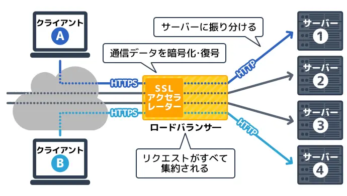
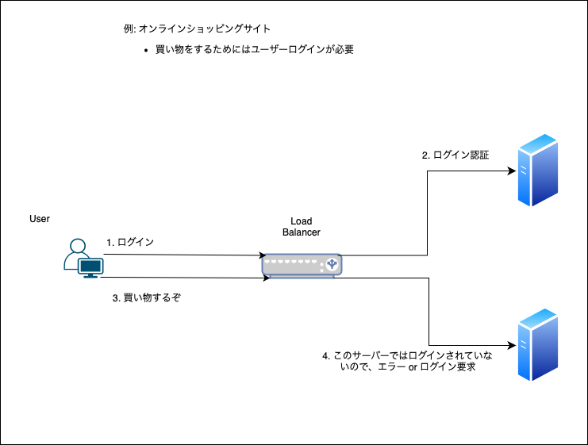
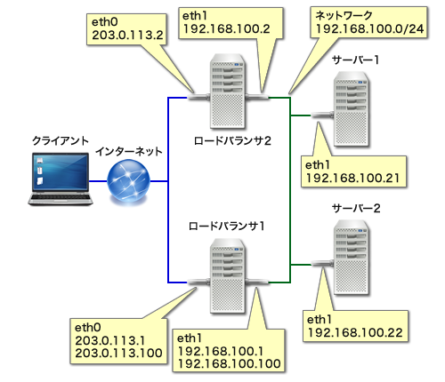
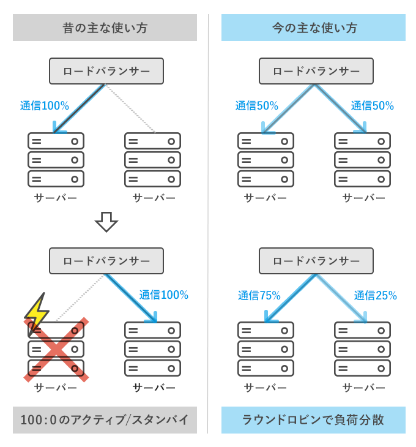

### ロードバランサーとは

サーバーへのアクセスを捌いていく装置

```
[例]
1つの Web サービスを2つのサーバーで運用している。
もし、大量のアクセスが1つの Web サーバーに集中したら、サーバーの負荷が増えレスポンスが遅くなったり、サーバーの故障につながる

[ロードバランサーの役割]
アクセスを均等に複数サーバーに割り振る

[結果]
1つのサーバーにアクセスが集中することをさけ、ユーザーが快適に Web サービスを利用することができる

また、サーバーに不具合が発生するリスクを減らす
```



引用: [【図で理解】ロードバランサーとは？負荷分散の仕組みを解説](https://www.kagoya.jp/howto/it-glossary/network/loadvalancer/)

<br>

ロードバランサーのポイント
- 同じユーザーは同一のサーバに割り振られる

    - 一貫したサービス(ユーザーエクスペリエンス?)を確保する = 以下の画像のようなことを防ぐ

    - *同じユーザーがずっと同じサーバーに割り振られるのではなく、同一セッション中は同じサーバーに割り振られるらしい



<br>
<br>

ロードバランサーに異常が発生してもサービスを提供し続けることができるように、ロードバランサー自体も複数用意することもある



引用: [「Linux Virtual Server」と「Keepalived」で作る冗長化ロードバランサ](https://knowledge.sakura.ad.jp/274/)

<br>

参考サイト1: [ロードバランサーの基本がマルわかり！仕組みから主要機能まで解説](https://it-trend.jp/server_application_management/article/114-0008)

参考サイト2: [【図で理解】ロードバランサーとは？負荷分散の仕組みを解説](https://www.kagoya.jp/howto/it-glossary/network/loadvalancer/)

同ユーザーは同サーバーに割り振られることについて: [知っておきたいロードバランサーの基礎技術](https://ascii.jp/elem/000/000/506/506272/2/)

---

### 追記

昔のロードバランサーは現在のようにアクセスを複数サーバーに振り分けるようなことはせず、100:0の振り分けをしていたらしい

で、稼働しているサーバーが止まったら他のサーバーに100:0で振り分ける



引用: [ロードバランサとは？わかりやすく解説！](https://academy.gmocloud.com/wp/qa/20170810/4591)