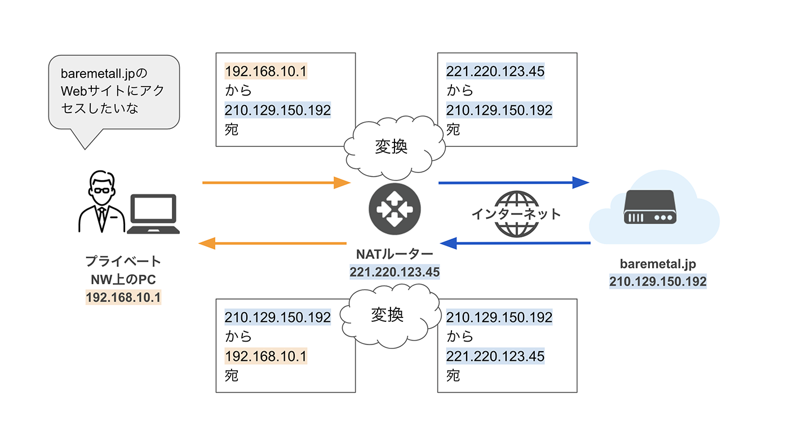
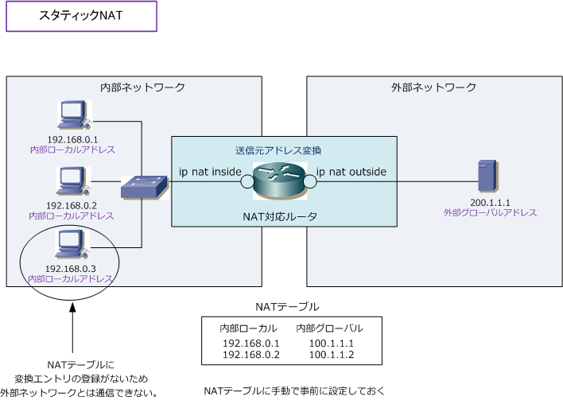
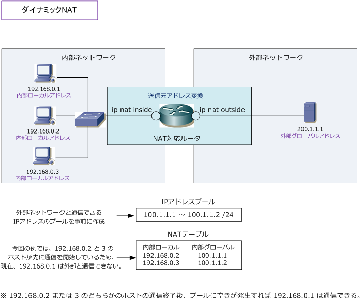
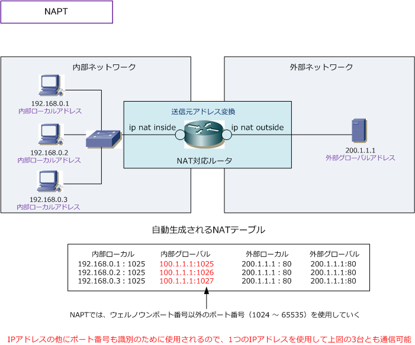

### LAN 内のコンユピューターがインターネットに接続するためには

PCのIPアドレスをルーターのグローバルアドレスと結びつけルーター経由でインターネットに接続する。
実際の仕組みとして [NAT](#NAT) や [NAPT](#NAPT) がある

---

### NAT (Network Address Translation)

PCのプライベート IP アドレスとルーターのグローバル IP アドレスを**1対1**で結びつける方法

 

例: 以下の機器がある
- 192.168.10.1 (プライベートIP) を持つ PC
- 221.220.123.45 (グローバルIP) を持つルーター

 

PC がインターネットに接続時

1. LAN 内の PC がインターネットに接続する際、ルーター側がそのリクエストの送信元である 192.168.10.1 を 221.220.123.45 に変換する

2. レスポンスが帰ってくると、ルーター側がそのレスポンスの送信先である 221.220.123.45 を 192.168.10.1 に変換する

\* なお、ルーターには LAN 側のプライベート IP アドレスも持つ

[NATとは？アドレス変換の仕組みや必要性、NAPTとの違いを解説](https://baremetal.jp/blog/2023/09/08/1298/)

---

### NAT の種類

Static NAT (静的 NAT)

- 管理者がルーターの NAT テーブル [^NATテーブル] を手動で設定

- NAT テーブルに登録されていない PC はインターネットに接続できない

[^NATテーブル]: LAN 内 PC の プライベート IP アドレスとルーターのグローバル IP アドレスの組み合わせ表のようなもの

[スタティックNAT](https://www.infraexpert.com/study/ip11.html)

 
 

Dynamic NAT (動的 NAT)

- ルーターに割り振られたグローバル IP アドレスを持っておくが、NAT テーブルへの事前の登録は必要ない

- LAN 内の PC がインターネットへ接続時にルーター側で利用できるグローバル IP アドレスとPCのプライベートIPアドレスの組み合わせを NAT テーブルに登録する

- インターネット接続終了時に NAT テーブルから組み合わせを削除し、グローバル IP アドレスを他の PC のインターネット接続のために空けておく

[ダイナミックNAT](https://www.infraexpert.com/study/ip11.html)

参考1: [Static NAT / Dynamic NAT](https://www.infraexpert.com/study/ip11.html)

参考2: [NATとは？アドレス変換の仕組みや必要性、NAPTとの違いを解説: NATの種類](https://baremetal.jp/blog/2023/09/08/1298/)

---

### NAT の弱点

ルーターに1つしかグローバルアドレスが割り振られていない場合、インターネットに接続できる LAN 内の PC は 1台だけ

ルーターに複数のグローバル IP アドレスが割り当てられていても、LAN 内の PC 台数分の グローバル IP アドレスが割り振られている状況は現実的ではない => グローバル IP アドレスがすぐに枯渇してしまう

上記の弱点を克服するために [NAPT (IP マスカレード)](#NAPT)が登場した

---

### NAPT (Network Address Port Translation)

別名: IP マスカレード

ルーターの1つのグローバル IP アドレスと LAN 内の複数の PC のプライベート IP アドレスを **1対多で結びつける**方法

 

具体的な仕組み

- NAT では PC のプライベート IP アドレスとルーターのグローバル IP アドレスの組み合わせを NAT テーブルに登録していた

- NAPT では PC の **プライベート IP アドレス + ポート番号** と ルーターの **グローバル IP アドレス + ポート番号**　の組み合わせを NAT テーブルに登録する

[NAPT ( Network Address Port Translation )](https://www.infraexpert.com/study/ip11.5.html)

 

これによって　ルーター側は1つのグローバル IP アドレスでLAN内の複数の PC がインターネットに接続できるようになった

参考1: [NAPT ( Network Address Port Translation )](https://www.infraexpert.com/study/ip11.5.html)
参考2: [NATとは？アドレス変換の仕組みや必要性、NAPTとの違いを解説: NAPTとは](https://baremetal.jp/blog/2023/09/08/1298/#NAPTとは)

---

### NAPT についての追記

いつも必ずポート番号は PC と ルーターで一致しているとは限らない

例: ルーター側で既に 1025 ポートが NAT テーブルに登録済みの場合で　PC が　プライベート IP アドレス + 1025 で接続してきた場合

-> ルーターは他のウェルノウンポート以外で空いているポートを利用する

参考: [SEILテクニカルマニュアル: NAPT適用時の送信元ポート番号割り当て方法](https://www.seil.jp/doc/index.html#fn/nat/napt.html)