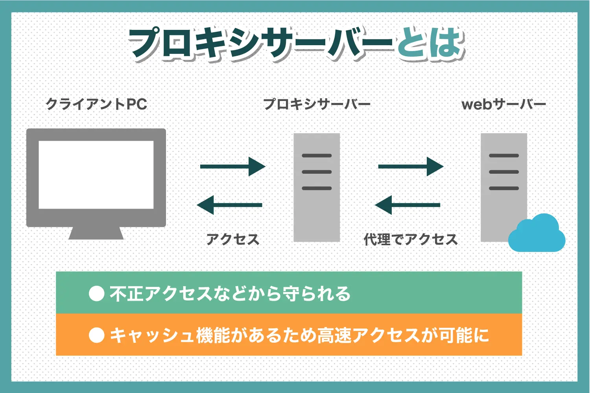
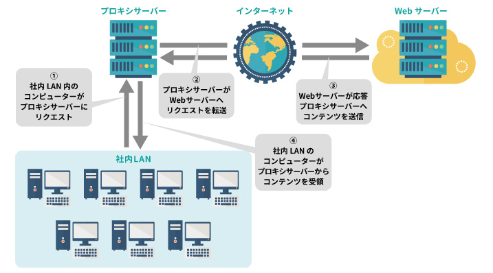
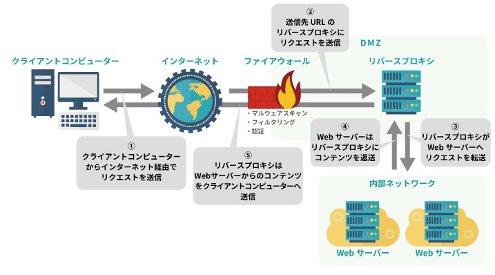
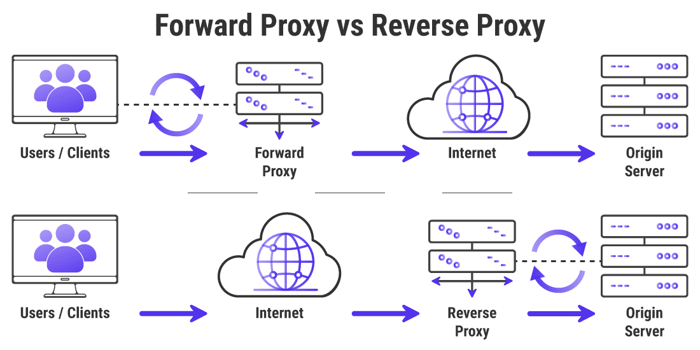

### プロキシサーバーとは

#### 概要

- クライアントとサーバーの中間で、両者の通信を中継する役割を担うサーバーのこと

引用: [プロキシサーバーとは？概要や歴史をわかりやすく解説！](https://www.freshvoice.net/knowledge/word/6365/)

 

#### 種類や機能

*1つのプロキシサーバーが以下の複数の役割をこなすこともある (例: リバースプロキシ+キャッシュ)

- フォーワードプロキシ
    - クライアントの代理
        - クライアントのリクスト
    - アクセスログの解析
    - 特定のwebサイトへのアクセス制限

    など

    

    引用: [リバースプロキシとプロキシの違いとは？それぞれのサーバーの仕組みは？](https://eset-info.canon-its.jp/malware_info/special/detail/201021.html)

 

- リバースプロキシ
    - web サーバーの代理
    - リクエストを複数のサーバーに振り分ける(ロードバランサー的な)
    - web サーバーなどの代わりに、リバースプロキシがクライアントと TLS で行うなど
        - webサーバー側とリバースプロキシでは HTTP 通信を行うことで素早く通信することができる

     など

     

 

- 一目でわかるフォーワードプロキシとリバースプロキシの違い

    

    引用: [プロキシサーバーは何のために存在するのか（仕組みと用途）](https://kinsta.com/jp/knowledgebase/what-is-a-proxy/)

 

- キャッシュサーバー

    - 特定のコンテンツ(画像や動画,htmlファイルなど)へのレスポンスをキャッシュしておき、同じコンテンツへのレスポンスに素早く応じる

    - サーバーへ取りに行かないので、サーバー側の分を軽減することができる

 
 

参考サイト

プロキシ全般について

- [プロキシサーバーとは](https://www.ntt.com/bizon/glossary/j-h/proxy-server.html)

- [プロキシサーバーは何のために存在するのか（仕組みと用途）](https://kinsta.com/jp/knowledgebase/what-is-a-proxy/)

- [プロキシサーバーとは。概要や役割、メリットを解説](https://www.winserver.ne.jp/column/about_proxy-server/)

リバースプロキシとフォーワードプロキシの違いについて

- [プロキシサーバー（Proxy）とは？使うべき？使わないべき？](https://nordvpn.com/ja/blog/what-is-a-proxy-server/)

- [リバースプロキシとフォワードプロキシの違いとは？基礎から分かりやすく解説！](https://jitera.com/ja/insights/39365)

- [【図解】リバースプロキシとフォワードプロキシの違いって何？](https://laplace-daemon.com/reverse-forward-proxy/)

- [リバースプロキシとプロキシの違いとは？それぞれのサーバーの仕組みは？](https://eset-info.canon-its.jp/malware_info/special/detail/201021.html)

