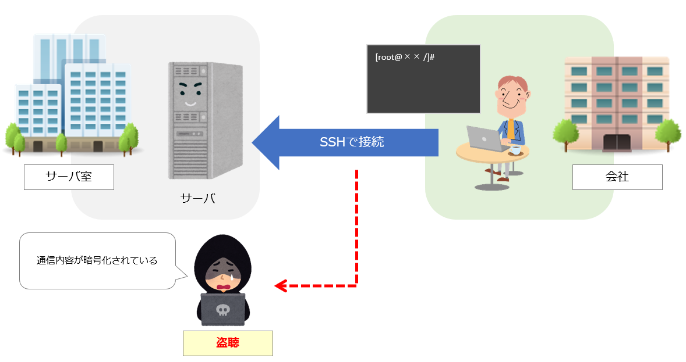
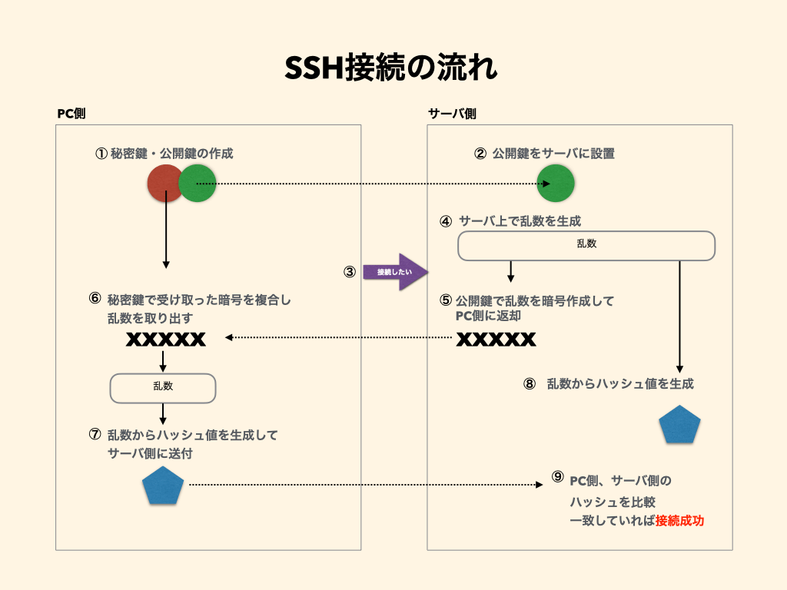
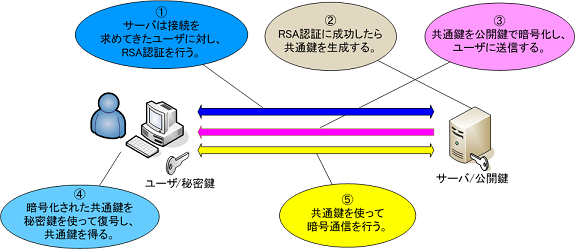

### SSH (Secure Shell) とは

ネットワーク経由で遠隔のコンピュータに**安全に**ログインするための通信方法(プロトコル)のこと

引用: [SSHとは](https://medium-company.com/ssh/)

---

### 具体的な技術内容

2種の暗号化方式を利用している

- ログイン認証時: RAS 認証

- ログイン認証以降： 共通鍵方式

 
 

ログイン時の仕組み (RAS 認証)

- ポイント

    - クライアント側が秘密鍵を持つ (下記画像①)

    - サーバー側で怪しい人からのアクセスでないことを確認するために、暗号化したデータを渡す (下記画⑤)

    - クライアント側は、怪しい人からのアクセスでないことを証明するために、暗号化されたデータを複合化して、サーバー側に証明する (下記画像⑥, ⑦)

引用: [【必見】SSH(Secure Shell)の目的と仕組みについて理解しよう！実際にSSHキーも作成！](https://tech-begin.com/computer-basic/network/service-protocol/ssh/#toc5)

 
 

ログイン後の通信のやり取り (共通鍵方式)

- ポイント

    - ログイン認証成功時にサーバーが共通鍵を生成し、クライアントに送信する

    - 共通鍵を使ってお互い暗号化/複合化を行う

引用: [Linux リテラシ - 第6回 SSH](https://rat.cis.k.hosei.ac.jp/article/rat/linuxliteracy/2005/ssh.html)

 

参考になったサイト1: [【必見】SSH(Secure Shell)の目的と仕組みについて理解しよう！実際にSSHキーも作成！](https://tech-begin.com/computer-basic/network/service-protocol/ssh/)

参考になったサイト2: [Linux リテラシ - 第6回 SSH](https://rat.cis.k.hosei.ac.jp/article/rat/linuxliteracy/2005/ssh.html)

---

### 追記

ログイン認証に RAS 認証ではなく、パスワード認証も使うことができるが、パスワードが漏れた場合誰からでもアクセスできてしまうため安全性は低い

