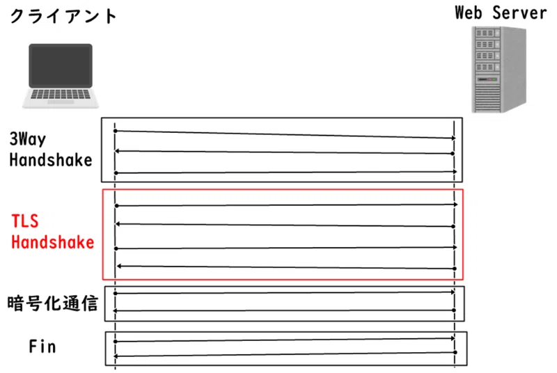
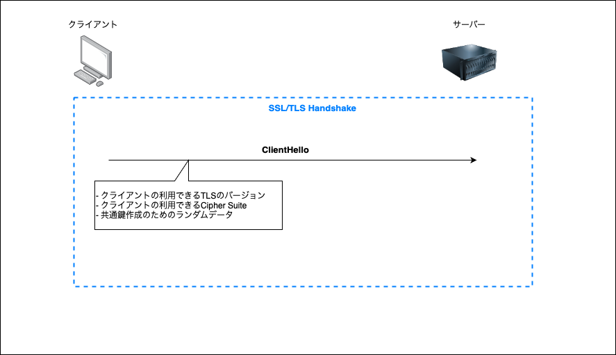
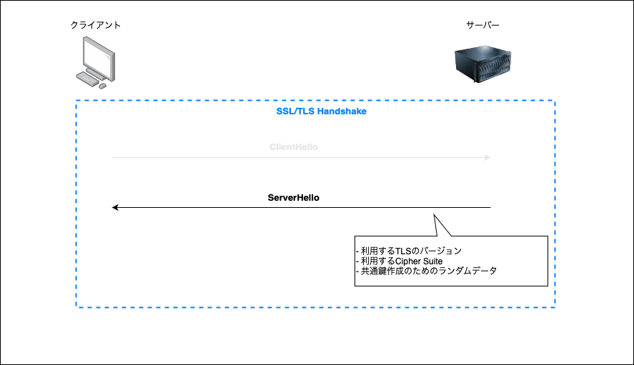
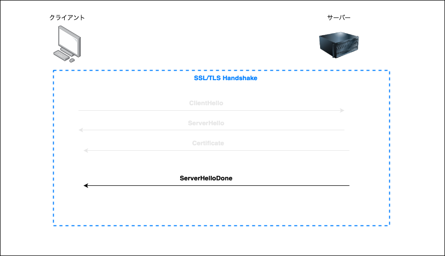
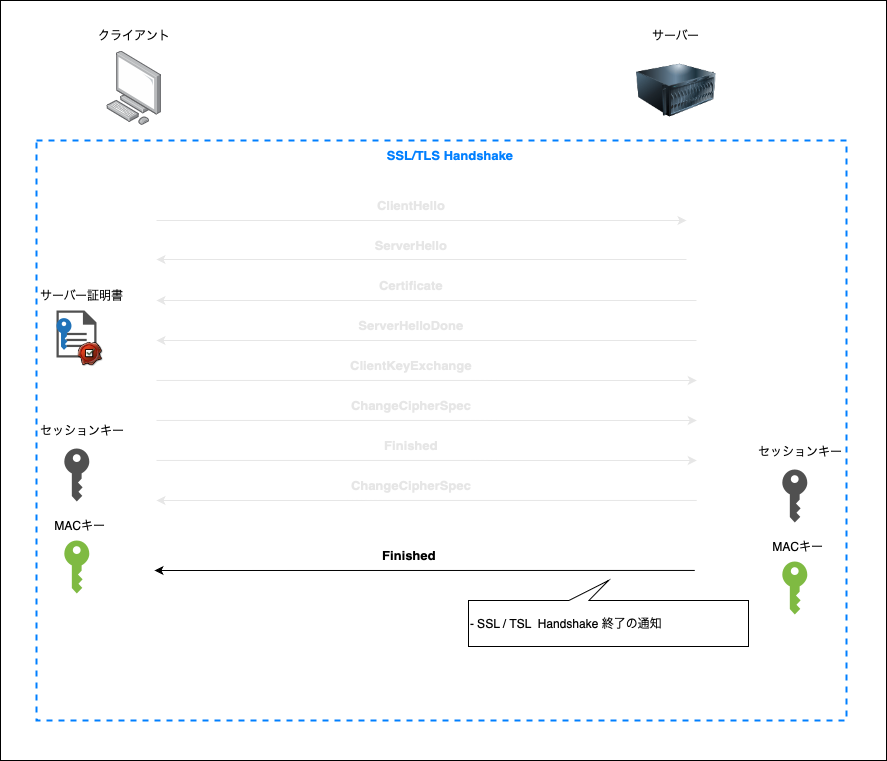
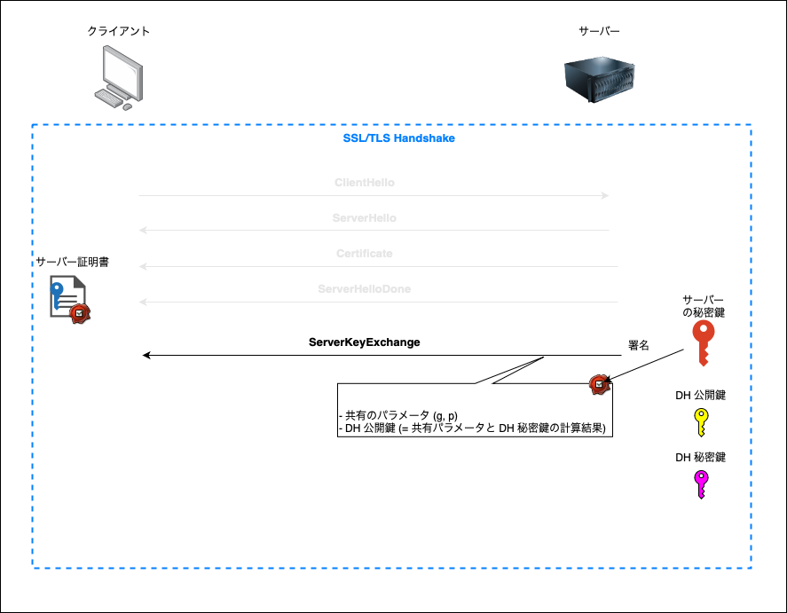
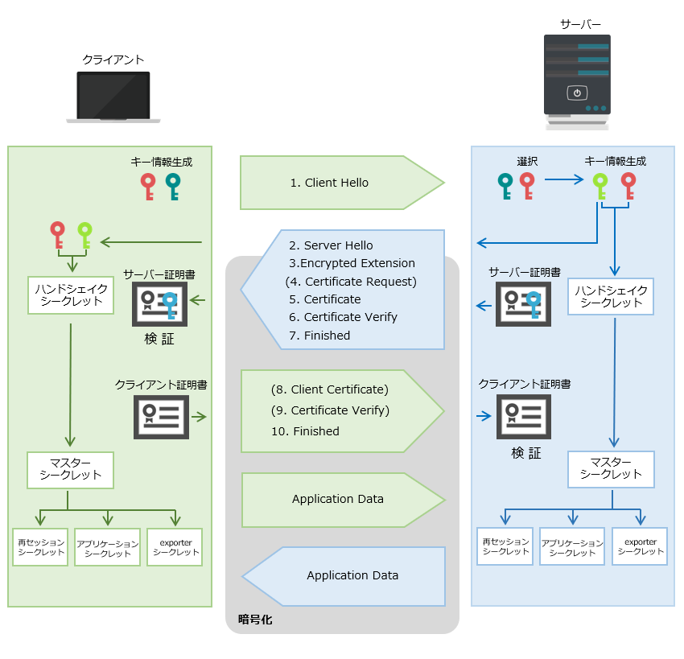

### SSL (Secure Sockets Layer) とは

クライアントとサーバー間の通信を暗号化し、安全にやりとりできるようにした仕組み

HTTPS は、この SSL の仕組みを利用している通信プロトコル

現在では、SSL は利用されていない。代わりにより安全で新しい仕組みの TLS が登場し、それが使われている

SSL の簡単な仕組みについては[こちらを参照](./公開鍵&秘密鍵/暗号化方式.pdf)

---

### TLS (Transport Layer Security) とは

SSL のアップグレード版。 SSL の

---

### SSL/TLS の仕組み (概念編)

SSL/TLS は暗号化、ハッシュ化などの複数の技術の組み合わせ (Ciper Suite) で成り立っている

- 通信内容を暗号化するための共通鍵の共有方法である **鍵交換の技術**

- メッセージ認証に利用される **ハッシュ化の技術**

- 

---

### SSl / TLS の流れ (大雑把バージョン)

1\. TCP 3way Handshake で通信を確立する

2\. SSL/TLS Hnadshake で以下を行う
    - サーバーの正当性の検証 (サーバー証明書のチェック)
    - 通信の暗号化に必要な共通鍵の生成

3\. 前の手順で作成された共通鍵を使ってデータを暗号化して送信、復号化して読み取る

引用: [TLS1.3の仕組みについて](https://note.com/tango9512357/n/n5228746c76e4)

 

---

### SSL/TLS ハンドシェイクの流れ (TSL1.2 RSA鍵交換)

TCP 3way Handshake で通信が確立できたら、以下の流れで SSL / TLS Handshake を行う

*RSA方式での鍵交換は脆弱性があるため、今は使われていない (RSAでの署名の安全性に問題はないので、そちらは使われている)

1\. ClientHello (クライアント → サーバー)

- 以下の情報をサーバーに送信する

    - クライアントが利用できる TLS のバージョン
    - クライアントが利用できる Cipher Suite 
    - 後に作成する共通鍵を作成するためのランダムなデータ (クライアントランダム)
    - などなど

 

2\. ServerHello (クライアント ← サーバー)

- 以下の情報をクライアントに送信する

    - 使用する TLS バージョン
    - 使用する Cipher Suite
    -  後に作成する共通鍵を作成するためのランダムなデータ (サーバーランダム)
    - などなど

 

3\. Certificate (クライアント ← サーバー)

- サーバー証明書と中間証明書をクライアントに送信する

- クライアント側は送られてきた証明書の検証を行う

 

4\. ServerHelloDone (クライアント ← サーバー)

- ServerHello からの一連のメッセージ完了の通知

 

5\. ClientKeyExchange (クライアント → サーバー)

- 共通鍵の作成に必要な「プリマスタシークレット」というランダム値を作成し、サーバー証明書の公開鍵で暗号化する

- 暗号化したプリマスタシークレットをサーバーに送る

 

6\. ChangeCipherSpec (クライアント → サーバー)

- クライアント側で以下の値から「マスターシークレット」を作成する
    - ClientHello のクライアントランダム
    - ServerHello のサーバーランダム
    - プリマスターシークレット

- 「マスターシークレット」から「セッションキー」と「MAC キー」を生成する
    - セッションキー: HTTPS 通信に使う共通鍵
    - MAC キー: メッセージ認証コード（MAC）を生成するためのキー。メッセージが改竄されていないかを確認するために必要

- サーバーに暗号化通信の準備完了を知らせる

 

7\. Finished (クライアント → サーバー)

- TSL HandShake 終了の通知

(具体的な送信するデータ)
- これまでの TLS ハンドシェイクの全通信のデータのハッシュ値を算出し、その値とマスターシークレットを組み合わせて計算した結果を送付する

 

8\. ChangeCipherSpec (クライアント ← サーバー)

- サーバー側で「マスターシークレット」を作成する
    - ClientHello のクライアントランダム
    - ServerHello のサーバーランダム
    - 復号化したプリマスターシークレット

- 「マスターシークレット」から「セッションキー」と「MAC キー」を生成する

- クライアントに暗号化通信の準備完了を知らせる

 

9\. Finihsed (クライアント ← サーバー)

- クライアントに TSL Handshake の終了の通知

(具体的な送信するデータ)
- これまでの TLS ハンドシェイクの全通信のデータのハッシュ値を算出し、その値とマスターシークレットを組み合わせて計算した結果を送付する

---

### SSL/TLS ハンドシェイクの流れ (TSL1.2 DH鍵交換)

ClientHello ~ Certificate までは同じ

 

4\. ServerKeyExchange (クライアント ← サーバー)

- DH 鍵交換方式での DH 秘密鍵と DH 公開鍵の生成

- DH 鍵交換方式での共有鍵の作成に必要なパラメータを送信
    - 共有パラメータ (K = g^x mod p の g と p)
    - DH 公開鍵 (g^x mod p の計算結果)

- 上記データにはサーバーの秘密鍵で署名をつける

 

5. ClientKeyExchange (クライアント → サーバー)

- 受け取ったデータを証明書(公開鍵)で検証する

- クライアント側で DH 秘密鍵と DH 公開鍵の生成

- 受け取ったサーバーの DH 公開鍵 および共有パラメータとクライアント側の DH 秘密鍵より「プリマスターシークレット」を生成する

- プリマスターシークレット、クライアントランダム、サーバーランダムより「マスターシークレット」を作成する

- マスターシークレットより、共通鍵と MAC キーを生成する

- クライアント側の DH 公開鍵をサーバーに送信する

 

このpフェーズでのポイント
- サーバーから送信されたデータより共有鍵を生成する
- サーバー側でも同じ鍵を生成できるように、　クライアント側の DH 共有鍵を送信する

 

6&7\. ChangeCipherSpec, Finished (クライアント → サーバー)
 
- RSA 鍵交換方式と同じ

8\. ChangeCipherSpec (クライアント ← サーバー)

- サーバー側の DH 秘密鍵とクライアントの DH 公開鍵からプリマスターシークレットを生成する

- プリマスターシークレット、クライアントランダム、サーバーランダムより「マスターシークレット」を作成する

- マスターシークレットより、共通鍵と MAC キーを生成する

- クライアントに暗号化通信の準備完了を知らせる

 

9\. Finihsed (クライアント ← サーバー)

- RSA 鍵交換方式と同じ

 

*ECDHE は交換するパラメーターや、公開鍵、秘密鍵、共通鍵の計算方法が違う数学の領域 (楕円曲線の加算) を利用するイメージ

 
 

参考サイト

- SSL/TLS Handshakeについて1: [ハンドシェイク](https://rms.ne.jp/what-is-an-ssl-certificate/handshake.html)

- SSL/TLS Handshakeについて2: [【PKI 応用】SSL/TLS ハンドシェイクをわかりやすく図解](https://pkiwithadcs.com/ssltls_handhshake/)

- SSL/TLS Handshakeについて3: [TLS | SSLハンドシェイクの プロセスは？](https://www.cloudflare.com/ja-jp/learning/ssl/what-happens-in-a-tls-handshake/)

- DH 鍵交換の時の ServerKeyExchange: [nginx.confの推奨設定からTLSを理解したい](https://zenn.dev/haan/articles/a1c72e56eb8004)

---

### SSL/TLS ハンドシェイクの流れ (TLS1.3)

TLS 1.2 との違い
- RSA　鍵交換方式、 DH 鍵交換方式 (static DH) は廃止となった = DHE か ECDHE での鍵交換になる

- TLS ハンドシェイクでのやり取りがより効率的になった

 

引用: [【図解】TLS v1.3の仕組み ~Handshakeシーケンス,暗号スイートをパケットキャプチャで覗いてみる~](https://milestone-of-se.nesuke.com/nw-basic/tls/tls-version-1-3/)

 

引用: [【PKI 応用】TLS 1.3 の仕組みについて詳しく解説！](https://pkiwithadcs.com/details_about_tls13/)

 
 

1\. ClientHello (クライアント → サーバー)
- 以下の情報をサーバーに送信する

    - クライアントで利用できる TLS のバージョン 
    - クライアントで利用できる Cipher Suite 
    - クライアントランダムなどのパラメーター
    - クライアントが利用できる鍵交換アルゴリズムの上位 2 つの鍵交換アルゴリズムの種類とパラメーター

 

2\. Server Hello ~ Finished (クライアント ← サーバー)

- 以下の情報をクライアントに送信する

    - 使用する TLS バージョン
    - 使用する Cipher Suite
    - 鍵交換アルゴリズムの合意した内容 (選択した鍵交換アルゴリズムでのサーバー側の公開鍵)
    - サーバーランダムなどのパラメータ
    - サーバー証明書、中間証明書

- クライアントで利用できる鍵交換のアルゴリズムを決め、共有パラメータおよび、公開鍵、自身の DHE や ECDHE などの秘密鍵からプリマスターシークレットを生成する

- プリマスターシークレット、サーバーランダム、クライアントランダムなどからマスターシークレットを生成する

- マスターシークレットからセッションキー(共通鍵)、MAC キーを生成する

- TSL HandShake の終了を通知する

 

3\. Finished (クライアント → サーバー)

- サーバー証明書の検証

- 選択された鍵交換アルゴリズムの共有パラメーター、自身の秘密鍵、サーバー側の公開鍵からプリマスターシークレットを生成する

- プリマスターシークレット、サーバーランダム、クライアントランダムなどからマスターシークレットを生成する

- マスターシークレットからセッションキー(共通鍵)、MAC キーを生成する

- TSL HandShake の終了を通知する

