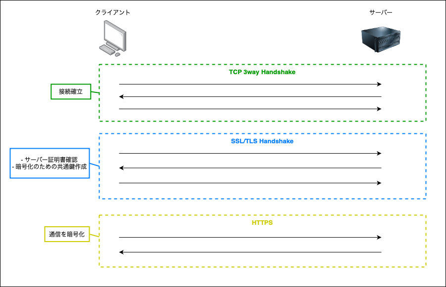
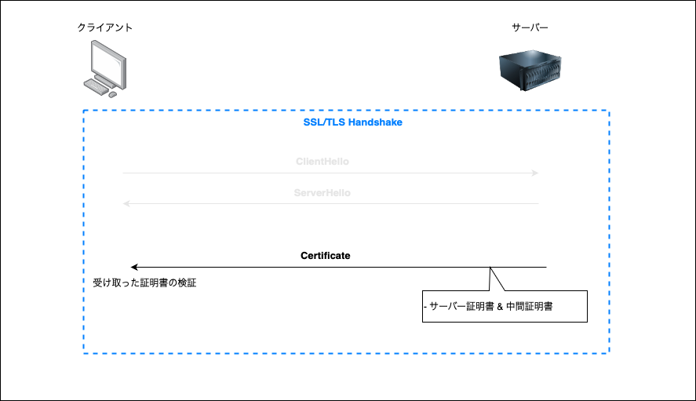
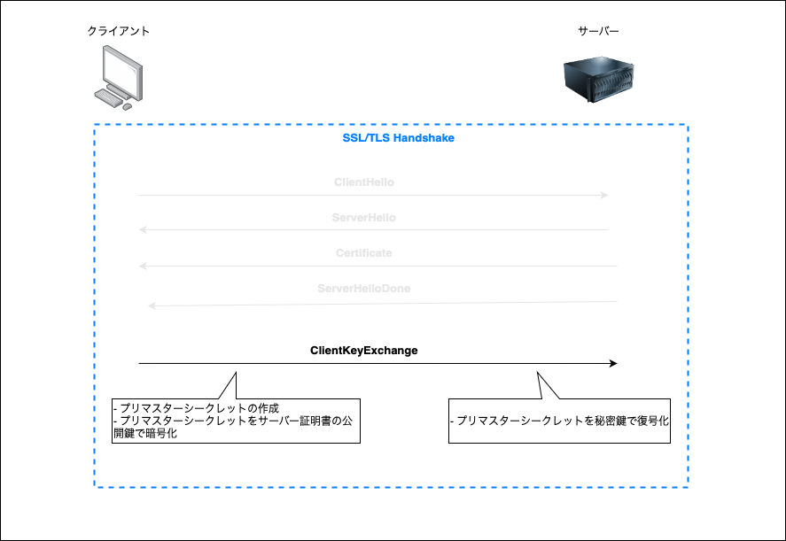
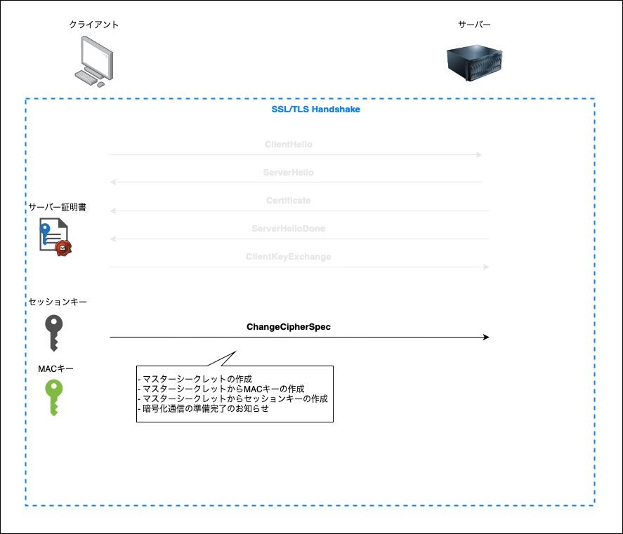
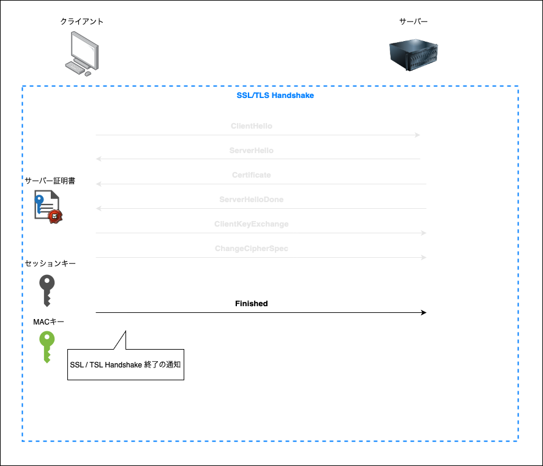

### SSL (Secure Sockets Layer) とは

クライアントとサーバー間の通信を暗号化し、安全にやりとりできるようにした仕組み

HTTPS は、この SSL の仕組みを利用している通信プロトコル

現在では、SSL は利用されていない。代わりにより安全で新しい仕組みの TLS が登場し、それが使われている

SSL の簡単な仕組みについては[こちらを参照](./公開鍵&秘密鍵/暗号化方式.pdf)

---

### TLL (Transport Layer Security) とは

SSL のアップグレード版。 SSL の

---

### SSL/TSL の仕組み (概念編)

SSL/TSL は暗号化、ハッシュ化などの複数の技術の組み合わせ (Ciper Suite) で成り立っている

- 通信内容を暗号化するための共通鍵の共有方法である **鍵交換の技術**

- メッセージ認証に利用される **ハッシュ化の技術**

- 

---

### SSl / TSL の流れ (大雑把番)

1\. TCP 3way Handshake で通信を確立する

2\. SSL/TLS Hnadshake で以下を行う
    - サーバーの正当性の検証 (サーバー証明書のチェック)
    - 通信の暗号化に必要な共通鍵の生成

3\. 前の手順で作成された共通鍵を使ってデータを暗号化して送信、復号化して読み取る

引用: [TLS1.3の仕組みについて](https://note.com/tango9512357/n/n5228746c76e4)

 

---

### SSL/TLS ハンドシェイクの流れ (TSL1.2 RSA鍵交換)

TCP 3way Handshake で通信が確立できたら、以下の流れで SSL Handshake を行う

*RSA方式での鍵交換は脆弱性があるため、今は使われていない (RSAでの署名の安全性に問題はないので、そちらは使われている)

1\. ClientHello (クライアント → サーバー)

- 以下の情報をサーバーに送信する

    - クライアントが利用できる TLS のバージョン
    - クライアントが利用できる Cipher Suite 
    - 後に作成する共通鍵を作成するためのランダムなデータ (クライアントランダム)
    - などなど

 

2\. ServerHello (クライアント ← サーバー)

- 以下の情報をクライアントに送信する

    - 使用する TLS バージョン
    - 使用する Cipher Suite
    -  後に作成する共通鍵を作成するためのランダムなデータ (サーバーランダム)
    - などなど

 

3\. Certificate (クライアント ← サーバー)

- サーバー証明書と中間証明書をクライアントに送信する

- クライアント側は送られてきた証明書の検証を行う

 

4\. ServerHelloDone (クライアント ← サーバー)

- ServerHello からの一連のメッセージ完了の通知

 

5\. ClientKeyExchange (クライアント → サーバー)

- 共通鍵の作成に必要な「プリマスタシークレット」というランダム値を作成し、サーバー証明書の公開鍵で暗号化する

- 暗号化したプリマスタシークレットをサーバーに送る

 

6\. ChangeCipherSpec (クライアント → サーバー)

- クライアント側で以下の値から「マスターシークレット」を作成する
    - ClientHello のクライアントランダム
    - ServerHello のサーバーランダム
    - プリマスターシークレット

- 「マスターシークレット」から「セッションキー」と「MAC キー」を生成する
    - セッションキー: HTTPS 通信に使う共通鍵
    - MAC キー: メッセージ認証コード（MAC）を生成するためのキー。メッセージが改竄されていないかを確認するために必要

- サーバーに暗号化通信の準備完了を知らせる

 

7\. Finished (クライアント → サーバー)

- TSL HandShake 終了の通知

(具体的な送信するデータ)
- これまでの TLS ハンドシェイクの全通信のデータのハッシュ値を算出し、その値とマスターシークレットを組み合わせて計算した結果を送付する

 

8\. ChangeCipherSpec (クライアント ← サーバー)

- サーバー側で「マスターシークレット」を作成する
    - ClientHello のクライアントランダム
    - ServerHello のサーバーランダム
    - 復号化したプリマスターシークレット

- 「マスターシークレット」から「セッションキー」と「MAC キー」を生成する

- クライアントに暗号化通信の準備完了を知らせる

 

9\. Finihsed (クライアント ← サーバー)

- クライアントに TSL Handshake の終了の通知

(具体的な送信するデータ)
- これまでの TLS ハンドシェイクの全通信のデータのハッシュ値を算出し、その値とマスターシークレットを組み合わせて計算した結果を送付する

---

### SSL/TLS ハンドシェイクの流れ (TSL1.2 DH鍵交換)

ClientHello ~ Certificate までは同じ

 

4\. ServerKeyExchange (クライアント ← サーバー)

- DH 鍵交換方式での共有鍵の作成に必要なパラメータを送信
    - 公開パラメータ
    - サーバー側の DH 公開鍵

- パラメータにはサーバーの秘密鍵で RSA 署名をつける

 

5. ClientKeyExchange (クライアント → サーバー)

- 受け取ったサーバーの DH 公開鍵 および公開パラメータとクライアント側の DH 秘密鍵より DH 共通鍵 = 「プリマスターシークレット」を生成する

- プリマスターシークレット、クライアントランダム、サーバーランダムより「マスターシークレット」を作成する

- マスターシークレットより、セッションキーと MAC キーを生成する

- クライアント側の DH 公開鍵をサーバーに送信する

