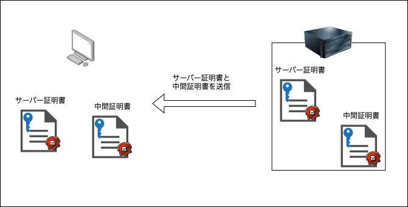

### SSL (TSL) 証明書とは

サーバー証明書と呼ばれることもある

SSL / TLS 通信の際にサーバーがクライアントに提示する証明書

第三者機関から「実在する運営者(組織)によって運営されている本物のウェブサイト」であることを証明するデジタル文書 (第三者機関の署名付き)

 

なぜ SSL / TLS 証明書を取得する必要があるのか

- HTTPS 通信を行うために必要

- クライアント(ユーザー)に、我々は第三者から認証されたサーバーですよということを証明するため

---

### 普通のデジタル文書の署名と違う点

- デジタル文書の署名は文書作成者の秘密鍵を使って行う

引用: [電子署名の仕組み](https://www.jipdec.or.jp/project/research/why-e-signature/PKI-crypto-mechanism.html)

 

- SSL / TLS 証明書の署名は、上位機関の秘密鍵を使って行う

 

SSL / TLS 証明書の中身

- Web サーバーのドメイン名

- **サーバーの公開鍵**  

- SSL / TLS 証明書の発行対象者

- 認可した認証局

- SSL / TLS 証明書の発行日

- SSL / TLS 証明書の有効期限

 
 

参考サイト

SSL 証明書の中身について： [SSL証明書とは？](https://www.cloudflare.com/ja-jp/learning/ssl/what-is-an-ssl-certificate/)

---

### SSL / TLS 証明書の作られ方

1\. サーバー側で秘密鍵と公開鍵のキーペアを作成する

 

2\. 秘密鍵から CSR (Certificate Signing Request) を作成する

- CSR にはサーバーのドメイン名や公開鍵の情報が含まれている

 

3\. CSR を認証局に送付 (認証局に証明書を依頼)

 

4\. 認証局の秘密鍵で CSR に署名する -> SSL 証明書の完成!

 

5\. 依頼者に SSL 証明書が届くので、サーバーにインストール + (中間)認証局の証明書もダウンロード & インストール

 

6\. SSL / TLS 化の準備完了

 

参考サイト

サーバー証明書と中間証明書の両方を配置する必要があることについて: [サーバー証明書と中間CA証明書は必ず必要ですか？](https://faq01-fb.fujifilm.com/faq/show/55247?category_id=575&site_domain=oars)

---

### SSL 証明書の構造

- サーバー証明書は中間認証局によって署名され、

    *サーバー証明書が中間認証局を挟まず、ルート認証局に署名されていることもある

 

- 中間認証局の証明書は、他の中間認証局またはルート認証局によって署名され、

 

- ルート認証局の証明書はルート認証局自身が署名している

 
 

以下の引用画像の方がイメージが湧きやすいかも

引用: [SSL証明書のルート認証局・中間認証局 とは？](https://qiita.com/miyuki_samitani/items/35941e2389b8f62625ad)

 

ポイント
- ルート認証局の証明書(ルート証明書)は、サーバーに配置されるのではなく、クライアントのブラウザなどにインストールされている

引用: [SSL証明書を理解する](https://blog.jbs.co.jp/entry/2024/05/10/091504)

---

### サーバー証明書の正当性チェック

クライアントとサーバー間で HTTPS 通信を始める前に、サーバーはサーバー証明書と中間証明書をクライアントに送り、「これからやりとりするサーバーは他者が成り代わっていない信頼できるサーバーですよ。それを担保してくれる人の証明書もあります」というやりとりをする必要がある

クライアントは、サーバー証明書と中間証明書を受け取ったら、その正当性をチェックする

 

ポイント

- サーバー側は、クライアントに自身のサーバー証明書からルート証明書直前までの中間証明書を全てを送信する

 

- クライアントは証明書のチェーンをルート証明書まで辿っていく

 

- クライアント側は、ブラウザにインストールされているルート証明書の公開鍵で署名のチェックを行い、ルート証明書の正当性チェックを行う

    - 検証の結果、正当性が確認できたらその証明書の鍵は正しいものだと判断する

 

- ルート証明書によって署名されている中間証明書の検証に移る

 

- 最後にサーバー証明書の検証を行う

- サーバー証明書の正当性がチェックできたら、通信を暗号化するための共通鍵の作成をする

*[詳しくはこちら](./SSL&TSL.md)

 

参考サイト

証明書の検証の順番について: [SSL証明書の署名と検証](https://dev.classmethod.jp/articles/ssl-certificate-system/)

証明書の検証について2: [TLS 証明書の簡易ガイド](https://hackernoon.com/ja/TLS-証明書の簡略ガイド)

---

### サーバー証明書の種類

ドメイン認証 (Domain Validation)

- 申請者がそのドメインの所有者であることを認証する証明書
    - 申請の受付から証明書の発行まで自動で行われ、メールによる認証がほとんど
    - 申請者の実在性 (どこどこの誰) はチェックされない

- ユーザーに保証されることは、そのサイトはそのドメインの所有者によって運営されているということのみ
    - どこの誰が運営しているのかはわからない

- 申請者、運営元の実在性は確認されないため、悪意のあるサイト運営者でも取得は可能
    - 悪さが見つかった場合は、証明書は失効しブラックリストに登録などがされるが、発覚前ならサーバー証明書として正常に機能する

- 個人運営や信頼性を高くする必要のない(ユーザーの個人情報を扱うなどのない)サイト、期間限定のキャンペーンサイトなどで利用されるのが多い

 
 

実在証明(Organization Validation)

- 申請者がそのドメインの所有者であることを認証する証明書 (= DV)

- サイトの運営の実在証明(会社名、所在地など)の確認が認証局によって取られた証明
    - 実在性の確認は電話によって行われることが多い -> 悪意のある第三者によって成り替わるのは難しい

- 運営元が確認(認証)されていることをアピールしてユーザーの信頼を得る必要のあるサイトに利用される
    - ショッピングサイトやSNSなどの個人情報を扱うサイト
    - コーポレートサイトなど、成り替わりでないことをアピールしたいサイト

 
 

拡張認証 (Extended Validation)

- 申請者がそのドメインの所有者であることを認証する証明書 (= DV)

- サイトの運営の実在証明(会社名、所在地など)の確認が認証局によっ取られた証明 **(OV よりも厳格なチェックが入る)**
    - EV は企業しか取得できない

- (もしブラウザが対応していれば) EVが配置されたサイトはアドレスが緑で表示されたり、URLと一緒に会社名も表示されるため、視覚的に「このサイトの信頼性は高い」ことがすぐに判断できるようになっている

- DV, OV より高い信頼が必要なサイトに利用される
     - 銀行やオンライン証券などの金融機関のサイトなど
        - フィッシングサイトとの判別がURLの表示から視覚的に判別できるように取得しているところがほとんど

    - EVは全世界共通の認証基準を使って認証されるため、世界規模で高い信頼性をアピールしたいサイト (グローバルなオンラインショップや官公庁のサイトなど)

 
 

参考サイト

- サーバー証明書の種類について1 -> [今さら聞けない SSL 証明書とは、DV、OV、EV や常時 SSL について](https://knowledge.cpi.ad.jp/security-info/244/)

- サーバー証明書の種類について2 -> [SSLサーバ証明書の種類と選び方](https://www.site-shokunin.com/blog/other/5255.html)

- サーバー証明書の種類について3 -> [SSLサーバ証明書の選び方（認証別）](https://www.ssl-store.jp/select-approval/)

---

### プライベート証明書とは

イメージ
- 個人で構築した認証局によって署名された証明書のこと

 

利用目的
- 社内で利用するwebシステムとの通信を暗号化(SSL / TLS)化したい場合、パブリック証明書のように有料の証明を置かずとも無料で作成できるプライベート証明書で SSL/ TLS 化する

- 上記の理由から社内システムに用いられることが多い

 

 

注意すべき点
- 社内ユーザーがルート証明書のインストールをする必要がある

 
 

参考サイト

- プライベート証明書について1: [電子署名の安全性に欠かせない「プライベート認証局」とは？](https://www.gmosign.com/media/work-style/privateninshokyoku/)

- プライベート証明書について2: [プライベート認証局とは？ 構築方法やパブリック認証局との違いを解説](https://www.netattest.com/private-ca_2022_mkt_fsp)

