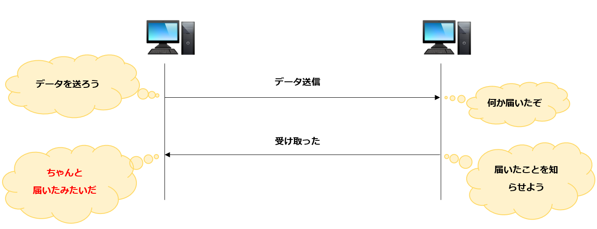
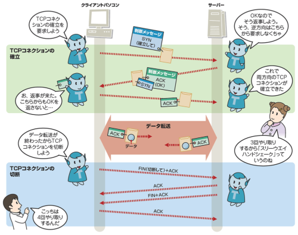

### TCP とは

IP 通信プロトコルの1つ上で動作する通信プロトコル

=> IP ネットワーク上で、どのように他のコンピュータ機器とやりとりをするのかについてに決まり事

TCP の特徴はデータの送信者と受信者が互いに相手の確認を取り合いながらやりとりをする「ハンドシェイク」と呼ばれる方法で通信を行う

---

### 実際のやり取りのイメージ

- 受信側が送信側に受け取ったという確認応答を返信する
- 送信側は受信側の確認応答を受け取ることで、ちゃんとデータが送信されたことを確認する

参照: [TCPとは](https://medium-company.com/tcpとは/)

 

- さらに、データの送信前に接続の要求やデータ送信後には切断の確認のやりとりを行う

参照: [IPとTCPの役割はどう違う？クイズと図で基本を再確認](https://xtech.nikkei.com/atcl/nxt/column/18/00917/082100004/?P=5)

---

### TCP ヘッダー