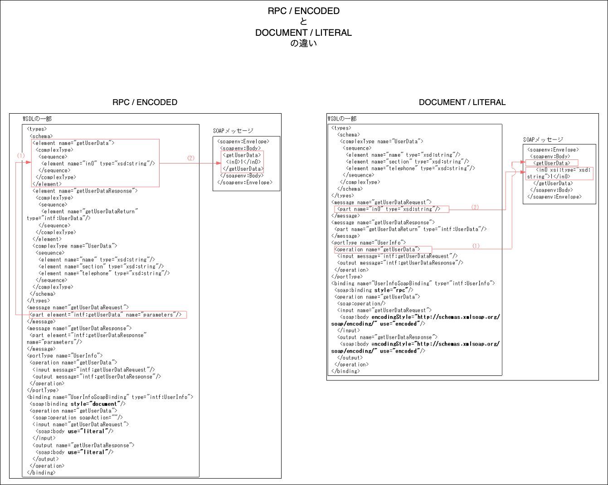

### WSDL の構造


引用: [Web Services Description Language](https://ja.wikipedia.org/wiki/Web_Services_Description_Language)

<br>
<br>

参考サイト

[パソコンで試してわかるWebサービス（6 WSDLでWebサービスを記述する](https://atmarkit.itmedia.co.jp/ait/articles/0301/23/news001_3.html)

[SOAPの仕掛け（4）Webサービスを記述するWSDL](https://atmarkit.itmedia.co.jp/ait/articles/0106/07/news001_2.html)

---

### types

- WSDL ファイル内で独自のデータ型を定義したい場合に使う要素

- types 要素以下は普通の [XML Schema](./XML_Schema.md) で書く

<br>


---

### message

- SOAP API の入力や出力のデータフォーマットを定義する要素

- [types](#types) で独自のデータ型を定義した場合、message 要素内で参照する

<br>


---

### portType

- 提供する API の抽象的な操作の集合をポートタイプと呼ぶ

    - 抽象的な操作: リクエストの時に受け取るデータ (= 入力メッセージ) と レスポンスの時に返却するデータ (= 出力メッセージ)

<br>

- operation 要素を子要素に持ち、各 operation 要素は input, output, fault 要素を持つ

    - input: Web サービスがクライアントから受け取る入力メッセージを記述する

    - output: Web サービスがクライアントへ送信する出力メッセージを記述する

    - fault: オプション。Weサービスでエラーが発生したときにエラー情報をクライアントへ送信するフォルトメッセージを記述する

<br>


<br>
<br>

参考サイト

[Webサービスのキホン（5）WSDL文書が持つ二層構造の前段部](https://atmarkit.itmedia.co.jp/ait/articles/0304/24/news002.html)

---

### binding

- types, message, portType で定義してきた抽象的なメッセージ形式や振る舞いを**具体的なプロトコルや WSDL スタイル (= 作成する SOAP メッセージのスタイル) と結びつけるセクション**

- ★binding 要素の type 属性にて [portType 要素](#porttype)で定義したポートタイプを参照する

- 以下は binding セクションの簡単な構造の例

```xsd
<!-- 利用するポートタイプの指定 -->
<wsdl:binding name="~~">

    <!-- 紐付けるプロトコル、メッセージの形式を指定 -->
    <soap:binding sytle="document"/>

    <!-- 提供する操作 (≒ エンドポイント?)の定義 -->
    <wsdl:operation name="操作A">

        <!-- SOAP アクションの指定 -->
        <soap:operation soapAction="http://www.操作A" />

        <!-- 操作Aが受け取る入力メッセージの形式の定義 -->
        <wsdl:input>
            <soap:body use="literal"/>
        </wsdl:input>

        <!-- 操作Aが返す出力メッセージの形式の定義 -->
        <wsdl:output>
            <soap:body use="literal"/>
        </wsdl:output>


        <!-- エラーが発生したときに操作Aが返すエラーメッセージの形式の定義 -->
        <wsdl:fault>
            <soap:body use="literal"/>
        </wsdl:fault>

    </wsdl:operation>

</wsdl:binding>
```

<br>

- `soap:binding`: 利用するメッセージ形式、通信プロトコルを指定する要素

    - transport 属性: http[]()://schemas.xmlsoap.org/soap/http" で HTTP プロトコルの利用を指定する

    - style 属性: 作成される [SOAP メッセージのスタイル](#soap-2つのメッセージ形式) (rpc か document) を指定する


<br>

- `soap:operation`: 提供する SOAP API (操作) 全体に関する情報を定義する要素

    - soapAction 属性: HTTP ヘッダーに　SOAP Action を含めたい場合に設定する属性 (省略可)

        - SOAP アクションとはクライアントで指定するサーバー側で実行したい SOAP メソッドを識別するための URI のこと

        - ★SOAP アクションで指定する URI 上にリソースの存在は不要

            - → ★指定する URI がサーバー上で実際にアクセス可能な URL である必要はなく、あくまでSOAPサービス内での操作の識別子として機能

<br>

- `soap:body`: SOAP メッセージ本体の内容どのように組み立てるか use 属性で指定する

    - use 属性

        - 詳しくは[エンコーディングの意味](#ここでのエンコーディングの意味とは)を参照

    - encodingStyle 属性

        - use 属性 encoded を指定した場合に指定する

        - 詳しくは[こちら](#エンコーディングの種類)を参照

<br>


<br>
<br>

参考サイト

binding セクションについて
- [Webサービス記述言語（WSDL）とは](https://lab.wallarm.com/what/webサービス記述言語（wsdl）とは/?lang=ja)

soap:bodu use 属性について
- [WSDL文書によるインターフェイス定義の仕上げ](https://atmarkit.itmedia.co.jp/ait/articles/0305/14/news001.html)

soap:body encodingStyle 属性について
- [SOAP Envelope 要素](https://memopad.bitter.jp/w3c/soap/soap_envelope.html)

---

### service


<br>

- wsdl:service 要素

    - 具体的なエンドポイントの定義を行う要素

<br>

- wsdl:port 要素

    - Webサービスを利用するための出入り口のことを WSDL ではポートと呼ぶ

    - name、 binding 属性はどちらとも必須

<br>

- soap:address 要素

    - location 属性: soap:address の location には WSDL の URL ではなく、実際に SOAP メッセージを送るサービスの URL を指定する

<br>
<br>

参考サイト

WSDL での"ポート"とは
- [Webサービスのキホン（5）WSDL文書が持つ二層構造の前段部](https://atmarkit.itmedia.co.jp/ait/articles/0304/24/news002.html)

wsdl:port 要素について
- [Webサービス記述言語（WSDL）とは](https://lab.wallarm.com/what/webサービス記述言語（wsdl）とは/?lang=ja)

---

### SOAP 2つのメッセージ形式

- SOAP の仕様では以下の2種類のメッセージ形式というものがある

    1. [RPC](#rpc-remote-protocol-call)
    2. [Document](#document)

- ★★ メッセージ形式は SOAP メッセージの body の形式(構造)に影響する

    - 同じ内容のメッセージでもメッセージ形式 (スタイル) によって、構成されるメッセージの構造が異なる

    

    引用: [Document, RPC, Literal, Encoded](https://flylib.com/books/en/2.87.1.32/1/)

<br>

#### RPC (Remote Protocol Call)

- rpc とは別のサーバーマシンにある関数をクライアントが呼び出すこと、またそのような思想を指すらしい

    <br>

    

    引用: [RPCの具現化であるgRPC](https://zenn.dev/hsaki/books/golang-grpc-starting/viewer/rpc)

<br>

##### RPC 形式での　SOAP メッセージ (body部分) の構造

- SOAP では RPC を記述する約束事として、body 直下の要素名は RPC で呼び出すメソッド名と同じにすること、またパラメータ名もその子要素名と同じにすることが決まっている


引用: [Webサービスのキホン（3）SOAPヘッダの役割とSOAP-RPCの実現](https://atmarkit.itmedia.co.jp/ait/articles/0301/17/news004.html)

<br>

#### Document

-  任意の書式と内容を持つ XML を SOAP メッセージに封入してやり取りを行う方法 

    - → RPC のように送りたいメッセージの形式を制約に従って整形する必要はない

    <br>

    

    引用: [吉松史彰のWebサービス論【第2回】(3)](https://xtech.nikkei.com/it/members/NBY/techsquare/20050713/164546/)

<br>

- 現在は Document 形式の方が主流

<br>

##### Document 形式での SOAP メッセージ (body部分) の構造

- 送りたいメッセージの XML をそのまま body 直下に書く

<br>
<br>

参考サイト

[1.2. プログラミング・開発ガイド](https://docs.nec.co.jp/sites/default/files/webotx_manual_v85/WebOTX/85/html/dev_devstudio_javaee/1.2_wsdk_programming.html)

[Document, RPC, Literal, Encoded](https://flylib.com/books/en/2.87.1.32/1/)

RPC 形式の SOAPメッセージについて
- [Webサービスのキホン（3）SOAPヘッダの役割とSOAP-RPCの実現](https://atmarkit.itmedia.co.jp/ait/articles/0301/17/news004.html)

---

### WSDL のメッセージ形式とエンコーディングの組み合わせ

#### ここでのエンコーディングの意味とは

- 符号化、シリアライズとも呼ばれる

- SOAP におけるエンコーディング (符号化) とは**送信するデータを XML として構築する手法のこと**を指す

    - ★送信するデータをバイナリに変換したり、文字エンコーディングするという意味ではないので注意

    - データはオブジェクト、数値、配列、文字列などから成り、1種のエンコーディング手法として、それらを XML として記述する際にデータ型も一緒に記述するものがある

<br>

#### エンコーディングの種類

- WSDL ファイルの soap:body 要素の use 属性で SOAP メッセージの body 部分をエンコーディング手法を指定する

    - literal

        - データをそのまま XML に記述する (データ型の記述は無い)
            - 個々の要素にデータ型の定義を併記しない

        - こちらが主流 かつ Document形式 と組み合わせられることが多い

    <br>

    - encoded

        - 個々のデータにデータ型を併記する

        - 同じ soap:body 要素の encodingStyle 属性 に指定される SOAP のエンコーディング規則に従って符号化される

            - SOAP1.1 のエンコーディング規則を利用する場合は encodingStyle="http[]()://schemas.xmlsoap.org/soap/encoding/" を指定すること

<br>

#### 一般的なメッセージ形式とエンコーディングの組み合わせ

- 以下の組み合わせが一般的

    - RPC / ENCODED

    - DOCUMENT / LITERAL

<br>

- 主流なのは DOCUMENT / LITERAL

<br>



引用: [Cosminexus　SOAPアプリケーション開発ガイド 3.3.3　生成されるWSDLの例](https://itpfdoc.hitachi.co.jp/manuals/3020/30203m4760/EM470034.HTM)

<br>
<br>

参考サイト

WSDLスタイルとエンコーディングスタイルについて
- [SOAP起動のフロー](https://help.asteria.com/documentation/warp/ja/4.5/flow/designer/flowservice/flowtype_soap.html)

エンコーディングの意味について
- [SOAPにおけるスタイルとエンコーディング](https://www.oracle.com/technetwork/jp/articles/index-093558-ja.html#soap)
- [SophiaFramework UNIVERSE 5.3](http://s-cradle.com/developer/sophiaframework/sf_reference/ref.SFXSOAPWriter.html)
- [SOAPの仕掛け（1）SOAPの仕掛けはどうなっている？](https://atmarkit.itmedia.co.jp/ait/articles/0103/02/news004_2.html)

use 属性の literal と encoded について
- ★わかりやすい! [SOAP(Simple Object Access Protocol)](http://xmlconsortium.org/websv/kaisetsu/C1/main.html)
- [1.2. プログラミング・開発ガイド](https://docs.nec.co.jp/sites/default/files/webotx_manual_v85/WebOTX/85/html/dev_devstudio_javaee/1.2_wsdk_programming.html)
