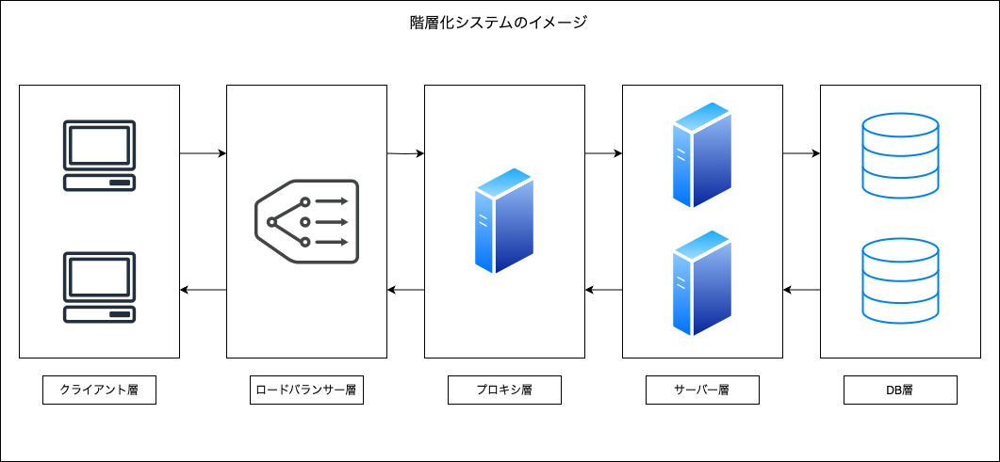

### Web API とは

- HTTPやHTTPSなどのWeb技術を利用して、他のプログラムが提供する機能 (API) を利用できる仕組み

- Web API にはいくつか種類がある

    - REST API
    - SOAP API

---

### REST とは

- REpresentational State Transfer の略

- API の設計思想の1つ

<br>

### REST 4原則

#### ★ステートレス (Stateless)

- セッションなどの状態管理を行わない (やり取りされる情報はそれ自体で完結して解釈することができる)

- クライアントとサーバー間の各 API リクエストが独立している

<br>

#### ★統一インターフェース (Uniform interface)

- ブラウザーやJavaScriptコード、モバイルアプリケーションなど、どんなRESTクライアントであっても同じ方法でサーバーを呼び出し、リソースにアクセスできるということ

- 具体的には以下の HTTP メソッドを使用してリソースへの操作を提供する

    - `GET`: リソースの取得
    - `POST`: リソースの作成
    - `PUT`: リソースの更新
    - `DELETE`: リソースの削除

<br>

#### アドレス可能性 (Addressability)

- リソースは URI で一意に識別され、API としてアクセス可能であること

    - リソース = クライアントが要求するデータ ~ DBに保存されているとある情報だったり、画像ファイルなどなど...

    ```
    例: ユーザーIDが2のユーザー情報を取得したい場合、RESTでは以下のURIで設計する

    https:www.sample.com/user/2
    ```

<br>

#### 接続性 （Connectability）

- レスポンスのリソースが別のリソースの情報やリンクを持つという特性のこと

    - リソース間の関連性を表現することが可能になる

<br>

### REST ６原則

- 上記[４原則](#rest-4原則)に以下の2つを加えた API の設計思想

#### クライアントとサーバの分離 (Separation of Client and Server)

- クライアントとサーバーがお互いに独立し、完全に分離していること

- どちらか一方が変更されても、もう一方に影響の無い or 少ない構造にする

<br>

#### コードオンデマンド （Code on Demand）

- ★オプショナルな原則

- クライアントがプログラムコードをサーバーからダウンロードし、クライアント側でそれを実行するアーキテクチャスタイルのこと

- メリット
    - クライアント側の機能を一時的に拡張できる

- デメリット
    - セキュリティリスクの増加

<br>

### その他の REST 原則

#### キャッシュ可能性 (Cacheable)

- REST APIではHTTPメソッドを利用しているため、HTTPのキャッシュが利用可能

    - ★REST ではリクエスト結果を必ずキャッシュしろというものではなく、**キャッシュを適切に設定することでパフォーマンスの向上を目指しましょう**というような設計指針

- REST だけに特別な設計指針ではなく、一般的な Web システムの設計指針として広く普及しているもの

<br>

#### 階層型システム (Layered system)



<br>

- 全体の構成を `クライアント層 - ロードバランサーなどの層 - サーバー層` のようにシステム内の機能やコンポーネントを階層的に抽象化し、それぞれの階層が特定の役割を持つように設計すること

- REST だけに特別な原則ではなく、一般的な Web システムの設計思想として広く普及しているもの

<br>
<br>

参考サイト

REST API 全般について
- [0からREST APIについて調べてみた](https://qiita.com/masato44gm/items/dffb8281536ad321fb08)
- [RESTについて簡単にまとめてみた](https://qiita.com/minisera/items/80318e52463829f1c642)
- [REST API ( RESTful API )](https://www.infraexpert.com/study/sdn09.html)
- [【Web API 設計 〜 理論編 〜】RESTの核心に迫る！REST ful APIは4原則ではなかった!? RESTとROAについて](https://zenn.dev/aiq_dev/articles/48100d5b3f13fe)
- [REST APIの6原則　初心者向け解説](https://qiita.com/Shin_728/items/4f42ef332abdbb25633a#3-キャッシュ可能)

REST の接続性について
- [【図解】RESTful API とは何なのか【2024年版】](https://ramble.impl.co.jp/2886/#toc9)

REST の統一インターフェースについて
- [REST APIとは REST APIの設計とメリット](https://www.talend.com/jp/resources/rest-api/)
- [REST APIとは？基本的な概念と利用方法](https://qiita.com/MaSi1031/items/37b2b59ca9c1a5cceb41#統一インターフェース)

6原則について
- [理解を深め：REST APIは4原則？6原則？](https://apidog.com/jp/blog/rest-api-rules/)

階層化システムについて
- [REST APIについて理解する](https://qiita.com/mutsuki15/items/ed40ebb5cfdb685cb5c5#階層化システム)
- [デザイナーが知るべき「Webの基礎」](https://note.com/_genkisuzuki/n/n0004fde942f3)

---

### REST APIとは

- REST の設計思想に基づいて実装される API のこと

<br>
<br>

参考サイト

---

### REST と RESTfull の違い

---

### SOAP API

---

### クエリパラメータとパスパラメータ

<br>
<br>

参考サイト

[Web API（RESTful API）設計時の基礎的なポイント](https://qiita.com/daimyo404/items/e07ff96b0b94563e5214#パスパラメータとクエリパラメータとの使い分けができているか)