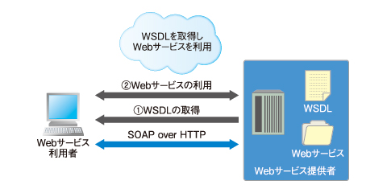

### Web API とは

- HTTP や HTTPS などの Web 技術を利用して、他のプログラムが提供する機能 (API) を利用できる仕組み

- Web API にはいくつか種類がある

    - [REST API](#rest-apiとは)
    - [SOAP API](#soap-api-とは)

---

### REST とは

- REpresentational State Transfer の略

- API の設計思想の1つ

<br>

### REST 4原則

#### ★ステートレス (Stateless)

- セッションなどの状態管理を行わない (やり取りされる情報はそれ自体で完結して解釈することができる)

- クライアントとサーバー間の各 API リクエストが独立している

<br>

#### ★統一インターフェース (Uniform interface)

- ブラウザーや JavaScript コード、モバイルアプリケーションなど、どんな REST クライアントであっても同じ方法でサーバーを呼び出し、リソースにアクセスできるということ

- 具体的には以下の HTTP メソッドを使用してリソースへの操作を提供する

    - `GET`: リソースの取得
    - `POST`: リソースの作成
    - `PUT`: リソースの更新
    - `DELETE`: リソースの削除

<br>

#### アドレス可能性 (Addressability)

- リソースは URI で一意に識別され、API としてアクセス可能であること

    - リソース = クライアントが要求するデータ ~ DBに保存されているとある情報だったり、画像ファイルなどなど...

    ```
    例: ユーザー ID が2のユーザー情報を取得したい場合、REST では以下の URI で設計する

    https:www.sample.com/user/2
    ```

<br>

#### 接続性 （Connectability）

- レスポンスのリソースが別のリソースの情報やリンクを持つという特性のこと

    - リソース間の関連性を表現することが可能になる

<br>

### REST ６原則

- 上記[４原則](#rest-4原則)に以下の2つを加えた API の設計思想

#### クライアントとサーバの分離 (Separation of Client and Server)

- クライアントとサーバーがお互いに独立し、完全に分離していること

- どちらか一方が変更されても、もう一方に影響の無い or 少ない構造にする

<br>

#### コードオンデマンド （Code on Demand）

- ★オプショナルな原則

- クライアントがプログラムコードをサーバーからダウンロードし、クライアント側でそれを実行するアーキテクチャスタイルのこと

- メリット
    - クライアント側の機能を一時的に拡張できる

- デメリット
    - セキュリティリスクの増加

<br>

### その他の REST 原則

#### キャッシュ可能性 (Cacheable)

- REST API では HTTP メソッドを利用しているため、HTTP のキャッシュが利用可能

    - ★REST ではリクエスト結果を必ずキャッシュしろというものではなく、**キャッシュを適切に設定することでパフォーマンスの向上を目指しましょう**というような設計指針

- REST だけに特別な設計指針ではなく、一般的な Web システムの設計指針として広く普及しているもの

<br>

#### 階層型システム (Layered system)


<br>

- 全体の構成を `クライアント層 - ロードバランサーなどの層 - サーバー層` のようにシステム内の機能やコンポーネントを階層的に抽象化し、それぞれの階層が特定の役割を持つように設計すること

- REST だけに特別な原則ではなく、一般的な Web システムの設計思想として広く普及しているもの

<br>
<br>

参考サイト

REST API 全般について
- [0からREST APIについて調べてみた](https://qiita.com/masato44gm/items/dffb8281536ad321fb08)
- [RESTについて簡単にまとめてみた](https://qiita.com/minisera/items/80318e52463829f1c642)
- [REST API ( RESTful API )](https://www.infraexpert.com/study/sdn09.html)
- [【Web API 設計 〜 理論編 〜】RESTの核心に迫る！REST ful APIは4原則ではなかった!? RESTとROAについて](https://zenn.dev/aiq_dev/articles/48100d5b3f13fe)
- [REST APIの6原則　初心者向け解説](https://qiita.com/Shin_728/items/4f42ef332abdbb25633a#3-キャッシュ可能)

REST の接続性について
- [【図解】RESTful API とは何なのか【2024年版】](https://ramble.impl.co.jp/2886/#toc9)

REST の統一インターフェースについて
- [REST APIとは REST APIの設計とメリット](https://www.talend.com/jp/resources/rest-api/)
- [REST APIとは？基本的な概念と利用方法](https://qiita.com/MaSi1031/items/37b2b59ca9c1a5cceb41#統一インターフェース)

6原則について
- [理解を深め：REST APIは4原則？6原則？](https://apidog.com/jp/blog/rest-api-rules/)

階層化システムについて
- [REST APIについて理解する](https://qiita.com/mutsuki15/items/ed40ebb5cfdb685cb5c5#階層化システム)
- [デザイナーが知るべき「Webの基礎」](https://note.com/_genkisuzuki/n/n0004fde942f3)

---

### REST APIとは

- [REST](#rest-とは) の設計思想に基づいて実装される API のこと

---

### REST API と RESTfull API

#### Restfull API とは

- [REST](#rest-とは) の設計思想に**忠実に**基づいて実装される API のこと

<br>

#### REST API と RESTfull API の違い

- ★基本的に広義の意味では同じ **REST の原則に従って設計、実装される Web API**

- 「どのぐらい厳密に REST の原則に従って設計されるか」で違いがあるイメージ

    - 基本的に従うが、柔軟性あり → REST API

    - 原則に忠実に従う → RESTfull API

<br>
<br>

参考サイト

[RESTとRESTfulの違い](https://qiita.com/furu_39/items/349e8a09706ef7cfe805)

[API の正しい選択： 統合には REST か RESTful か](https://www.integrate.io/jp/blog/choosing-the-right-api-rest-vs-resftul-for-integration-ja/)

---

### SOAP とは

- Simple Object Access Protocol の略

<br>

- ★SOAP は [REST](#rest-とは) のような API の設計思想ではなく、**データ(メッセージ)交換についてのプロトコル**

    - → 送信、受信するメッセージについての決まり事

<br>

- SOAP は通信プロトコルに HTTP(S) や SMTP、FTP などを利用することができる

    - → SOAP は交換するメッセージについてのプロトコルで、通信プロトコルは自由に選択できる

<br>

- SOAP でやりとりされるデータ(メッセージ)は XML ベースのもの

    - ★SOAP 規格に準拠した XML 形式のメッセージのことを **[SOAP メッセージ](#soap-メッセージ)**と呼ぶ

<br>
<br>

参考サイト

SOAP について
- [SOAPとは？API通信としての使われ方やRESTとの違いなど](https://weblion303.net/2009)
- [SOAPプロトコルとは？SOAP APIをテストするには？](https://apidog.com/jp/blog/soap-and-its-debugging/)

---

### SOAP API とは

- [SOAP](#soap-とは) に基づいたメッセージ交換方式 (XML ベースの SOAP メッセージ) で実装される Web API のこと

<br>

- ★SOAP メッセージを作成し、 POST メソッドでリクエストする

    - GET メソッドでも可能らしいが、 XML を[クエリパラメーター](#クエリパラメータとパスパラメータ)に含むので、ほとんど GET メソッドは利用されないらしい

<br>

- [WSDL](#wsdl-とは) を利用して SOAP API を実装することが多い

    - WSDL から SOAP メッセージを作成することができるライブラリを使って簡単に SOAP API のを呼び出すクライアント側 & レスポンスを返すサーバー側を実装できるから

<br>
<br>

参考サイト

[SOAP API](https://appmaster.io/ja/glossary/soap-api-ja)

[Do SOAP Web services support only "POST" http method](https://stackoverflow.com/questions/26339317/do-soap-web-services-support-only-post-http-method)

---

### SOAP メッセージ

#### 構造


引用: [Webサービスのキホン（2）SOAPという封筒の内部構造](https://atmarkit.itmedia.co.jp/ait/articles/0301/17/news004.html)

<br>

#### プロトコルバインディングヘッダ

- SOAP メッセージの内部構造で、実装するトランスポートプロトコルに依存するヘッダ

<br>

#### エンベロープ

- SOAP メッセージの一番外側

- SOAP ヘッダと SOAP ボディから構成されている

<br>

#### SOAP ヘッダ

- メッセージのメタデータを持つ

    - メタデータ: 認証情報やトランザクションの情報など、メッセージの本文とは直接関係のない情報

- また SOAP ヘッダは SOAP メッセージを処理するアプリケーションが機能を拡張するために、独自に定義する要素・属性を格納できるようになっている

<br>

#### SOAP ボディ

- クライアント - サーバー間でやり取りされる XML データが入る

<br>
<br>

参考サイト

[Webサービスのキホン（2）SOAPという封筒の内部構造](https://atmarkit.itmedia.co.jp/ait/articles/0212/13/news001.html)

---

### WSDL とは



引用: [企業システムの常識をJBossで身につける（6) いまさら聞けない「Webサービス」の常識](https://atmarkit.itmedia.co.jp/ait/articles/1002/26/news094.html)

<br>

- Web Services Description Language の略

<br>

- SOAP API を実装する際によく利用される XML ベースの言語

    - WSDL で記述した XML ファイルのことを WSDL ファイルと呼び、拡張子は `.wsdl`

<br>

- WSDL は API のインターフェース(仕様書)のようなもの

    - Web サービスの呼び出しに必要なエンドポイント（URL）や、メッセージの形式（XML など）が定義されている。また、Web サービスが受け取るパラメーターや、返すデータの形式や構造も記述される。

<br>

- WSDL を利用することで何が嬉しいのか?

    - WSDL を元に SOAP メッセージを作成するライブラリを利用して、より簡単にクライアント & サーバー側の実装ができる

<br>

- WSDL の構造、書き方については[こちら](./WSDL.md)を参照

<br>
<br>

参考サイト

[「SOAP」「WSDL」って何？初めて聞いた。。](https://qiita.com/shibuchaaaan/items/0b8005310a13c641d089)

[Webサービス記述言語（WSDL）とは](https://lab.wallarm.com/what/webサービス記述言語（wsdl）とは/?lang=ja)

[WSDL誕生の背景](https://atmarkit.itmedia.co.jp/ait/articles/0106/07/news001.html)

[WSDL（Web Services Description Language）とは](https://yminamiyama.com/wsdl-overview/)

[WSDL：Webサービスのインターフェイス情報](https://atmarkit.itmedia.co.jp/ait/articles/0303/18/news003.html)

[Webサービスを記述するWSDL](https://atmarkit.itmedia.co.jp/ait/articles/0106/07/news001.html)

[SOAP API を PHPで叩く](https://www.tam-tam.co.jp/tipsnote/program/post12555.html)

[生成されるWSDLの例](https://itpfdoc.hitachi.co.jp/manuals/3020/30203m4760/EM470034.HTM#ID00098)

[WSDL チュートリアル: Web サービス Descriptイオン言語の例](https://www.guru99.com/ja/wsdl-web-services-description-language.html)

---

### SOAP と REST　の違い

- 大前提

    - SOAP はメッセージ交換のプロトコル

    - REST は設計思想

<br>

- データ形式

    - SOAP は XML ベースの SOAP メッセージのみ

    - REST は XML、JSON、プレーンテキスト、 HTML など柔軟

<br>

- どちらを使ったらいいのか

    - 基本的には REST の方が簡単で柔軟に実装できる

    - すでに SOAP を利用したレガシーな SOAP API である場合はそのまま SOAP を利用し続けることがあるらしい

---

### SOAP API の実装イメージ (Node.js)

- クライアント側

    - SOAP クライアントを作成できるライブラリをインストール

        - `npm install soap`

    <br>

    - サーバー側の [WSDL](#wsdl-とは) にアクセスする

        - ↑でインストールしたライブラリから soap クライアントを作成し、サーバーに配置されている WSDL にアクセスするイメージ

        - WSDL にアクセスしたら、必要なパラメータを渡すことで SOAP メッセージが作成され、 SOAP API 通信ができるようになる感じ

<br>

- サーバー側

    - SOAP サーバーを作成できるライブラリをインストール

        - `npm install soap`

    <br>

    - WSDL を作成 & 公開する

        - = 提供する Web API の定義の作成 & 公開

    <br>

    - インストールした SOAP サーバー作成ライブラリを利用して SOAP サーバーを実装

        - Web API の URL や、API の処理内容などの実装をするイメージ

        - ★WSDL はあくまでインターフェース(=引数や戻り値、サービス名の仕様) であり、実際の処理内容はサーバー側で実装する必要がある

<br>
<br>

参考サイト

[Node.js + ExpressでSOAP通信するAPIを作ろう](https://qiita.com/tamura_CD/items/f3f69660441d3993d2c7)

[Soap](https://www.npmjs.com/package/soap#soapcreateclienturl-options-callback---create-a-new-soap-client-from-a-wsdl-url-also-supports-a-local-filesystem-path)

[Understanding SOAP API and Implementing it with Node.js: A Practical Tutorial](https://dvmhn07.medium.com/understanding-soap-api-and-implementing-it-with-node-js-a-practical-tutorial-34e9c36f3a1e)

---

### クエリパラメータとパスパラメータ

- どちらも大きくまとめると URL パラメーターに属する

    - URL パラメータ: URLの末尾に付加される変数や文字列のこと

<br>

#### クエリパラメータ

- URL の最後に `?key=val` の形で指定されるパラメータのこと

    - 複数のクエリパラメータを渡したい場合は　`&` で連結する

    ```
    http://www.example.co.jp/page?queryParam1=val1&queryParam2=val2
    ```

- 使い所

    - 省略可能な付加情報を渡したいときに利用するらしい

        - ポイント: クエリパラメータをつけなくともページにアクセスできるように設計すべき

    - イメージ的には表示している画面を特定の条件でさらに絞り込みたいとき

        - 検索ワード、ページの指定 などでクエリパラメータ多く利用される

            ```
            例： 図書館Aの書籍検索で"programming"の検索結果を示すURL
            → https://www.libraryA.jp/search?keyword=programming


            図書館Aの書籍検索で"programming"の検索結果の2ページ目を表すURL
            → https://www.libraryA.jp/search?keyword=programming&page=2
            ```

<br>

#### パスパラメータ

- URL の中にパスの一部に埋め込まれるパラメータのこと

    ```
    http://www.example.co.jp/page/{pathParam}
    ```

- 使い所

    - リソースを一意に識別するときに利用する

        - 表示するページがその特定の一意のリソースメインのページの場合、パスパラメータが多く利用される

            ```
            例: 会社Aの日本支部の社員一覧ページの URL 
            → http://www.companyA.co.jp/employees/japan
            
            japan 部分がパスパラメータ
            ```

<br>
<br>

参考サイト

わかりやすい! → [パスパラメータ・クエリストリング・リクエストボディの使い分け](https://buuuuuuun3939.hatenablog.com/entry/2022/05/18/130147)

[Web API（RESTful API）設計時の基礎的なポイント](https://qiita.com/daimyo404/items/e07ff96b0b94563e5214#パスパラメータとクエリパラメータとの使い分けができているか)
