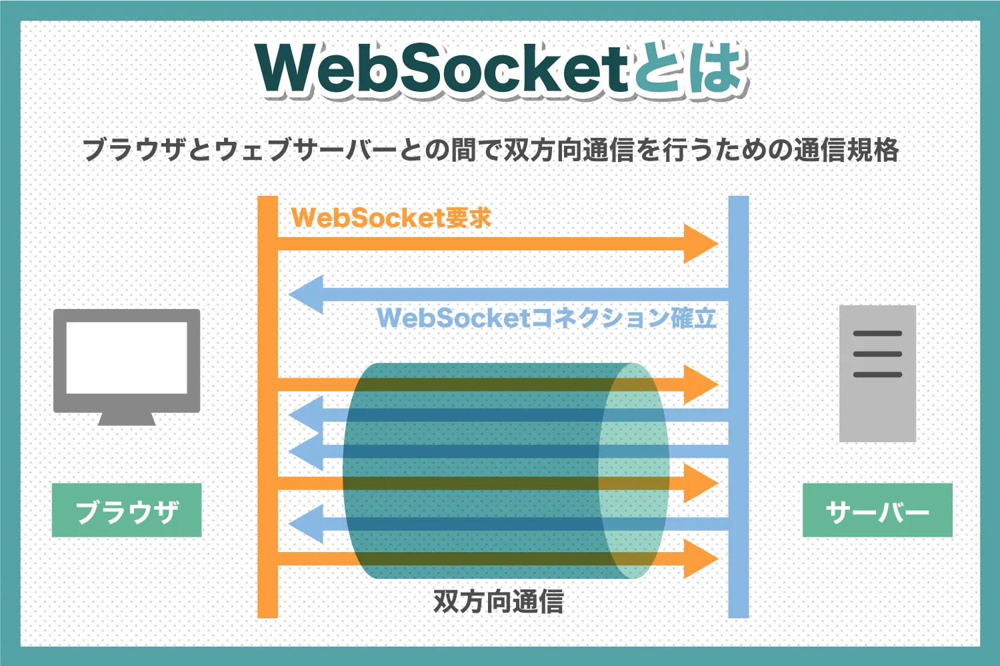
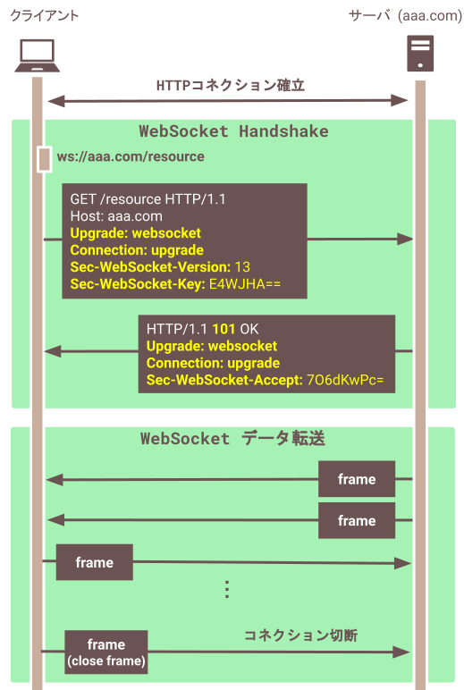
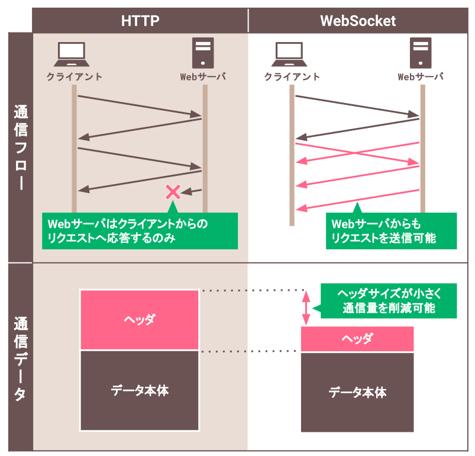

### WebSocket とは

引用: [WebSocketとは？WebSocketについて詳しく解説します](https://www.freshvoice.net/knowledge/word/6323/)

 

- クライアント (Webブラウザ) と サーバー (Webサーバー) 間で**双方向の通信**を行うための**通信プロトコル**

 

#### 特徴

- クライアント側とサーバー側を常時接続状態にしておいて双方向通信ができる

    - サーバー側からクライアント側にリクエストが送れる

 

- 送信と受信を同時に行うことができるフルデュプレックス (Full Duplex) な通信を提供

- 

 

#### ざっくりとした仕組み

引用: [ITまとめノート WebSocket](https://shukapin.com/infographicIT/websocket)

 

- ★最初のコネクションの確立には HTTP を使う

- HTTPコネクションが確立されると、以降の通信に WebSocket を利用する

- データはフレームという単位でやり取りされる

 
 

参考サイト

[【JavaScript入門】誰でも分かるWebSocketによるデータ送受信の方法](https://www.sejuku.net/blog/70583)

[解説：WebSocketとREST APIの違い｜どちらにしよう？](https://apidog.com/jp/blog/websocket-rest-api-difference/)

---

### HTTP と Web Socket

- HTTP、 WebSocket ともに Web 上での通信プロトコルの1つ

 

#### HTTP と WebSocket の違い

引用: [ITまとめノート WebSocket](https://shukapin.com/infographicIT/websocket)

 

- HTTP

    - ★1つのコネクションで1つのリクエストしか送れず、サーバーから自主的なデータ送信はできない

    - ヘッダーのデータサイズが大きいらしい

    - ★ステートレス

 

- WebSocket

    - ★1度コネクションを確立すると、サーバとクライアントのどちらからも通信を行うことが可能

    - ヘッダーのデータサイズが HTTP のものと比べると小さいらしい

    - ★ステートフル
    
 
 

参考サイト

[ITまとめノート WebSocket](https://shukapin.com/infographicIT/websocket)

[今さら聞けないWebSocket~WebSocketとは~](https://qiita.com/chihiro/items/9d280704c6eff8603389)

[WebSocket と REST API](https://lab.wallarm.com/what/websocket-と-rest-api/?lang=ja)
