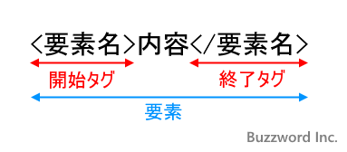

### XMLとは

- コンテキストによって以下のような意味で使われる

    - スキーマ言語 (eXtensible Markup Language) としての XML

        - スキーマとは? → XMLの構造を意味する

            - 要素(タグ)やその要素の属性、要素の親要素、子要素といったものによって XML ファイルが構成されていく

    - 構造化された文書 (XML ファイルとしての XML)

<br>
<br>

参考サイト

[簡単なXML Schemaから始めよう](https://atmarkit.itmedia.co.jp/ait/articles/0312/02/news002.html)

---

### XML の基本構造

#### XML 宣言と XML 文章

- XML のドキュメント(ファイル)は大きく分けると XML 宣言と XML 文章から構成されている

    - XML 宣言: バージョンと文字コードを指定する

    - XML 文章: XML の本体(コンテンツ)となる部分

        - XML 文章は**単一のルート要素で構成されている必要がある**

    ```
    <!-- ↓ XML 宣言部分 -->
    <? xml version="1.0" encoding="UTF-8" ?>

    <!-- ↓ XML 文章部分 (タグは何でもいい) -->
    <content>
        ~~
    </content>
    ```

<br>

#### 要素、タグ、属性



引用: [要素を記述する](https://www.javadrive.jp/xml/ini/index3.html)

<br>

- XML では要素名を自由に決めることができる

- 要素名に英語だけではなく日本語も使用できる

<br>


- 属性: 要素に対して付加的な情報を付け加えるために使用されるもの

<br>
<br>

参考サイト

[XML入門](https://www.javadrive.jp/xml/)

[XML徹底入門【わかりやすい図解解説】](http://xml.prognavi.com)

[簡単なXML Schemaから始めよう](https://atmarkit.itmedia.co.jp/ait/articles/0312/02/news002.html)

---

### XML の名前空間  

#### 名前空間が必要となるケース

- 1つの要素の中に、同じ名前の要素が複数存在する

    ```xml
    <books>
        <book>One Piece vol.1</book>
        <book>One Piece vol.2</book>
    </books>
    ```

    ↑の時、books 内の book を一意に特定できない

<br>

- 名前空間を利用して、各 book を一意に特定する

    - `xmls:prefix="{URI}"` で名前空間を定義する

        - URI 部分が要素を一意に定めるための識別子

            - ★★URI は実在するサイトの URL である必要はない → ただの文字列でいい

                - ではなぜ http~~ から始まっているのか? → Web の URI はこの世に重複することはないため、慣例的に Web の URI が使われている

        - prefix 部分は URI を示すエイリアスのようなもの

    ```xml
    <books
        xmls:A="http://www.sample.com/book1"
        xmls:B="http://www.sample.com/book2">

        <A:book>One Piece vol.1</book>
        <B:book>One Piece vol.2</book>

    </books>
    ```

    - One Piece vol.1 の book は http[]()://www.sample.com/book1 に属する要素

    - One Piece vol.2 の book は http[]()://www.sample.com/book2 に属する要素


<br>
<br>

参考サイト

[名前空間を使う](http://xml.prognavi.com/?p=123)

[XML名前空間](https://atmarkit.itmedia.co.jp/aig/01xml/namespace.html)
