### XML Schema とは

- ルールの決められた XML の書き方

    - 特段ルールのない XML ならば[要素名は何でもよく、日本語を使ってもいい](./XML.md#要素タグ属性)

    - XML Schema では使用出来る要素名はあらかじめ決まっている

- XML Schema で書かれた XML ファイルの拡張子は `.xsd` となる

- ★★XML Schema は XML 文書の**構造**を記述する

    - 通常の XML (要素の中にコンテンツが記述された XML) ではなく、「この XML Schema に従って書かれた XML は \~~ 要素を持ち、コンテンツのデータ型は \~~ で、、、」　みたいなものを定義するのが  XML Schema

    - クラス → XML Schema、　インスタンス → XML のイメージ

---

### 基本的な XML Schema の書き方

#### XML Schema の構造

- 通常の XML と同様に [XML 宣言部分と XML 文章部分](./XML.md#xml-の基本構造)から構成される

#### 要素

- XML Schema では、いくつかの決まった要素名がある

    - `schema`: XML 文章部分のルート要素

        - 通常の XML
            ```xml
            <!-- XML 文章部分 -->
            <root>
                <!-- 子要素 -->
            </root>
            ```

        <br>

        - XML Schema

            ```xsd
            <xs:schema xmlns:xs="http://www.w3.org/2001/XMLSchema">
                <!-- 子要素 -->
            </xs:schema>
            ```

            - 名前空間の URI には `http://www.w3.org/2001/XMLSchema` が慣例的に使われる

            - 名前空間のプレフィックスは `xs` か `xds` が慣例的に使われる

            - ★XML Schema では XML 文章内の全ての[グローバル要素](#ローカル要素とグローバル要素)がルートで定義される名前空間に属する必要がある
    
    <br>

    - `element`: 通常の要素に使用する要素

        - XML Schema

            ```xsd
            <xs:schema xmlns:xs="http://www.w3.org/2001/XMLSchema">
                <xs:element name="book" type="xs:string">
                </xs:element>
            </xs:schema>
            ```

            - element 要素は **その要素名を表す** name　属性を持つ

            - element 要素は **その要素のコンテンツのデータ型を表す** type 属性を持つ

        <br>

        - 上記 XML Schema に従った XML

            ```xml
            <book>
              よくわかるXML
            </book>
            ```

    <br>

    - `complexType`: 子要素群を表現する要素 (子要素を持つ要素の直下に書く)

        - XML Schema

            ```xsd
            <xs:schema xmls:xs="http://www.w3.org/2001/XMLSchema">
                <xs:element name="book">
                    <xs:complexType> <!-- 子要素群を表現する -->
                        <xs:sequence>
                            <xs:element name="title" type="xs:string"> <!-- 子要素 -->
                            </xs:element>
                        </xs:sequence>
                    </xs:complexType>
                </xs:element>
            </xs:schema>
            ```

            - たとえ子要素が1つだったとしても complexType 要素は必要
        
        <br>

        - 上記 XML Schema に従った XML

            ```xml
            <!-- book要素は子要素にtitle要素を持つ -->
            <book> 
                <title>
                    よくわかるXML
                </title>
            </book>
            ```

    <br>

    - `sequence`: 子要素群(element 要素) の登場順を固定したい場合に使用される要素

        - XML Schema

            ```xsd
            <xs:schema xmlns:xs="http://www.w3.org/2001/XMLSchema">

                <xs:element name="book" >

                    <xs:complexType>
                        <!-- book要素の子要素は title, author, price の順で登場しなければならない -->
                        <xs:sequence>
                            <xs:element name="title" type="xs:string">
                            </xs:element>

                            <xs:element name="author" type="xs:string">
                            </xs:element>

                            <xs:element name="price" type="xs:int">
                            </xs:element>
                        </xs:sequence>

                    </xs:complexType>

                </xs:element>

            </xs:schema>
            ```

            - ★子要素の登場順を順不同にしたい場合や、どれか1つ**だけ**の登場を期待する場合は sequence ではなく`他の要素で子要素を囲む必要がある`
        
        <br>

        - 上記 XML Schema に従った XML

            ```xml
            <book>
                <title>
                    よくわかるXML
                </title>
                <author>
                    山田太郎
                </author>
                <price>
                    1000
                </price>
            </book>
            ```

    <br>

    - `attribute`: 特定の要素に**ユーザー独自の属性**を持たせたい時に利用する要素

        - XML Schema

            ```xsd
            <xs:schema xmlns:xs="http://www.w3.org/2001/XMLSchema">
                <xs:element name="book" >
                    
                    <complexType>
                        <xs:attribute name="id" type="xs:integer"/> <!-- book 要素の属性であることに注意-->
                    </complexType>
                </xs:element>
            </xs:schema>
            ```

            - attribute 要素は complexType 要素で囲まれる必要がある

            - attribute 要素は以下の属性を指定することができる

                - `use 属性`: その attribue の属性を「必ず指定しなければならない」のか「省略できる」のか「指定してはいけない」のか

                    ```xsd
                    <xs:element name="book">
                        <xs:complexType>
                            <!-- title属性は指定しなければならない -->
                            <xs:attribut name="title" type="xs:string" use="required"/>

                            <!-- author属性は省略しても良い -->
                            <xs:attribut name="author" type="xs:string" use="optional"/>

                            <!-- price属性は指定してはいけない -->
                            <xs:attribut name="price" type="xs:integer" use="prohibited" />
                        </xs:complexType>
                    </xs:element>
                    ```
                

        <br>

        - 上記 XML Schema に従った XML

            ```xml
            <book id="1">
            </book>
            ```

<br>
<br>

参考サイト

schema 要素について
- [第8回　XML Schemaの定義(1)－XML Schemaの基礎，要素の宣言を学習する](https://xtech.nikkei.com/it/article/COLUMN/20070122/259197/)

element, complexType, sequence 要素について
- [XML Schemaの定義](http://xml.prognavi.com/?p=129)

attribute 要素について
- [XSD 空要素](https://memopad.bitter.jp/w3c/schema/schema_complex_empty.html)
- [属性のデータ型、デフォルト値、グループ](https://atmarkit.itmedia.co.jp/ait/articles/0404/29/news003.html)
- [XML Schema (3)](https://www.ikueikan.ac.jp/~tomoharu/ws2004/text/index_c5.html#doc6_684)

---

### データ型

- XML Schema で利用できる基本的なデータ型は以下を参照
    - [SEのためのXML Schema入門（4）豊富に用意されたデータ型を利用する](https://atmarkit.itmedia.co.jp/ait/articles/0403/02/news094.html)

    - [第8回　XML Schemaの定義(1)－XML Schemaの基礎，要素の宣言を学習する](https://xtech.nikkei.com/it/article/COLUMN/20070122/259197/)

---

### その他の要素と属性

#### element 要素に指定できる属性
- `ref` 属性: element 要素に指定可能。対象の要素をコンポーネント化することができる

    - XML Schema

        ```xsd
        <xs:schema xlmns:xs="http://www.w3.org/2001/XMLSchema">

            <!-- book要素を子要素に持つbooks要素の定義 -->
            <xs:element name="books">
                <xs:complexType>
                    <xs:element ref="book"> <!-- book要素の要素名をref属性に指定することで参照可能 -->
                </xs:complexType>
            </xs:element>

            <!-- book要素をコンポーネント化 -->
            <xs:element name="book">
                <xs:complexType>
                    <xs:element name="title" type="xs:string">
                    </xs:element>
                </xs:complexType>
            </xs:element>
        </xs:schema>
        ```

        - ref の属性値に参照したい element 要素の要素名を指定

        - ネストが深くなるのを防ぐことができる

    <br>

    - 上記 XML Schema に従った XML

        ```xml
        <books>
            <book>
                <title>
                    よくわかるXML
                </title>
            </book>
        </books>
        ```

<br>

- `maxOccurs` 属性: element 要素に指定可能。その要素の最大繰り返し回数

    - 例: maxOccurs が2の要素は、最大2回まで繰り返しで出現しても OK

    - 最大回数が無制限 (=何回繰り返し出現してもいい)　の場合は unbounded を指定する

    <br>

    - XML Schema

        ```xsd
        <xs:element name="books">
            <xs:complexType>
                <xs:element name="book" maxOccurs="2">
                    <xs:complexType>
                        <xs:element name="title" type="xs:string">
                        </xs:element>
                    </xs:complexType>
                </xs:element>
            </xs:complexType>
        </xs:element>
        ```

    <br>

    - 上記 XML Schema に従った XML

        ```xml
        <books>
            <!-- book要素の繰り返し出現回数は2回まで -->
            <book>
                <title>
                    よくわかるXML
                </title>
            </book>
            <book>
                <title>
                    よくわかるJSON
                </title>
            </book>
        </books>
        ```
<br>

- `minOccurs` 属性: element 属性に指定可能。その要素の最小繰り返し回数

    - 例: minOccurs が2の要素は、少なくても2回以上繰り返しで出現する必要がある

    <br>

    - XML Schema

        ```xsd
        <xs:element name="books">
            <xs:complexType>
                <xs:element name="book" minOccurs="1">
                    <xs:complexType>
                        <xs:element name="title" type="xs:string">
                        </xs:element>
                    </xs:complexType>
                </xs:element>
            </xs:complexType>
        </xs:element>
        ```

    <br>

    - 上記 XML Schema に従った XML

        ```xml
            <books>
                <!-- book要素の繰り返し出現回数は少なくとも1回以上 -->
                <book>
                    <title>
                        よくわかるXML
                    </title>
                </book>
                <book>
                    <title>
                        よくわかるJSON
                    </title>
                </book>
                <book>
                    <title>
                        よくわかるHTML
                    </title>
                </book>
            </books>
            ```

<br>

#### sequence の他に使える要素

- `all` 要素: 子要素の登場順を順不同にしたい場合に利用する要素

    - XML Schema

        ```xsd
        <xs:element name="books">
            <xs:complexType>
                <xs:all>
                    <!-- books の子要素である title,author,price要素はどのような順番で記載してもいい -->
                    <xs:element name="title" type="xs:strng"/>
                    <xs:element name="author" type="xs:strng"/>
                    <xs:element name="price" type="xs:integer"/>
                </xs:all>
            </xs:complexType>
        </xs:element>
        ```

    <br>

    - 上記 XML Schema に従った XML

        ```xml
        <books>
            <book>
                <author>
                    山田太郎
                </author>
                <price>
                    500
                </price>
                <title>
                    よくわかるXML
                </title>
            </book>
        </books>
        ```
<br>

- `choice` 要素: 子要素のうちどれか１つの要素だけが出現することを表す時に利用する要素

    - XML Schema

        ```xsd
        <xs:element name="books">
            <xs:complexType>
                <xs:all>
                    <!-- books の子要素である title,author,price要素のうちどれか一つを記載する -->
                    <xs:element name="title" type="xs:strng"/>
                    <xs:element name="author" type="xs:strng"/>
                    <xs:element name="price" type="xs:integer"/>
                </xs:all>
            </xs:complexType>
        </xs:element>
        ```

    <br>

    - 上記 XML Schema に従った XML

        ```xml
        <books>
            <book>
                <author>
                    山田太郎
                </author>
            </book>
        </books>
        ```

<br>
<br>

参考サイト

ref 属性について
- [SEのためのXML Schema入門（2）複数要素を定義する4つの基本形を覚えよう](https://atmarkit.itmedia.co.jp/ait/articles/0401/07/news072.html)
- [ref属性を使ったスキーマ定義](http://xml.prognavi.com/?p=133)

maxOccurs, minOccurs 属性について
- [XML Schema (3)](https://www.ikueikan.ac.jp/~tomoharu/ws2004/text/index_c5.html#doc6_704)
- [内容モデルの定義](http://xml.prognavi.com/?p=137)

all 要素, choice 要素について
- [XML Schema (3)](https://www.ikueikan.ac.jp/~tomoharu/ws2004/text/index_c5.html)

---

### targetNamespace とは

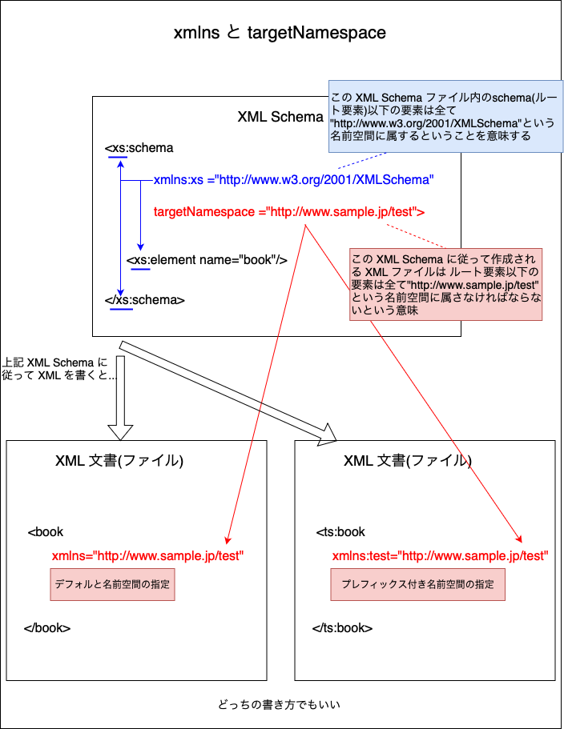

<br>

- XML Schema ファイルに定義するが、役割としては、その XML Schema に従って書かれた XML に対して、「この名前空間をつかえ」と強制する命令を意味する

<br>

#### xmlns と targetNamespace の違い


- xmlns はその (XML Schema, XML 関係なく) ファイルにて使用する名前空間

- targetNamespace はその XML Schema に従って作成される XML ファイル(文書)にて使用しなければいけない名前空間

<br>

#### targetNamespace と schemaLocation 属性

- 疑問: XML 文書をパーサーが解析するとき、その XML 文書の構成が正しいものであるとどうやって判断されるのか?

    ```xml
    <!-- 以下の XML の構造は正しいのか正しくないのか? 
    どうやつて判断されるのか? -->
    <mb:book xmlns:mb="http://www.mybook.jp">

        <mb:title>
            よくわかるXML
        </mb:title>

        <mb:author>
            山田太郎
        </mb:author>

    </mb:book>
    ```

<br>

- 答え: XML 文書側で schemaLocation 属性を利用する

    - ★schemaLocation で指定された XML Schema を元に XML 文章の構造がチェックされるかどうかは解析する XML パーサーの実装次第

    <br>

    - schemaLocation の使い方
        - `schemaLocation`=`{名前空間のURI}` `XML SchemaファイルのURL`

        <br>

        - XML Schema

            ```xsd
            <!-- XML文書部分のみ -->
            <xs:schema 
                xmlns:xs="http://www.w3.org/2001/XMLSchema"
                targetNamespace="http://www.mybook.jp">

                <xs:element name="book">
                    <xs:complexType>

                        <xs:element name="title" type="xs:string"/>

                        <xs:element name="author" type="xs:string"/>

                    </xs:complexType>
                </xs:element>
            </xs:schema>
            ```

        <br>

        - 上記 XML Schema に従った XML

            ```xml
            <!-- XML文書部分のみ -->
            <mb:book
                xmlns:mb="http://www.mybook.jp"
                mb:schemaLocation="http://www.mybook.jp {XML Schema ファイルのURL}"
            >

                <mb:title>
                    よくわかるXML
                </mb:title>

                <mb:author>
                    山田太郎
                </mb:author>

            </mb:book>
            ```

<br>

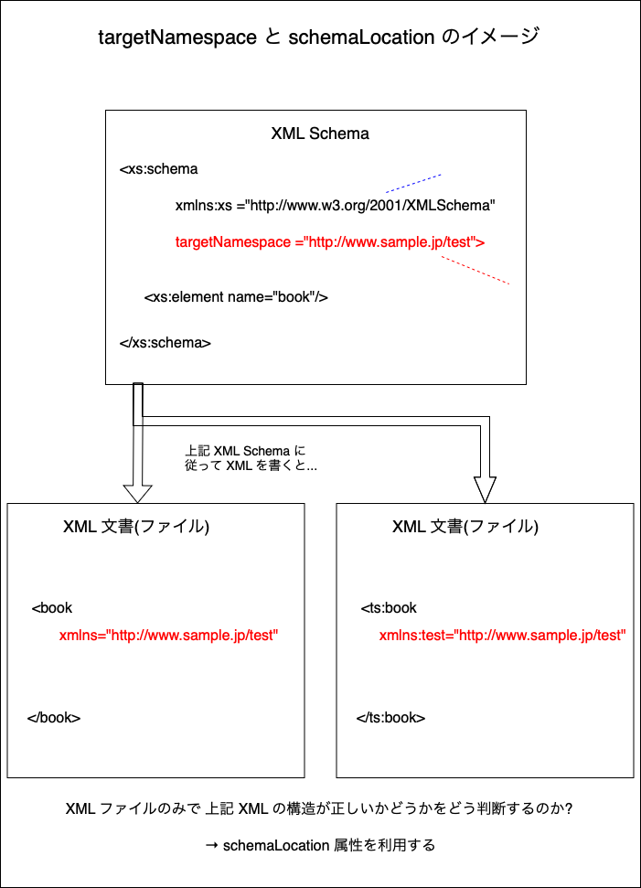

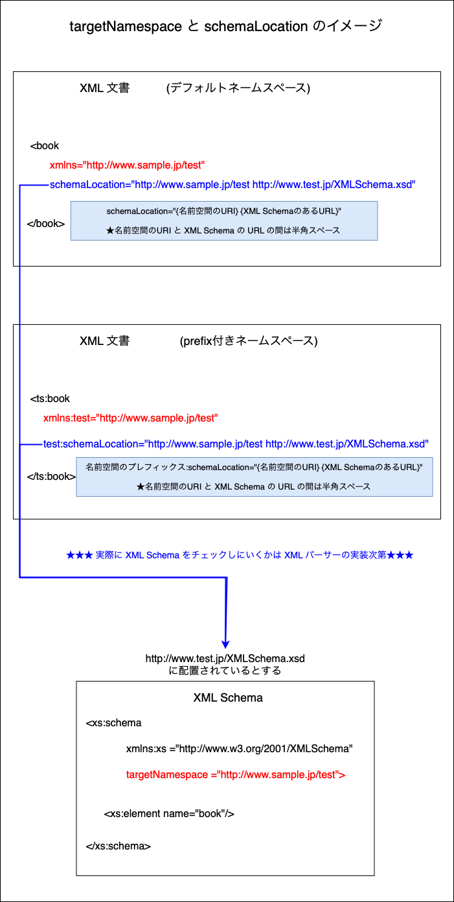

<br>
<br>

参考サイト
[XML Schema 8章　NamespaceとXML Schema](https://www.techscore.com/tech/XML/XML_Schema/Schema8/8_2)

---

### ローカル要素とグローバル要素

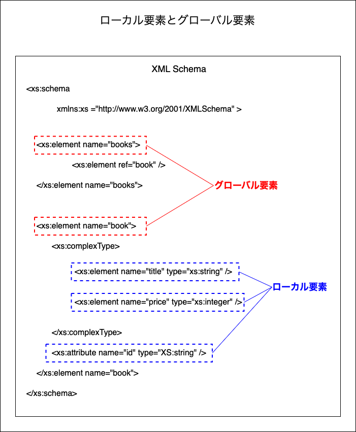

<br>

- グローバル要素

    - schema 要素の子要素

<br>

- ローカル要素

    - schema 要素の子要素　(直下で定義されている)　ではない要素

    - 主に complexType 要素以下に宣言された子要素

<br>

#### 注意点

- グローバル要素は、その XML Schema で指定された targetNamespace の名前空間に所属する

    - → XML Schema の ref や type 属性で参照する際は、名前空間(prefix)を指定しなけれならない

    - → XML 文書でその要素名を書くときは、名前空間(prefix)を指定しなければならない

    <br>

    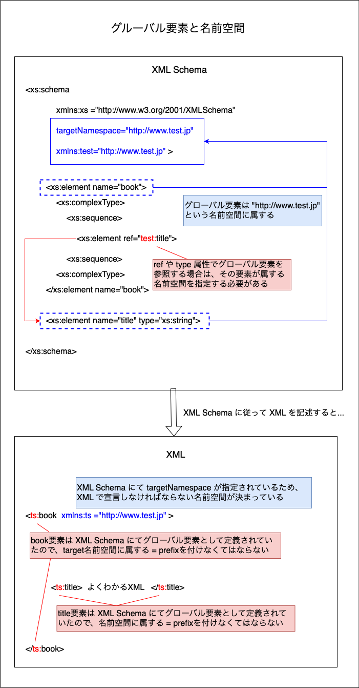

<br>

- ローカル要素は、その XML Schema で指定された targetNamespace の名前空間には所属しない

    - → XML 文書(ファイル)でその要素名を書くときは、名前空間を指定してはいけない

    <br>
    
    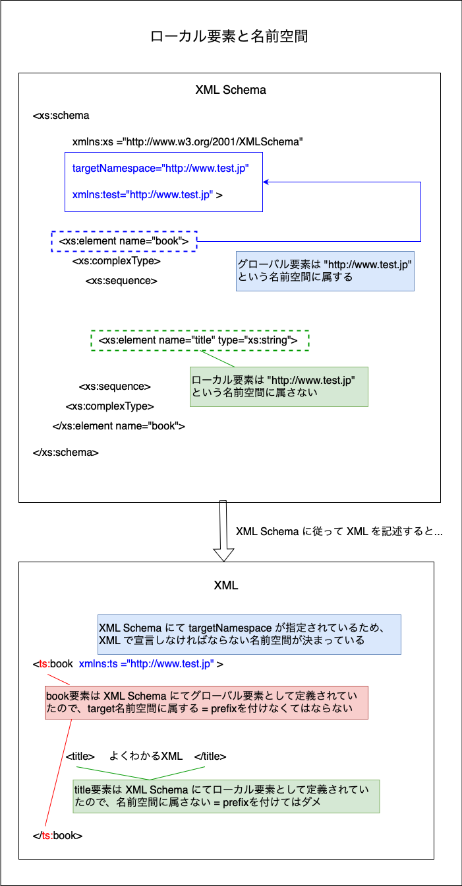

<br>
<br>

参考サイト

[最終回　XML Schema―型の再利用と名前空間](https://atmarkit.itmedia.co.jp/fxml/rensai2/xmlmaster15/master15.html)

[9.2 XML 文書内のNamespace指定](https://www.techscore.com/tech/XML/XML_Schema/Schema9/9_2)

[XML Schema (2)](https://www.ikueikan.ac.jp/~tomoharu/ws2004/text/index_c4.html#doc5_531)

---

### XML Schema 側にて taregtNamespace の名前空間を参照するケース

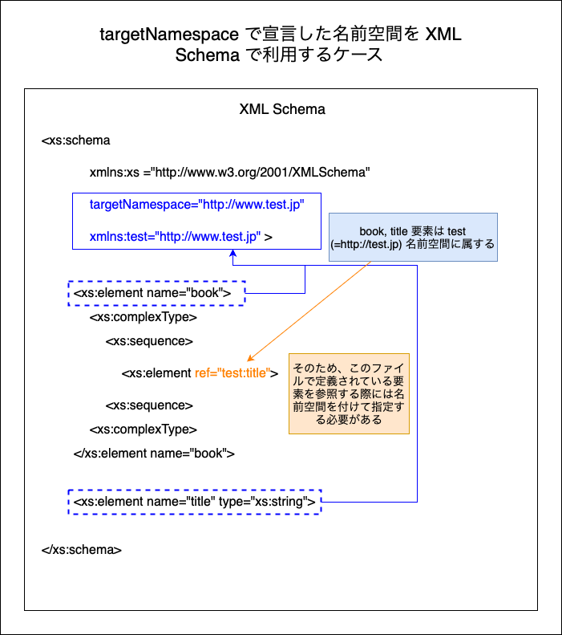

<br>

上記 XML Schema に従って記述される XML 文書の例

```xml
<!-- XML文章分のみ -->
<ts:book xmlns:ts="http://www.test.jp" >
    <!-- title要素は XML Schema にてグローバル要素で定義されているので名前空間を指定する必要がある -->
    <ts:title>
        よくわかるXML
    </ts:title>
</ts:book>
```

#### ポイント

- XML Schema 側
    - ref や type 属性で XML Schema 内の他の要素を参照する場合、その XML Schema で宣言したtargetNamespace の名前空間を指定する必要がある

- XML 文書(ファイル)側

    - 記述する要素がグローバル要素かローカル要素によって、要素名に名前空間を付けなければいけない/付けてはいけない
        
        - 詳しくは[こちら](#ローカル要素とグローバル要素)を参照

<br>
<br>

参考サイト

[最終回　XML Schema―型の再利用と名前空間](https://atmarkit.itmedia.co.jp/fxml/rensai2/xmlmaster15/master15.html)

[対象名前空間](https://art-tags.net/xml/schema/step38.html) ★ブラウザのエンコーディングを Shift-JIS にしないと文字化けが起きる

---

### 名前空間を指定しない XML Schema を参照するケース

- XML Schema にて targetNamespace が指定されていないものをカメレオンスキーマと呼ぶ

- XML でカメレオンスキーマな XML Schema を参照したい場合は `noNamespaceSchemaLocation` 属性で参照する

    - 参照方法は[schemaLocation属性](#targetnamespace-と-schemalocation-属性)と似た記法 (名前空間のURIが無く、XML Schema ファイルの URL だけを指定する)

<br>

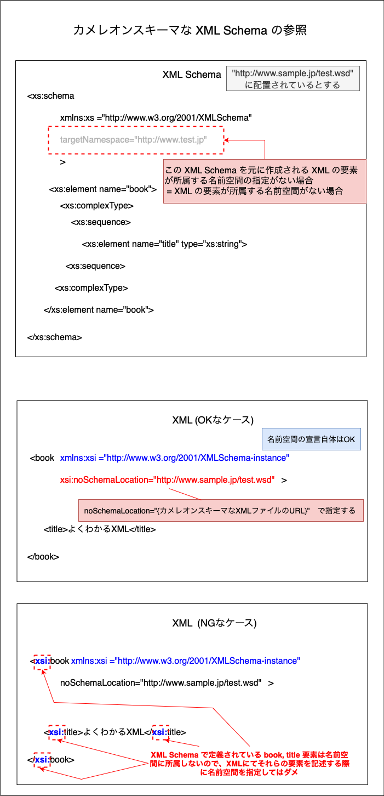

<br>
<br>

参考サイト

[8.4 schemaLocation、noNamespaceSchemaLocation](https://www.techscore.com/tech/XML/XML_Schema/Schema8/8_4)

---

### form 属性と elementFormDefault 属性

- 通常 XML Schema では、ローカル要素は targetNamespace で宣言された名前空間に所属しない

    - 以下のうちどれか1つの方法でローカル要素も名前空間での修飾を強制させることができる (どちらともXML Schema 側で指定する)

        1. 対象の ローカル要素の form 属性 の値に "qualified" を指定する

            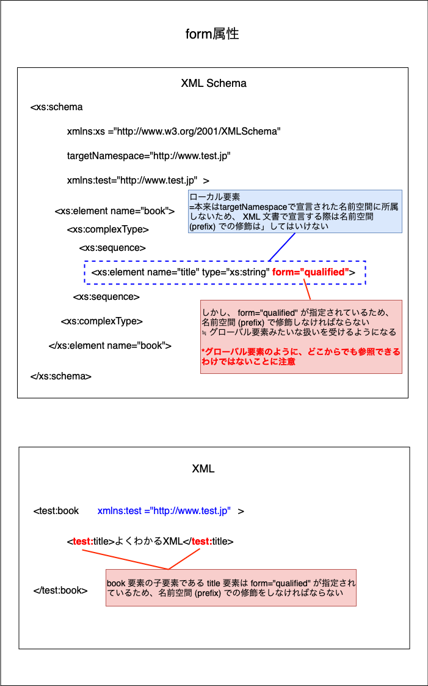

        <br>

        2. schema 要素の elementFormDefault 属性の値に "qualified" を指定する

            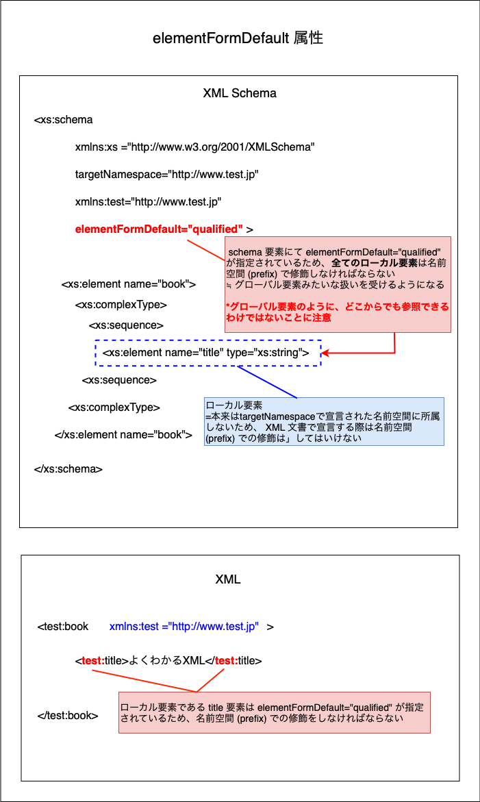

<br>

#### form 属性と elementFormDefault 属性の違い

- form 属性

    - 対象のローカル要素のみに名前空間での修飾の強制力が働く

    - 宣言する場所は、対象となるローカル要素

<br>

- elementFormDefault 属性

    - 全てのローカル要素に名前空間での修飾の強制力が働く

    - 宣言する場所は schema 要素

---

### ref 属性を利用する際の注意点

- グローバル要素には ref 属性は使えない

    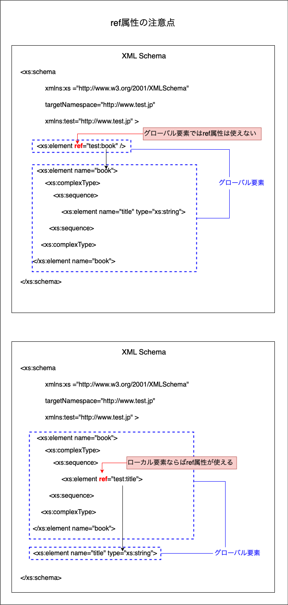

<br>

- グローバル要素で ref みたいに他の要素を参照したい場合は type 属性で参照することができる

    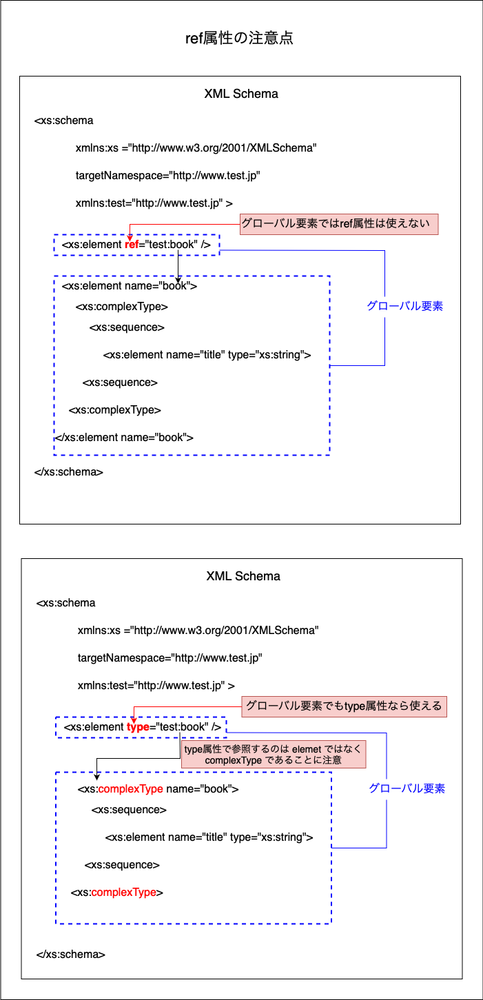

---

### グローバル属性に注意

- グローバルレベルで宣言された attribute 要素は targetNamespace で指定された名前空間に所属する

    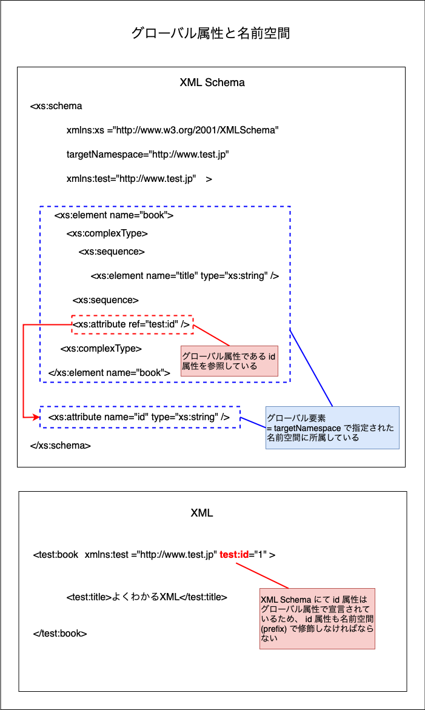

<br>

- ローカルレベルで宣言された attribute 要素は targetNamespace で指定された名前空間に所属しない

    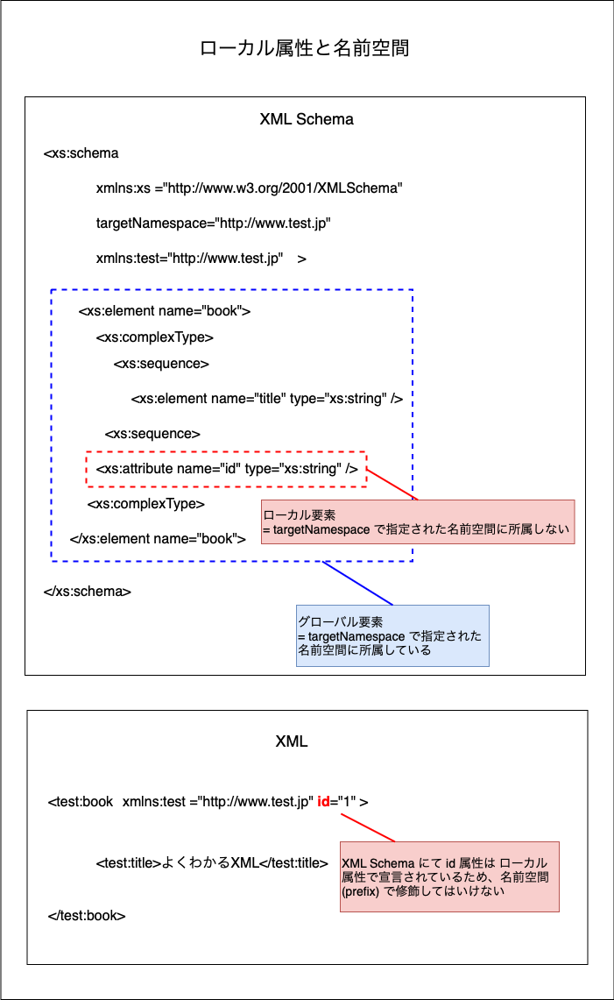

<br>
<br>

参考サイト

[XML Schema: やるべきこと、やってはいけないこと](https://www.horobi.com/xml/XMLSchemaDosAndDONTs.ja.html#avoid_chameleon)

---

### その他

- XML が XML Schema に従って記述されているかを検証してくれる Web ツール

    - [Free Online XML Validator (XSD)](https://www.liquid-technologies.com/online-xsd-validator)
