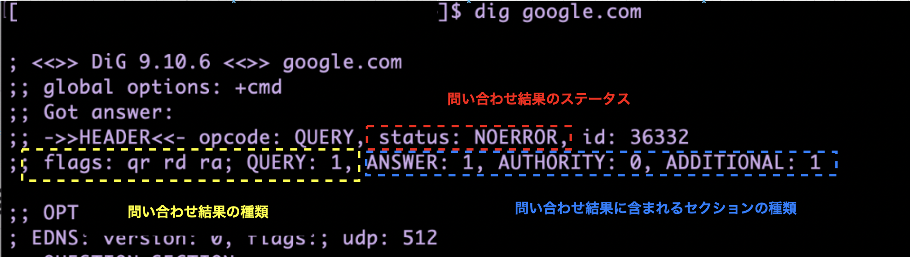

### dig コマンドとは

- キャッシュ DNS サーバー、および権威 DNS サーバーに対してドメイン名の解決を依頼するコマンド

    ```bash
    dig ドメイン名 @キャッシュDNSサーバーのIPアドレス オプション
    ```

    - 例: google.com の IP アドレスを問い合わせる

        ```bash
        # デフォルトのキャッシュ DNS サーバーに問い合わせる
        dig google.com

        # google の キャッシュ DNS サーバー (8.8.8.8)に問い合わせる
        dig google.com @8.8.8.8
        ```

<br>
<br>

参考サイト
[hana_shinのLinux技術ブログ](https://hana-shin.hatenablog.com/entry/2021/12/22/201022)

---

### 再帰問い合わせと反復問い合わせ(非再帰問い合わせ)


<br>

- 再帰問い合わせ

    - クライアントからキャッシュ DNS サーバーへの問い合わせ

    - dig コマンドでのドメイン名の問い合わせはデフォルトで再帰問い合わせになる

<br>

- 反復問い合わせ (非再帰問い合わせ)

    - キャッシュ DNS サーバーから権威 DNS サーバーへの問い合わせ

    - +norec オプションをつけると、dig コマンドはクライアントから権威 DNS サーバーへドメイン名を問い合わせる

<br>
<br>

参考サイト

[【入門 DNS プロトコル】 名前解決の確認方法をわかりやすく説明](https://hogetech.info/network/protocol/dns#toc16)

[DNS resolver / recursive query iterative query](https://www.infraexpert.com/study/tcpip24.html)

---

### dig コマンドの結果の見方


<br>

#### HEADER セクションの見方



<br>

- status: 問い合わせ結果のステータス(成功/失敗/エラーなど)を表す

    - `NOERROR`: 正常な応答

        - status が NOERROR でも ANSWER セクションあからだったりする場合もあることに注意
    
    <br>

    - `NXDOMAIN`: 問い合わせたドメインが存在しない

        

        <br>

    - `SERVFAIL`: サーバー側の異常でエラー

    - `REFUSED`: アクセス制限などの理由で問い合わせの拒否がされた

<br>

- flags: 問い合わせ結果がどのような種類のものであるかを表す

    - `qr`: 問い合わせへの応答であることを示す

    <br>

    - `rd`: キャッシュ DNS サーバーへの再帰問い合わせの結果であることを示す

    <br>

    - `aa`: 権威 DNS サーバー からの問い合わせ結果であることを示す

<br>
<br>

[DIGを使ったDNSの探求: 基本から応用まで](https://ryo-ux-it-agile.com/dig/)

[DNSチュートリアル -初心者のためのDNS運用入門-](https://www.janog.gr.jp/meeting/janog35/download_file/view/83/175/index.pdf)

[用語辞典 AAビット](https://jprs.jp/glossary/index.php?ID=0203)

[digコマンドの「status」と「fags」](https://qiita.com/harukin721/items/294d18ec74a36a322a2a)

---

### +trace オプション

- dig を実行している環境がキャッシュ DNS に替わって権威 DNS サーバーに反復問い合わせを行うオプション

    

<br>

#### +norec オプションとの違い

- +norec

    - 1回の問い合わせで1つの権威DNSサーバーに問い合わせを行うオプション

    - 非帰問い合わせ

        

<br>

- +trace

    - 1回の問い合わせでルート DNS サーバーから下位の権威 DNS サーバーまで一気に反復問い合わせを行ってくれるオプション

        

<br>
<br>

参考サイト

[基礎から理解するCDN入門: 第4回 DNSの仕組みを理解する](https://www.bloomblock.net/media/what-is-dns/#index_id11)

[Yahoo!知恵袋](https://detail.chiebukuro.yahoo.co.jp/qa/question_detail/q13287056618)
