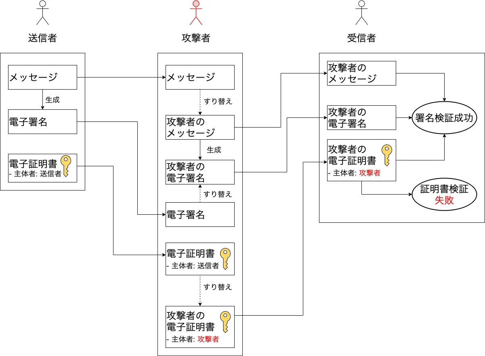

### デジタル署名 (Degital Signature) とは

デジタル文書に付与されるデータで、以下のような役割がある

- そのデジタル文書の作成者本人だということを証明する

- そのデジタル文章は送付される途中で改竄などはされていないということを証明する

---

### デジタル署名の仕組み (RSA 暗号方式)

具体的にはハッシュ化と公開鍵方式 (RSA) の暗号化を利用している

 

ポイント
- 秘密鍵で暗号化 & 公開鍵で復号化 (RSA 暗号方式だからできること、一般的な公開鍵方式ではできない)

- 暗号/復号化する対象は文書のハッシュ値

引用: [電子署名の仕組み](https://www.jipdec.or.jp/project/research/why-e-signature/PKI-crypto-mechanism.html)

---

### デジタル署名の仕組み (DSA/ECDSA 署名方式)

具体的にはハッシュ化と DSA/ECDSA 署名方式を利用している

 

ポイント
- RSA 暗号化方式のような**暗号化は行なっていない**

- 署名として付与されるデータは r と s (実際は数値)

- 署名時は、ハッシュ値と秘密鍵などで色々計算した結果 r, s というデータを署名として生成する

- 検証時は、ハッシュ値と署名データ s と公開鍵で色々計算した結果を r と比較する

引用: [電子署名と公開鍵暗号方式](電子署名と公開鍵暗号方式)

 

参考サイト1: [電子署名と公開鍵暗号方式](https://www.jipdec.or.jp/project/research/why-e-signature/public-key-cryptography.html)

参考サイト2: [デジタル署名～シュノア署名とECDSAの比較～](https://spotlight.soy/detail?article_id=z1mk21yed)

---

### その他メモ (RSA 暗号化方式)

秘密鍵が流出したら、もちろん安全性の担保は全くできない

 

RSA 暗号化方式にて、秘密鍵で暗号化したものは公開鍵で復号化でき、公開鍵で暗号化したものは秘密鍵で復号化できる

- このことから、「秘密鍵と公開鍵の違いは?」となった

    - 秘密鍵から公開鍵の生成はできるが、公開鍵から秘密鍵の生成はできない

 
 

デジタル署名と RSA についての参考サイト

参考1: [暗号化と署名は対称じゃないよという話](https://www.machu.jp/posts/20080302/p01/)

参考2: [公開鍵暗号と電子署名の基礎知識](https://qiita.com/kunichiko/items/ef5efdb41611d6cf7775)

---

### 疑問

以下のケースにおいて、デジタル署名は無力では?

- 中間者 (攻撃者) が、自分の秘密鍵で署名を差し替え、証明書も差し替えた場合

引用: [電子署名について一歩踏むこんで知る](https://blog.sa2taka.com/post/digital-signature-foundation/)

 

一見、上記画像のように成り替わりが可能のように思える

しかし、正当な電子証明書は第３者 (認証局) からの署名がされており、受信側は証明書の正当性を検証する = [証明書チェーンの検証](./SSLサーバー証明書.md#サーバー証明書の正当性チェック)

よって、証明書の偽装は難しい

 
 

参考サイト

- まさに自分の疑問について取り上げているサイト: [電子署名について一歩踏むこんで知る](https://blog.sa2taka.com/post/digital-signature-foundation/)