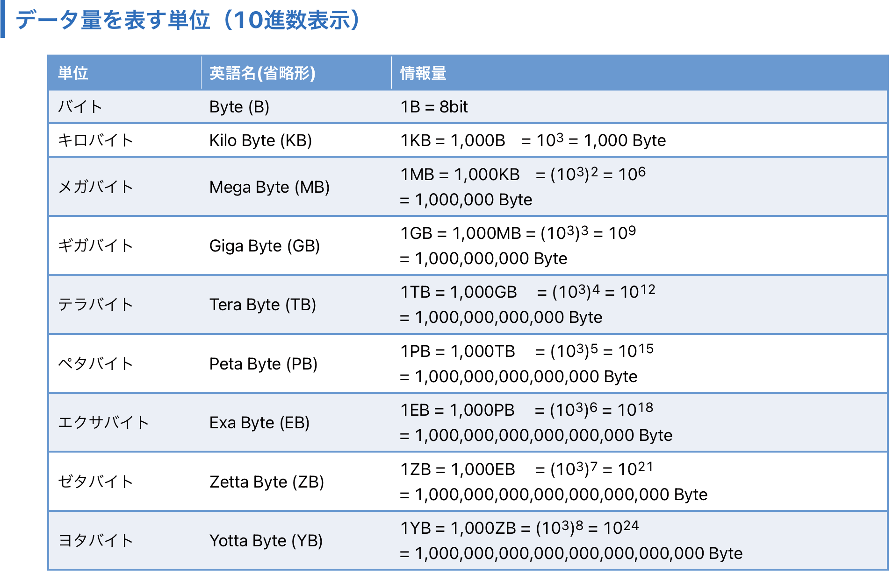
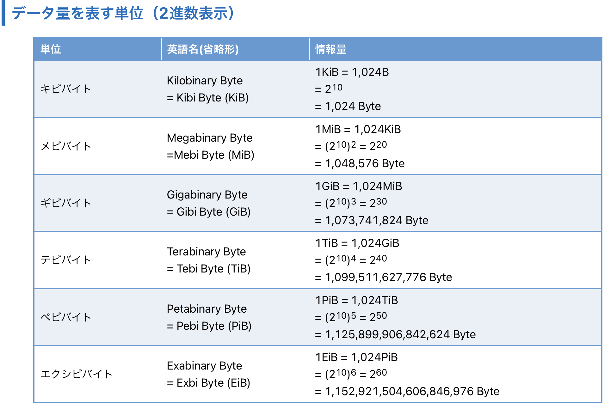
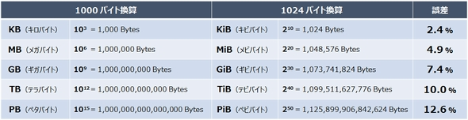

### KB と KiB

- KB (キロバイト)
    - 1 KB = 1000 Byte

 

- KiB (Kilobinary Byte = キビバイト)
    - 1 KiB = 1024Byte

 

#### 間に i を挟まないデータ容量

- 10 の 3 乗で表される
    - 1GB = 1000MB (10^3MB)

引用: [第5節　ビット？バイト？データ量の表し方](https://www.networld.co.jp/solution/learn_first/storage/1st/01_basis/05_bit_byte/)

 

#### 間に i を挟んで表されるデータ容量

- 2 の 10 乗で表される (だからbinary)
    - 1GiB = 1024MiB (2^10MiB)

        *1GiB = 1024MBではないことに注意

- コンピューターが扱うのは2進数のため、厳密にはこちらの方が正しい

引用: [第5節　ビット？バイト？データ量の表し方](https://www.networld.co.jp/solution/learn_first/storage/1st/01_basis/05_bit_byte/)

 

#### 注意点　

- 1KB と 1KiB の差はたった 24Byte だが、単位が大きくなればなるほど差はどんどん大きくなる

引用: [第47回 単位の世界「テビ」と「テラ」　この違いを知ってますか？](https://www.itmedia.co.jp/enterprise/articles/1608/05/news024.html)

 
 

参考サイト

[第5節　ビット？バイト？データ量の表し方](https://www.networld.co.jp/solution/learn_first/storage/1st/01_basis/05_bit_byte/)

[第47回 単位の世界「テビ」と「テラ」　この違いを知ってますか？](https://www.itmedia.co.jp/enterprise/articles/1608/05/news024.html)