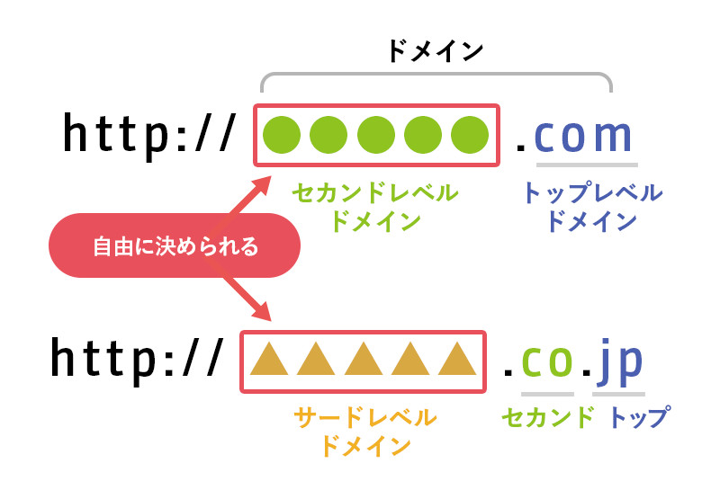

### ドメイン名とは

見た目、構造
- とあるURL `https://www.example.co.jp`  があったとして、 `example.co.jp` がドメイン名と言われる部分

- また、ドメイン名は階層構造になっており、ドメイン名部分末尾から トップレベルドメイン、セカンドレベルドメイン、サードレベルドメインと呼ばれる

引用: [ドメイン名はどの部分？](https://www.idcf.jp/rentalserver/user-support/knowledge/domain/part.html)

 

役割
- **ドメイン名とは、インターネット上のネットワークを特定するための文字列**

- IP アドレスのネットワーク部のイメージ

- *ドメイン名だけではインターネット経由で通信対象のマシンにはたどり着けない

引用: [ドメイン名・ホスト名・FQDNって？](https://livra.geolocation.co.jp/iplearning/250/)

---

### ホスト名とは

見た目、構造
- とあるURL `https://www.example.co.jp`  があったとして、 `www` がホスト名と言われる部分

 

役割
- **ネットワーク上のコンピューターを識別するための文字列**

- IP アドレスのホスト部のイメージ

引用: [ドメイン名・ホスト名・FQDNって？](https://livra.geolocation.co.jp/iplearning/250/)

---

### FQDN (Fully Qualified Domain Name = 完全修飾ドメイン名)

見た目、構造
- ホスト名とドメイン名をつなげた表記形式のこと

- とあるURL `https://www.example.co.jp`  があったとして、 `www.example.co.jp` が FQDN と言われる部分

引用: [FQDN？URL？ドメイン名？違いは？](https://itmanabi.com/fqdn-url/#st-toc-h-2)

 

役割
- ネットワーク上の特定のコンピューターを特定する

- IP アドレス (ネットワーク部 + ホスト部)のイメージ

引用: [ドメイン名・ホスト名・FQDNって？](https://livra.geolocation.co.jp/iplearning/250/)

 
 

参考サイト

ドメイン、ホスト名、FQDN についての非常にわかりやすいサイト -> [ドメイン名・ホスト名・FQDNって？](https://livra.geolocation.co.jp/iplearning/250/)

---

### URL

見た目
- スキーム + FQDN + ポート番号 + ディレクトリ + ファイル名 + パラメータ + フラグメント で構成される

    - スキーム: 通信プロトコル
    - パラメーター: クライアントからの入力データ
    - フラグメント: ソース（ページ）内の特定情報の場所を示す識別子

 

役割
- ネットワーク上の **特定のリソースにアクセスする** ための識別子

引用: [シマウマ用語集](https://makitani.net/shimauma/url)

 
 

参考サイト

- URL についてのわかりやすい解説: [URL](https://shukapin.com/infographicIT/url)

---

### FQDN と URL の違い

ポイント
- FQDN は URL の一部

- FQDN: ネットワーク上の特定のコンピューターを特定する

- URL: インターネット上のコンピューターのリソースを示す

引用: [シマウマ用語集](https://makitani.net/shimauma/url)

---

### トップレベルドメイン (Top Level Domain)

- ドメイン名の中で、jp や com などの末尾の部分

引用: [ドメイン名はどの部分？](https://www.idcf.jp/rentalserver/user-support/knowledge/domain/part.html)

 

- 利目的、政府機関、国など、そのサイトの種類を視覚的に判断するのに役立つ

 

**トップレベルドメインには種類がある**
- generic Top Level Domain = gTLD (汎用トップレベルドメイン) : 世界中の誰でも登録でき、どんなサイトでも使用できるトップレベルドメイン
    - .com, .net, .org などが gTLD に当たる

    - どんなサイトにも使用できるが、一般的にはウェブサイトの目的トップレベルドメイン名を緩やかに関連付ける

 

- country code Top Level Domain = ccTLD (国別トップレベルドメイン): 特定の国を表すトップレベルドメイン
    - .jp, .us, .nz　などが ccTLD に当たる
    - **ccTLDによってはその国の居住者でなければならないものもあれば、世界中のどこの人でも登録できるものもある**

 

- sponsored Top Level Domain = sTLD (スポンサー付きトップレベルドメイン): 特定の業種や事業目的のために用意されたドメイン
    - .museum, .travel など
    - **sTLDの提供元の組織が認めた場合、使用できるようになる**

 
 

参考サイト

- トップレベルドメインについてわかりやすいサイト: [トップレベルドメインとは](https://www.nadukete.net/domain-guide/beginners/top-level-domain.html)

- sTLD についてのわかりやすいサイト1: [ドメインの種類/gTLDって？](https://livra.geolocation.co.jp/iplearning/539/)

- sTLD についてのわかりやすいサイト2: [トップレベルドメイン（ TLD ）とは？種類や選び方を初心者向けに解説](https://knowledge.cpi.ad.jp/basic-knowledge/tld/)

---

### セカンドレベルドメイン

- トップレベルドメインの前に配置されるドメイン

 

ポイント
- トップレベルドメインによっては、固定のサブドメインがつくことがある (属性型JPドメインなど)
    - co.jp、ac.jp, ne.jp など組織の属性を表すセカンドレベルドメイン

    - 取得のための条件(日本国内の会社であるかなど)がある

- 一方、自分が自由にセカンドレベルドメインを決めれるケースもある (汎用JPドメインなど)

引用: [ドメインについて徹底解説！ドメインの種類や決め方のコツ](https://hp-maruwakari.com/domain/)

 

参考サイト

属性型 JP ドメインについて -> [属性型JPドメインとは](https://jpdirect.jp/modalpage/modal_youken_jp.html)

属性型 JP ドメインについてその2 -> [属性型JPドメイン名](https://jprs.jp/glossary/index.php?ID=0080)

---

### サードレベルドメイン

- セカンドレベルドメインの前、セカンドレベルドメインがなければトップレベルドメインの前に配置されるドメイン名

- サードレベルドメインは自由に決めることができるため、「独自ドメイン」とも呼ばれる

    - トップレベルドメインの種類によってはセカンドレベルドメインが独自ドメインになることもある

参考サイト

サードレベルドメインについて: [ドメイン（サーバー）の選び方](https://web-partner.jp/knowledge-domain-server/)
