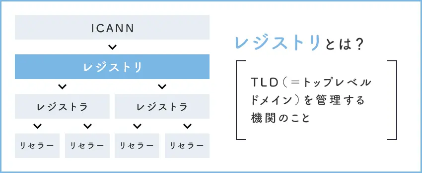
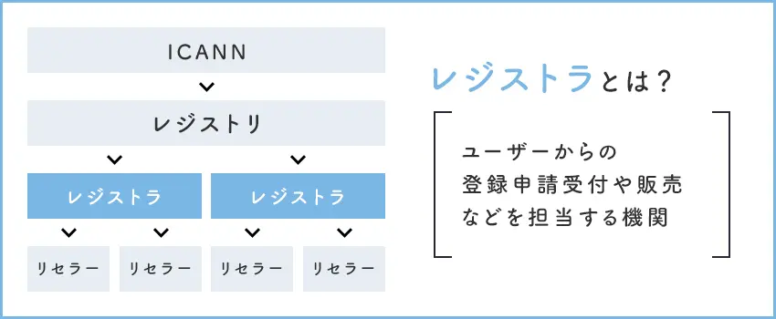
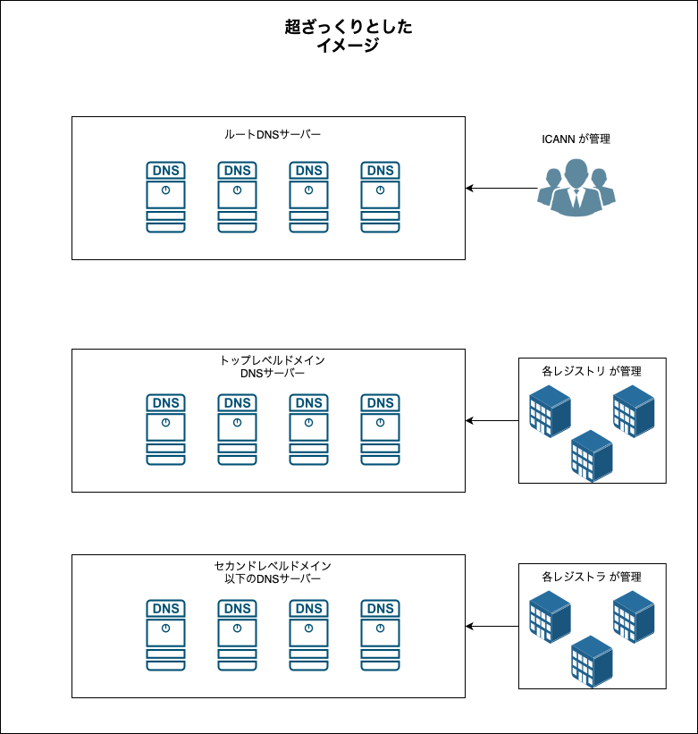

### レジストリとレジストラ

#### レジストリとは

引用: [レジストリとレジストラの違いとは？ドメイン運用の仕組みを解説](https://grannet.co.jp/column/registry_registrar/)

 

- [トップレベドメイン](./ドメイン名.md#トップレベルドメイン-top-level-domain) を管理する機関のこと

- ドメインの販売ではなく、**ドメイン名、DNSサーバーなどの管理**を行う

 

#### レジストラとは

引用: [レジストリとレジストラの違いとは？ドメイン運用の仕組みを解説](https://grannet.co.jp/column/registry_registrar/)

 

- ユーザーからのドメイン登録申請受付や販売などを担当する機関のこと

- ★レジストラはレジストリに直接アクセスする権限を持っており、ユーザーから申請されたドメインをレジストリのデータベース上に登録を行う。

 

#### リセラーとは

- レジストラからドメインの再販権を得た業者のこと

- レジストラとは異なり、レジストリに直接アクセスする権限を持っていない

    - リセラーはレジストラに対してドメイン登録申請をする

 

#### その他メモ

- (たぶん) レジストラ、レジストリが管理する DNS サーバーは以下のような感じ

    

 
 

参考サイト

[レジストリとレジストラの違いとは？ドメイン運用の仕組みを解説](https://grannet.co.jp/column/registry_registrar/)

[レジストリとレジストラの違い](https://qiita.com/miyuki_samitani/items/ac8bf32554872a701735)

[レジストリとレジストラ](https://www.onamae.com/clever/about/regist.html)