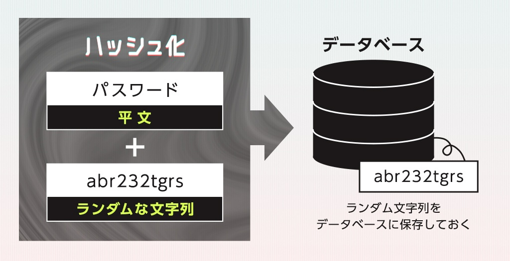
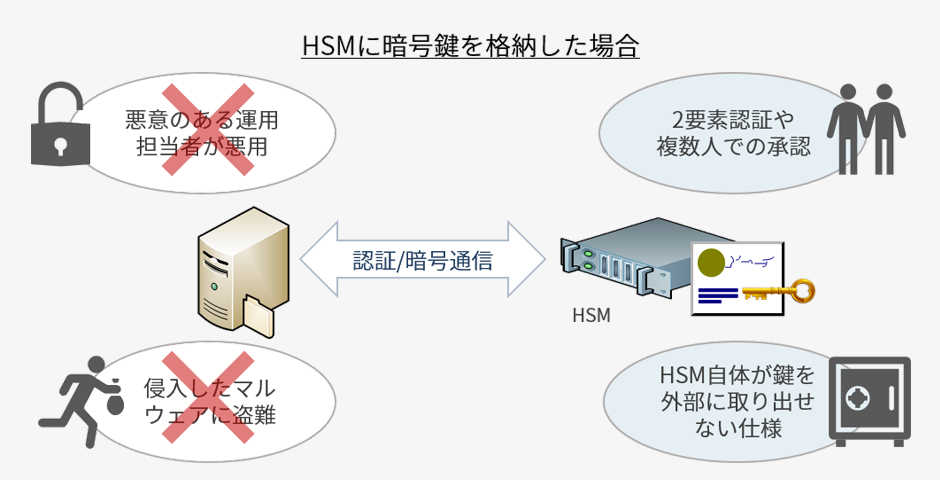
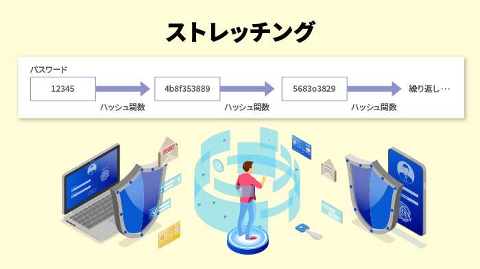

### 暗号化とハッシュ化の共通点

データ内容をランダムな文字/数字列に変換すること

万が一、第三者に中身を見られても内容がわからないようにすること

----

### 暗号化とハッシュ化の違い

暗号化
- 暗号化(*ランダムに変換)された内容を元に戻すことが可能 (復号化可能)

ハッシュ化
- ハッシュ化(*ランダムに変換)された内容は元に戻すこと非常に難しい(ほぼ不可能)

*完全にランダムに変換されるわけではなく、そのように変換される規則/計算方法はある。しかし第三者から見れば、ランダムな文字列に見える

---

### それぞれの使い分け

暗号化
- 復号化する必要のあるデータに利用される
    - 例: メールの送受信、http を安全に => https　など

ハッシュ化
- 復号化しなくてもいいデータに利用される
    - 例: DB に保存するユーザーのパスワード、署名(データが改竄されていないかを証明するハッシュ値) など

---

### 一見安全そうに見えるハッシュ化だが...

完全に安全というわけではない

ハッシュ化の弱点
- ハッシュ関数が同じなら、入力値に対するハッシュ値は同じ

 

代表的なハッキング方法: レインボーテーブル攻撃

前提
- ハッシュ化されたパスワードが漏洩した

 

攻撃方法

1\. 任意の平文を、特定のハッシュ関数でハッシュ化し、還元関数で平文にまた戻す処理を繰り返し (= チェイン化)、一番最初の任意の平文と最終的に生成された平文のペアをテーブルに格納する

このテーブルをレインボーテーブルと呼ぶ

例: "パスワード"という文字をチェーン化し、結果"いぬ"という平文が取得できる

引用: [レインボーテーブルの仕組みを図解で分かりやすく解説](https://medium-company.com/レインボーテーブル/)

*チェーン化の回数(=チェーンの長さ)は任意

*還元関数はその都度異なるものを選ぶ

 

2\. 結果以下のようなテーブルが出来上がる

 

3\. 漏洩したパスワードのハッシュ値を、各チェインの最後の還元関数にかけ平文を取得する。

取得できた平文を、テーブルの「最後の平文」と比較し同じものがないかを探す

 

4\. 見つからなかった場合、最後から2つ前の還元関数にかけ平文を取得、その平文を最後の還元関数にかけ再び平文を取得。

最終的に取得できた平文を、テーブルの「最後の平文」と比較し同じものがないかを探す

 

5\. 見つからなかった場合、もう一つ前の還元関数で同じ処理を行う

 

6\. 上記手順を繰り返していき、どこかで同じ平文が見つかった場合、そのレコードの最初の平文からチェインを再度作成する

 

7\. 再作成したチェーンを辿っていき、漏洩したパスワードのハッシュ値が出てこないか探す

*チェーンを再作成しながら辿っていくのかも

 

8\. 同じハッシュ値が見つかった場合、その手前の平文がパスワードであることがわかる

 
 

疑問に思ったこと

- レインボーテーブル作成の時に使用しているハッシュ化のアルゴリズムが、漏洩したシステムが使っていたハッシュ化のアルゴリズムと違えば、たとえ同じハッシュ値を発見できてもパスワードを復元できるとは限らないのでは?

    - 例: 漏洩したシステムではハッシュ化のアルゴリズムに MD5 を使用しており、レインボーテーブル作成の際にハッカーは SHA-1 を利用していた。

\[結論\]  
確かに、レインボーテーブルのハッシュ化アルゴリズムと、漏洩したシステムのハッシュ化アルゴリズムは同じものである必要がある

しかし、そもそもハッシュ関数とはハッシュ値の衝突を十分に考慮されているため、異なるハッシュ関数でハッシュ値の衝突が起きるとは考えにくい

*MD5 と SHA-1 はハッシュ値の衝突に関する脆弱性が見つかり、現在では使ってはダメ

 
 

レインボーテーブル攻撃への防御策
- [ソルト処理](#Salt)を行う
- [ストレッチング](#Streching)を行う

 
 

参考サイト1: [レインボーテーブルの仕組みを図解で分かりやすく解説](https://medium-company.com/レインボーテーブル/)

参考サイト2: [レインボーテーブル (Wiki)](https://ja.wikipedia.org/wiki/レインボーテーブル)

参考サイト3: [情報セキュリティマネジメント試験ドットコム](https://www.sg-siken.com/word/レインボーテーブル.html)

---

### ハッシュ化とともによく聞くソルトとは?

ハッシュ化する前の平文に"ソルト"と呼ばれる文字列をつけてからハッシュ化する方法

 

ポイント
- ソルトはランダムな文字列であることが多い

- ソルトを付与することによって、元の平文がパスワード+ランダムな文字列になるので、レインボーテーブルの平文の候補になりにくい

- (ダメな点)ソルトはパスワードと同じ DB に保存されることが多い

- ソルト値は同じ値を使い回してはダメ。それが流失してしまったら、レインボーテーブル攻撃で平文に流失したソルト値を加えてチェーン化すればハッキングが成功する可能性が上がる

- ソルト値はユーザーごとに一意であるべき

---

### ソルト化の弱点とシークレットソルト(ペッパー)

ソルト値はパスワードと同じ DB に保存されることが多い

-> ハッシュ化したパスワードが流失する場合、ソルト値も一緒に流失する可能性が高い

引用: [ソルト…お塩！？セキュリティ強化手法「ソルト付きハッシュ化」とは？](https://depart-inc.com/blog/security-hash-salt/#)

 

対策としての "シークレットソルト(ペッパー)"

ポイント
- ソルト値はパスワードと同じDBに保存せず、別の場所に保存する
    - 保存場所の例1: ファイルに保存し、環境変数として渡す
        - あまり安全ではないらしい
    
    - 保存場所の例2: ハードウェアセキュリティモジュール (HSM) に保存

- 同じソルト値を使い回す

 
 

ハードウェアセキュリティモジュール (HSM) とは
- 秘密鍵などの絶対に流失させたくないファイルを保存すことを目的としたストレージ

引用: [「耐タンパ装置（HSM）とは」](https://www.cyberware.co.jp/2018/03/26/hsm/)

参考サイト: [第1時限目 HSMとは](https://www.sarion.co.jp/ref/ref_hsm_primer_sec1.html)

---

### ストレッチングとは

パスワードなどの平文にハッシュ化処理を複数回繰り返し行うこと (一般的には数千～数万回ほど繰り返すらしい)

メリット
- 最終的に保存されるハッシュ値は、元のパスワードの平文からかなり異なったものになっている。そのため、レインボーテーブル攻撃の際もチェーンがかなり長くなるので、パスワードハッキングを遅らせることができる (その間にユーザーにパスワード変更のお願いなどの対策を打てる)

デメリット
- ハッシュ化複数回行うサーバーに負荷がかかる

引用: [【レインボー攻撃】とは？攻撃手口や対策をわかりやすく解説！](https://office110.jp/security/knowledge/cyber-attack/rainbow-attack#sec07-3)

---

### 参考サイト

[ハッシュ化と暗号化の違いとは？](https://eset-info.canon-its.jp/malware_info/special/detail/211013.html)