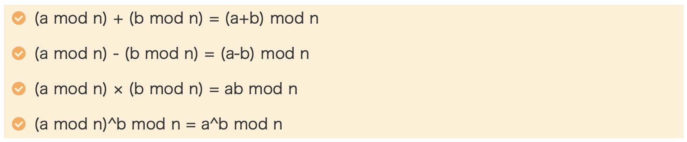
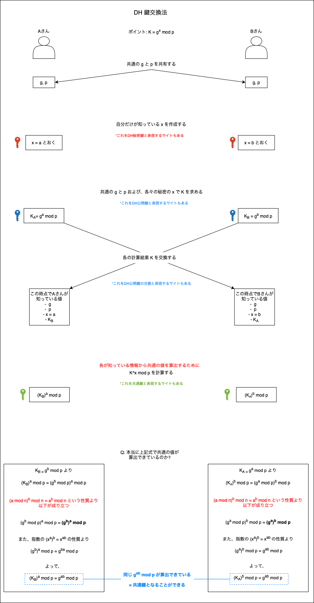
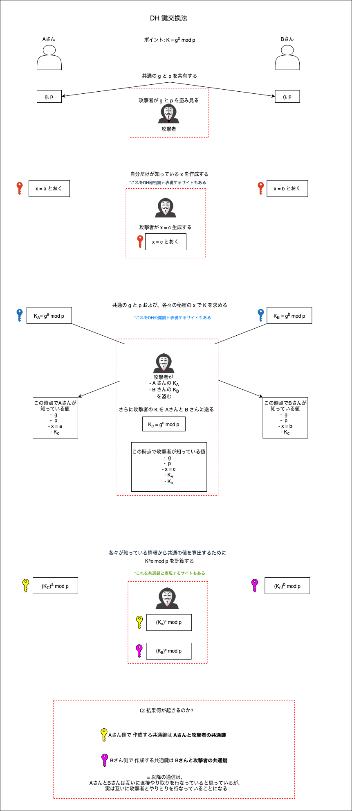
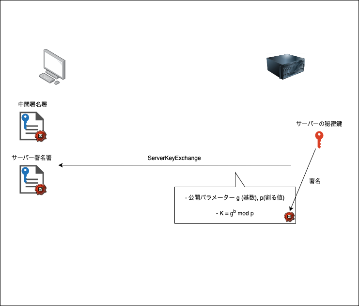
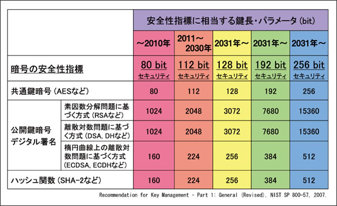

### 鍵交換とは

2者の間で共通鍵を生成すること

<br>

ポイント
- RSA 鍵交換と異なり **共通鍵を相手に送ることなく、各で共通鍵を生成する**

---

### DH 鍵交換法

根底のとなる数学的考え

- mod
- 離散対数問題

<br>

```
mod の考え

K = a mod b
は　a を b で割った時、余りは K

具体例: 10 mod 6 = 4
-> 10 / 6 の余りは 4
```

またmodの演算には以下の性質がある



引用: [【図解】素数とDiffie-Hellman鍵交換法 ~わかりやすい計算例とシーケンス,RFCや種類,アルゴリズムについて~](https://milestone-of-se.nesuke.com/nw-basic/tls/diffie-hellman-summary/)

<br>

```
離散対数問題という考え

条件
- *p は大きな素数
- *g は p よりも小さい自然数
- *x は 1 < x < p

上記条件を満たす

K = g^x mod p

は以下の特性がある
- g, x, p が与えられた時に K を求めるのは簡単
- K, g, p が与えられた時でも x を求めるのは困難
```

<br>

DH鍵交換法のポイント
- 2者の間で x を自分だけが知っている値として保持 (= DH 秘密鍵)
- g, p を公開してもいい値として、2者間で共有する
- 各で g^x mod p を計算し、計算結果をお互いに送信する (計算結果 = DH 公開鍵)
- (相手の計算結果)^x mod p は互いに一致する (= 共通鍵)

<br>



<br>
<br>

参考サイト

- mod 演算の性質について: [【図解】素数とDiffie-Hellman鍵交換法 ~わかりやすい計算例とシーケンス,RFCや種類,アルゴリズムについて~](https://milestone-of-se.nesuke.com/nw-basic/tls/diffie-hellman-summary/)

- DH 鍵交換法の仕組みについて: [Diffie-Hellman鍵交換入門](https://qiita.com/okajima/items/036d7e751234f88fbe9a)

---

### DH 鍵交換法の弱点

中間者によるに弱い

- DH 公開鍵の交換にて、やり取りの相手が本物かどうかの認証をしないので、その際に中間者によって偽造されると偽の使えない共通鍵を作成させられてしまう

ポイント
- 攻撃者が公開パラメーターである g (基数), p (割る値) を盗み見る

- A と B の公開鍵を自分の公開鍵に差し替える



<br>
<br>

参考サイト

- 中間者攻撃について1: [【図解】素数とDiffie-Hellman鍵交換法 ~わかりやすい計算例とシーケンス,RFCや種類,アルゴリズムについて~](https://milestone-of-se.nesuke.com/nw-basic/tls/diffie-hellman-summary/#toc5)

- 中間者攻撃について2: [DH鍵交換とは](https://npo-csr.jp/dh鍵交換とは/?doing_wp_cron=1718926369.8978509902954101562500)

---

### DH 鍵交換に対する攻撃への対策

DH 鍵交換を利用するケースとしては SSL / TLS Handshake

- サーバーから公開パラメーター (基数と割る値) と　DH 共通鍵を送信する

    - この時にサーバーの秘密鍵で RSA 署名をする


- クライアント側は、サーバーからのデータに付与されている署名を検証することで、本当に対象のサーバーから送られてきたデータかを確認する



<br>
<br>

参考サイト

- 電子署名がなぜデータ改竄に有効なのか: [電子署名について一歩踏むこんで知る](https://blog.sa2taka.com/post/digital-signature-foundation/)

---

### DH 鍵交換法 と DHE 鍵交換法 の違い

DH 鍵交換法
- 共通鍵作成のためのパラメーターは 証明書をもとに作成される

DHE 鍵交換法
- 共通鍵作成のためのパラメーターは通信の時に作成される (セッションごと)

- セッションが終了すると、そのパラメーターから作成された DH 秘密鍵、 DH 公開鍵、　共通鍵は捨てられる

- パラメーターの作成はランダムだったり、すでに登録されているパラメータの組の中から選ばれたりするらしい

<br>
<br>

参考サイト

- DH と DHE の違い: [SSL(TLS)のDHとDHEの違い](http://assam-at-night.blogspot.com/2008/08/ssltlsdhdhe.html)

- DHE での DH 鍵作成のためのパラメータの生成について: [TLSとDiffie-Hellmanグループパラメータ](https://qiita.com/n-i-e/items/fac121aa5b2a3d16a632)

---

### ECDHE　鍵交換法とは

DHE
- ベースとなるのは DH 鍵交換方式
- K = g^x mod p にて、(K, g, p) から x を算出するのは難しい(時間がかかる) という性質を利用

<br>

ECDHE
- ベースとなる考え方は「楕円曲線における加算」というものらしい
- 利用する数式などは違うが、共通鍵の生成のアイディアは同じ
    - 共通パラメータがある
    - 各々が秘密値 (秘密鍵) を生成する
    - 上記2種の値で計算した値 (公開鍵) の交換
    - 各々の秘密鍵と交換した公開鍵の計算結果、双方の値が等しくなる (共通鍵)

<br>
<br>

参考サイト

- 一番なんとなく理解できたサイト: [楕円曲線ディフィー・ヘルマン鍵共有](https://ja.wikipedia.org/wiki/楕円曲線ディフィー・ヘルマン鍵共有)

- DHE と ECDHE の違いについて: [【TLS通信解説】①鍵交換アルゴリズムについて](https://blog.qualitia.com/ppap/658/)

-  楕円曲線と加法について1: [【技術】楕円曲線暗号① 楕円曲線とその性質](https://acompany.tech/privacytechlab/elliptic-curve-cryptography-1)

-  楕円曲線と加法について2: [楕円曲線暗号アルゴリズムを理解する](https://techracho.bpsinc.jp/yoshi/2019_08_16/79280)

---

### 鍵長とは

暗号鍵 (時には公開鍵や共通鍵) のデータ量のこと

ポイント
- 同じ暗号アルゴリズムならば鍵が長いほど解読が困難になるが、暗号化や復号に必要な計算量は増える

- 異なるアルゴリズムなら、同じ鍵長でもアルゴリズムによって強度が異なる
    - 楕円曲線暗号と RSA 暗号　ならば同じ鍵長なら楕円曲線暗号の方が強度が高い (解読されにくい)

- 鍵長が長くなればなるほど、計算に時間がかかる

<br>

覚えておくと良いこと

- DHE 方式で強度の高い暗号化にしたい場合、最低でも秘密鍵の鍵長は 2048 bit 必要

- ECDHE の場合、224 bit で同程度の強度となる
    - *なぜそうなるのかは、[ビットセキュリティ](#bit-security)で説明

- つまり、 DHE よりも ECDHE の方がパラメータのデータ量が少なく、計算も早い (パラメーターが小さいので計算も早くなる) 

<br>
<br>

参考サイト

- 鍵長の意味: [鍵長 【key length】 key size](https://e-words.jp/w/鍵長.html)

- DHE と比べて ECDHE のメリットを説明しているサイト: [Internet Infrastructure Review（IIR）Vol.31
](https://www.iij.ad.jp/dev/report/iir/031/03_03.html)

---
<div id="bit-security"></div>

### ビットセキュリティとは

- 異なる暗号アルゴリズムについて安全性の指標となるもの

- *鍵交換アルゴリズムだけではなく、ハッシュ関数や共通鍵の安全性を示すためにも使われる

- 評価対象とする暗号アルゴリズムに対してもっとも効率的な攻撃手法を用いたときに、どの程度の計算量 (2^n) があれば解読できるかを表す
    - 例: 特定の暗号アルゴリズムを用いた ~~bit 鍵長の暗号鍵に対するビットセキュリティは 112 bit

    - 上記は、対象の暗号アルゴリズムを用いた ~~ bit の鍵長の暗号鍵に、最も効率的な攻撃手法を用いると解読に 2^112 回の計算(操作?)を要するということ

<br>

ポイント

- 以下の表が各アルゴリズムとその鍵長に対するビットセキュリティ評価

- 2031 から、システムで利用する暗号化アルゴリズムとその鍵長に対しては、 **128bit セキュリティを満たさなければならない**
    - 例: DSA や DH を利用した鍵交換は、その暗号鍵の鍵長は 最低でも 3072 bit なければならない



引用: [暗号の安全性評価](https://www.nict.go.jp/publication/NICT-News/1303/01.html)

<br>
<br>

参考サイト

- ビットセキュリティに関して1: [128bitセキュリティのメモ](https://qiita.com/hakoritenshi/items/72334a8f9682a0184d5e)

- ビットセキュリティに関して2: [楕円曲線暗号方式の強度について](https://dwango.github.io/articles/2024-02_security_level/)

- ビットセキュリティに関して3: [暗号の安全性評価](https://www.nict.go.jp/publication/NICT-News/1303/01.html)